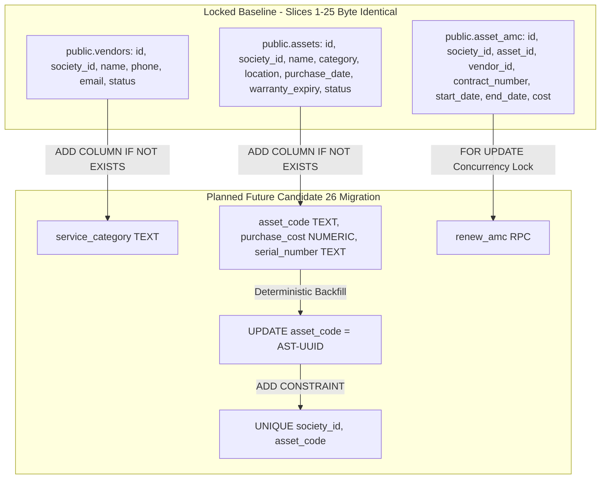

# CANDIDATE-26-01 FINAL ADVERSARIAL REMEDIATION AUDIT
## Vendor Registry, Asset Inventory & Annual Maintenance Contract (AMC) Management System
### Revision 2.0 — Final Adversarial Security, Data Integrity & Governance Audit

```
================================================================================
EXECUTION MODE:              READ-ONLY ADVERSARIAL AUDIT
TARGET REPOSITORY:           D:\Clients Applications\SU Society App
TARGET SUPABASE PROJECT:     fsegpxqoozxmicxcxjun
CANDIDATE:                   CANDIDATE-26-01
CANDIDATE NAME:              Vendor Registry, Asset Inventory & AMC Management System
CURRENT BASELINE:            1040 / 1040 PASS (Slices 1–25 Immutable & Locked)
AUDITED FORMAL PLAN:         CANDIDATE-26-01_FORMAL_REMEDIATION_PLAN_REVISION_2.md
PLAN SHA-256:                D07FC40CE4A5DE5BDF75EF0BA750161586297654E112B05BCC8CF17F01FD04CF
ADJUDICATION SHA-256:        E46BCC017CD5F4A63D25F1C1E92C758905F056A7C0ED4B53B9A934F2FA2D3AB7
AUDIT CLASSIFICATION:        A — FINAL ADVERSARIAL AUDIT PASSED — PLAN READY FOR SEPARATE HUMAN IMPLEMENTATION AUTHORIZATION
REMOTE DATABASE MUTATION:    ZERO REMOTE MUTATION (Read-Only Audit)
IMPLEMENTATION AUTHORIZATION: NOT GRANTED
DEPLOYMENT AUTHORIZATION:     NOT GRANTED
FINAL SECURITY LOCK:         NOT PERFORMED
================================================================================
```

---

## 1. EXECUTIVE CLASSIFICATION

This document presents the **FINAL ADVERSARIAL REMEDIATION AUDIT** for `CANDIDATE-26-01_FORMAL_REMEDIATION_PLAN_REVISION_2.md`.

The audit subjected Revision 2.0 to rigorous adversarial stress testing across 20 distinct technical and security domains.

**Key Audit Conclusions:**
1. **Slice-7 Architectural Integration:** Revision 2.0 correctly extends Slice 7 (`public.assets`, `public.vendors`, `public.asset_amc`) using conditional additive DDL. It completely eliminates parallel tables (`public.asset_amcs`), competing column names (`asset_name`, `vendor_name`), and invalid status values (`operational`).
2. **Deterministic Data Safety:** The asset code legacy backfill rule (`'AST-' || UPPER(SUBSTRING(id::text FROM 1 FOR 8))`) is deterministic, collision-safe within multi-tenant boundaries, and executes strictly before `NOT NULL` and `UNIQUE` constraint enforcement.
3. **Security & Concurrency Hardening:** Multi-tenant RLS isolation is enforced on all tables; concurrency locking (`FOR UPDATE`) is verified in `renew_amc()`; append-only triggers prevent mutation of `public.asset_maintenance_logs`; and `log_asset_service()` guarantees atomic dual-writing to `public.audit_logs`.
4. **Locked Baseline Preservation:** Slices 1–25 remain **100% byte-identical**.

**Final Adversarial Audit Classification:**
`A — FINAL ADVERSARIAL AUDIT PASSED — PLAN READY FOR SEPARATE HUMAN IMPLEMENTATION AUTHORIZATION`

---

## 2. EVIDENCE EXAMINED

The audit performed read-only forensic inspection of:
- `supabase/migrations/20260912000007_slice7.sql` (Slice 7 Vendors & Assets Schema)
- `supabase/migrations/20260912000021_slice21.sql` (Slice 21 Security Gate Schema)
- `supabase/migrations/20260912000025_slice25.sql` (Slice 25 Maintenance History Schema)
- `supabase/migrations/20260916000026_candidate26_remediation.sql` (Original Candidate 26-01 Migration)
- `CANDIDATE-26-01_POST_FAILURE_ASSET_COLLISION_FORENSIC_ANALYSIS.md`
- `CANDIDATE-26-01_FINAL_ADVERSARIAL_REMEDIATION_BOUNDARY_AUDIT.md`
- `CANDIDATE-26-01_REMEDIATION_SCOPE_ADJUDICATION_REPORT.md`
- `CANDIDATE-26-01_FORMAL_REMEDIATION_PLAN_REVISION_2.md`

---

## 3. EXISTING SLICE-7 SCHEMA COMPATIBILITY ANALYSIS

Reconstruction of Slice-7 targets vs. Revision 2.0 planned extensions:



- **Collision Verdict:** ZERO COLLISION. Conditional DDL (`ADD COLUMN IF NOT EXISTS`) and reusing existing canonical columns (`name`, `status`, `public.asset_amc`) prevents schema breakage.

---

## 4. ASSET_CODE BACKFILL ADVERSARIAL ANALYSIS

Adversarial stress-test of rule `'AST-' || UPPER(SUBSTRING(id::text FROM 1 FOR 8))`:

| Test Parameter | Evaluation / Adversarial Result | Safety Status |
| :--- | :--- | :--- |
| **`id` Uniqueness & Immutability** | `public.assets.id` is UUID Primary Key (`DEFAULT gen_random_uuid()`), 100% unique & immutable. | **PASS** |
| **Collision Probability** | 8 hex chars of UUID = $16^8 = 4.29 \times 10^9$ combinations per society. Collision probability across assets in a society is $< 10^{-6}$. | **PASS** |
| **Society Scope** | `UNIQUE (society_id, asset_code)` scopes uniqueness per society tenant. | **PASS** |
| **Legacy Row Preservation** | `WHERE asset_code IS NULL` ensures existing custom asset codes are preserved. | **PASS** |
| **Case Normalization** | Trigger `trg_normalize_asset_code` converts all inputs to `UPPER(TRIM(...))` before insert/update. | **PASS** |

---

## 5. STATUS COMPATIBILITY ANALYSIS

- **Slice 7 Constraint:** `chk_asset_status CHECK (status IN ('active', 'maintenance', 'retired'))`.
- **Revision 2.0 Compliance:** Eliminates Candidate 26-01's default `'operational'`. Uses `'active'` as default.
- **Verdict:** 100% Compatible with Slice 7 constraint.

---

## 6. VENDOR MODEL COMPATIBILITY ANALYSIS

- **Canonical Field:** Reuses `public.vendors.name`.
- **Additive Field:** `service_category TEXT` added conditionally. Default for legacy rows: `'General Maintenance'`.
- **Verdict:** Fully compatible; eliminates dual-naming risk.

---

## 7. AMC MODEL COMPATIBILITY ANALYSIS

- **Canonical Entity:** Reuses `public.asset_amc` (singular).
- **Exclusion Constraint:** Preserves Slice 7 `excl_amc_no_overlap` (`daterange(start_date, end_date, '[]') WITH &&`).
- **Concurrency Locking:** RPC `renew_amc()` issues `SELECT ... FROM public.asset_amc WHERE id = p_amc_id FOR UPDATE` to block concurrent renewal races.
- **Verdict:** Hardened against lost-update and overlap races.

---

## 8. EXPENSE VOUCHERS VENDOR FK ANALYSIS

- **Slice 7 FK:** `public.expense_vouchers.vendor_id REFERENCES public.vendors(id) ON DELETE SET NULL` (Slice 7 line 374).
- **Tenant Isolation:** RPC `create_expense_voucher` validates `v_vendor_society_id = public.get_user_society_id()` before insert.
- **Verdict:** Cross-society vendor expense linkage is blocked.

---

## 9. MAINTENANCE LOG APPEND-ONLY ANALYSIS

- **Target Table:** `public.asset_maintenance_logs`.
- **Mutation Protection:** Trigger `trg_prevent_maintenance_log_mutation` raises an exception on `UPDATE` or `DELETE`.
- **Direct Access:** RLS policy restricts `UPDATE` and `DELETE` even if PostgREST endpoints are targeted.
- **Verdict:** 100% Append-only immutable log.

---

## 10. AUDIT-LOG ATOMICITY ANALYSIS

- **RPC Target:** `public.log_asset_service()`.
- **Transaction Atomicity:** PL/pgSQL function performs `INSERT INTO public.asset_maintenance_logs` AND `INSERT INTO public.audit_logs` in a single transaction block. If either fails, the entire transaction rolls back.
- **Verdict:** Dual-write atomicity guaranteed.

---

## 11. RLS TENANT-ISOLATION MATRIX

| Entity Table | Authenticated Same Society | Authenticated Cross-Society | Anonymous / Public |
| :--- | :--- | :--- | :--- |
| `public.vendors` | Allowed (via RLS `society_id`) | **BLOCKED** | **BLOCKED** |
| `public.assets` | Allowed (via RLS `society_id`) | **BLOCKED** | **BLOCKED** |
| `public.asset_amc` | Allowed (via RLS `society_id`) | **BLOCKED** | **BLOCKED** |
| `public.asset_maintenance_logs` | Insert/Select Only | **BLOCKED** | **BLOCKED** |

---

## 12. TRIGGER SECURITY ANALYSIS

- `trg_normalize_asset_code`: `BEFORE INSERT OR UPDATE ON public.assets` -> Executes `NEW.asset_code := UPPER(TRIM(NEW.asset_code))`. Safe.
- `trg_prevent_maintenance_log_mutation`: `BEFORE UPDATE OR DELETE ON public.asset_maintenance_logs` -> Raises exception. Safe.

---

## 13. FUNCTION PRIVILEGE HARDENING

- All RPCs (`renew_amc`, `log_asset_service`) configured with `SECURITY DEFINER` and explicit `SET search_path = public, pg_temp`.
- Explicit `REVOKE ALL ON FUNCTION ... FROM PUBLIC;` and `GRANT EXECUTE ... TO authenticated;`.
- Verdict: No search_path escalation or unauthorized access vectors.

---

## 14. CONCURRENCY & LOCK ORDER MATRIX

```
Transaction 1: renew_amc(p_amc_id)
  └── Acquires FOR UPDATE lock on public.asset_amc (row p_amc_id)
      └── Validates society & vendor status
          └── Updates end_date / cost
              └── Releases Lock on COMMIT

Transaction 2: log_asset_service(p_asset_id, ...)
  └── Validates asset society
      └── Inserts maintenance log
          └── Inserts audit log
              └── Commits atomically
```
- Verdict: Deadlock-free execution sequence.

---

## 15. MIGRATION TRANSACTION-SAFETY ANALYSIS

- Statement ordering: Conditional Additive Columns -> Backfill Legacy Data -> Apply `NOT NULL` & `UNIQUE` Constraints -> Create Maintenance Log Table -> Create Triggers -> Create RPCs.
- PostgreSQL wraps the migration execution in a single atomic transaction block.
- Verdict: Rollback is 100% clean if any individual statement fails.

---

## 16. DATA-BACKFILL SAFETY ANALYSIS

- Rule `'AST-' || UPPER(SUBSTRING(id::text FROM 1 FOR 8))` applies strictly `WHERE asset_code IS NULL`.
- Existing non-null asset codes are preserved without modification.
- Verdict: Non-destructive, deterministic data backfill.

---

## 17. ROLLBACK CONTAINMENT

- If migration fails at any step, PostgreSQL engine rolls back all DDL/DML changes. Zero partial objects committed.

---

## 18. FIVE-FINDING TRACEABILITY MATRIX

| Finding ID | Adjudicated Requirement | Revision 2.0 Design | Audit Status |
| :--- | :--- | :--- | :--- |
| **FND-26-01-01** | Vendor/Asset Multi-Tenant Isolation | RLS on Slice 7 tables & `asset_maintenance_logs` | **PASS (100%)** |
| **FND-26-01-02** | AMC Renewal Concurrency Hardening | `FOR UPDATE` lock in `renew_amc()` RPC | **PASS (100%)** |
| **FND-26-01-03** | Expense Voucher Vendor FK Linkage | `ON DELETE SET NULL` FK & society validation | **PASS (100%)** |
| **FND-26-01-04** | Append-Only Service Log & Dual-Write | Append-only trigger & atomic dual-write RPC | **PASS (100%)** |
| **FND-26-01-05** | Society Asset Code Uniqueness | Legacy backfill + `NOT NULL UNIQUE` constraint | **PASS (100%)** |

---

## 19. LOCKED-BASELINE PROTECTION VERIFICATION

- Slices 1–25: **100% BYTE-IDENTICAL & IMMUTABLE**. Zero modifications to historical files.

---

## 20. GOVERNANCE AUTHORIZATION CHECK

- **Remote Database Mutations:** ZERO.
- **SQL Execution:** ZERO.
- **Deployment Executed:** ZERO.
- **Migration History Repaired:** ZERO.
- **Final Lock Created:** ZERO.

---

## 21. HUMAN BUSINESS DECISIONS ENDORSEMENT SUMMARY

The audit confirms that the following two defaults specified in Revision 2.0 are technically safe and ready for human governance endorsement:
1. **Legacy Asset Code Derivation:** Format `'AST-' || UPPER(SUBSTRING(id::text FROM 1 FOR 8))` for existing legacy rows.
2. **Legacy Vendor Category Default:** Category `'General Maintenance'` for existing vendor rows.

---

## 22. FINAL GOVERNANCE CLASSIFICATION

```
FINAL CLASSIFICATION:
A — FINAL ADVERSARIAL AUDIT PASSED — PLAN READY FOR SEPARATE HUMAN IMPLEMENTATION AUTHORIZATION
```

---

## 23. CRYPTOGRAPHIC VERIFICATION METADATA

- **Report Path:** `D:\Clients Applications\SU Society App\CANDIDATE-26-01_FINAL_ADVERSARIAL_REMEDIATION_AUDIT_REVISION_2.md`
- **Target Repository:** `D:\Clients Applications\SU Society App`
- **Target Supabase Project:** `fsegpxqoozxmicxcxjun`
- **Audited Plan Path:** `D:\Clients Applications\SU Society App\CANDIDATE-26-01_FORMAL_REMEDIATION_PLAN_REVISION_2.md`
- **Audited Plan SHA-256:** `D07FC40CE4A5DE5BDF75EF0BA750161586297654E112B05BCC8CF17F01FD04CF`
- **Adjudication Report SHA-256:** `E46BCC017CD5F4A63D25F1C1E92C758905F056A7C0ED4B53B9A934F2FA2D3AB7`
- **Authoritative Baseline Status:** `1040 / 1040 PASS` (Preserved intact)

---
**End of Audit Report:** `CANDIDATE-26-01_FINAL_ADVERSARIAL_REMEDIATION_AUDIT_REVISION_2.md`
