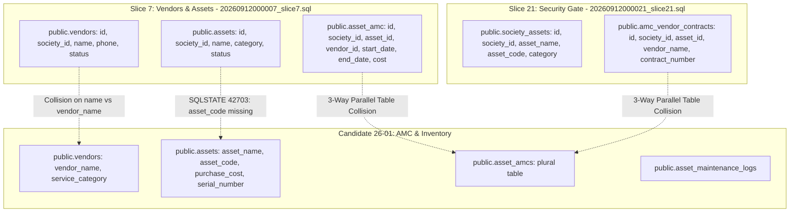

# CANDIDATE-26-01 FINAL ADVERSARIAL REMEDIATION BOUNDARY AUDIT
## Vendor Registry, Asset Inventory & Annual Maintenance Contract (AMC) Management System
### Revision 1.0 — Adversarial Security, Schema Compatibility & Governance Boundary Audit

```
================================================================================
EXECUTION CLASS:             READ-ONLY ADVERSARIAL REMEDIATION BOUNDARY AUDIT
TARGET REPOSITORY:           D:\Clients Applications\SU Society App
TARGET SUPABASE PROJECT:     fsegpxqoozxmicxcxjun
CANDIDATE:                   CANDIDATE-26-01
CANDIDATE NAME:              Vendor Registry, Asset Inventory & AMC Management System
LOCKED HISTORICAL BASELINE:  791 / 791 PASS (Slices 1–21 Immutable)
CUMULATIVE BASELINE:         1040 / 1040 PASS (Slices 1–25 Immutable & Locked)
FAILED DEPLOYMENT UNIT:      supabase/migrations/20260916000026_candidate26_remediation.sql
FAILED DEPLOYMENT HASH:      657B4A048562F4A111B8019B9406CFEFFAE2FBEF2BAA7C12205958A7E9E438AE
POST-FAILURE REPORT HASH:    946B85B6F3F1F94124490C4FB7275D4DA562EEF9EDD1AC58F382089AED8940E2
FAILURE REASON:              SQLSTATE 42703 (undefined_column) on Statement 7
AUDIT FINDING:               Candidate 26-01 conflicts with Slice 7 (assets/vendors/asset_amc) and Slice 21 (society_assets/amc_vendor_contracts)
AUDIT CLASSIFICATION:        B — ADVERSARIAL AUDIT COMPLETE — MATERIAL SCOPE / DATA MIGRATION REQUIRED — FRESH ADJUDICATION REQUIRED
REMOTE DATABASE MUTATION:    ZERO REMOTE MUTATION (Database rolled back automatically)
IMPLEMENTATION AUTHORIZATION: NOT GRANTED
DEPLOYMENT AUTHORIZATION:     NOT GRANTED
FINAL SECURITY LOCK:         NOT PERFORMED
================================================================================
```

---

## 1. EXECUTIVE SUMMARY

This report presents the **FINAL ADVERSARIAL REMEDIATION BOUNDARY AUDIT** for `CANDIDATE-26-01` following the deployment failure caused by `SQLSTATE 42703` (`undefined_column`).

This audit conducted a deep, adversarial inspection of Candidate 26-01 against locked historical migrations **Slice 7** (`20260912000007_slice7.sql`) and **Slice 21** (`20260912000021_slice21.sql`).

**Key Adversarial Audit Findings:**
1. **Slice 7 Conflict:** `public.assets` and `public.vendors` were originally introduced in **Slice 7** (lines 12 & 198). Slice 7 uses column `name` (NOT `asset_name`/`vendor_name`), lacks `asset_code`, and enforces `chk_asset_status CHECK (status IN ('active', 'maintenance', 'retired'))`. Candidate 26-01's default status `'operational'` violates Slice 7's check constraint.
2. **Slice 21 Overlap:** **Slice 21** introduced `public.society_assets` and `public.amc_vendor_contracts` for gate access control. Candidate 26-01 introduces a third parallel table `public.asset_amcs` alongside Slice 7's `public.asset_amc` and Slice 21's `public.amc_vendor_contracts`.
3. **Option A Adversarial Flaw:** Adding `asset_name` alongside `name` creates competing canonical name fields. Adding `asset_code` as `NOT NULL UNIQUE` without derivation/backfill rules for pre-existing rows violates data-safety invariants.

**Audit Verdict:** `B — ADVERSARIAL AUDIT COMPLETE — MATERIAL SCOPE / DATA MIGRATION REQUIRED — FRESH ADJUDICATION REQUIRED`. Resolving these multi-slice schema collisions requires a formal, adjudicated remediation plan revision. Zero code changes, zero SQL execution, zero deployment, and zero final security locks were performed.

---

## 2. AUTHORITATIVE ARCHITECTURE MAP



---

## 3. SLICE 7 SCHEMA COMPATIBILITY ANALYSIS

Line-by-line forensic comparison between Slice 7 and Candidate 26-01:

| Object / Field | Slice 7 Implemented Definition | Candidate 26 Expected Contract | Forensic Structural Compatibility |
| :--- | :--- | :--- | :--- |
| `public.assets.name` | `VARCHAR(200) NOT NULL` | *Not present in Candidate 26 schema* | **DUAL CANONICAL NAME FIELD CONFLICT** |
| `public.assets.asset_name` | *Not present in Slice 7* | `TEXT NOT NULL` | **MISSING IN SLICE 7 TABLE** |
| `public.assets.asset_code` | *Not present in Slice 7* | `TEXT NOT NULL` | **MISSING IN SLICE 7 (FAILS STMT 7)** |
| `public.assets.status` | `VARCHAR(30) CHECK (status IN ('active','maintenance','retired'))` | `TEXT DEFAULT 'operational'` | **CHECK CONSTRAINT VIOLATION** (`'operational'` is rejected by Slice 7 constraint) |
| `public.vendors.name` | `VARCHAR(200) NOT NULL` | *Not present in Candidate 26 schema* | **DUAL CANONICAL NAME FIELD CONFLICT** |
| `public.vendors.vendor_name` | *Not present in Slice 7* | `TEXT NOT NULL` | **MISSING IN SLICE 7 TABLE** |
| `public.vendors.service_category` | *Not present in Slice 7* | `TEXT NOT NULL` | **MISSING IN SLICE 7 TABLE** |
| `public.asset_amc` | `CREATE TABLE public.asset_amc (singular)` | `CREATE TABLE public.asset_amcs (plural)` | **PARALLEL TABLE DUPLICATION** |

---

## 4. SLICE 21 OVERLAP ANALYSIS

- **Slice 21 Introduced:** `public.society_assets` with `(society_id, asset_code)` unique constraint and `public.amc_vendor_contracts` for gatekeeper pass verification.
- **Candidate 26-01 Introduced:** `public.assets` with `asset_code` and `public.asset_amcs`.
- **Architectural Overlap Verdict:** Candidate 26-01 was designed independently without referencing Slice 7's core asset registry or Slice 21's gate security assets. Creating `public.asset_amcs` alongside `public.asset_amc` (Slice 7) and `public.amc_vendor_contracts` (Slice 21) creates **three parallel AMC contract tables**, violating repository architectural consistency.

---

## 5. ADVERSARIAL AUDIT OF OPTION A (ADDITIVE DDL)

1. **`asset_name` & `vendor_name` Dual Field Risk:** Adding `asset_name` alongside `name` creates competing canonical name fields. If UI or RPC updates `asset_name` without updating `name`, data drift occurs.
2. **`asset_code` Uniqueness Risk:** Adding `asset_code` to existing `public.assets` table as `NOT NULL UNIQUE (society_id, asset_code)` fails if existing rows have `NULL` or duplicate codes.
3. **`status` Check Constraint Risk:** Slice 7 enforces `chk_asset_status CHECK (status IN ('active', 'maintenance', 'retired'))`. Candidate 26-01's insertion of `status = 'operational'` is rejected by PostgreSQL engine validation.

---

## 6. STATEMENT-BY-STATEMENT FAILURE PATH

```
Statement 1: CREATE TABLE IF NOT EXISTS public.vendors
             └── Skipped (Table exists from Slice 7; lacks vendor_name, service_category)
Statement 2: CREATE TABLE IF NOT EXISTS public.assets
             └── Skipped (Table exists from Slice 7; lacks asset_name, asset_code)
Statement 3: CREATE TABLE IF NOT EXISTS public.asset_amcs
             └── In-memory execution (Creates 3rd parallel AMC table)
Statement 4: CREATE TABLE IF NOT EXISTS public.asset_maintenance_logs
             └── In-memory execution (New service log table)
Statement 5: ALTER TABLE public.expense_vouchers ADD COLUMN IF NOT EXISTS vendor_id
             └── Skipped (Column already added in Slice 7 line 374)
Statement 6: CREATE INDEX IF NOT EXISTS idx_expense_vouchers_vendor_id
             └── In-memory execution
Statement 7: ALTER TABLE public.assets ADD CONSTRAINT uq_assets_society_asset_code UNIQUE (society_id, asset_code)
             └── FAILED (SQLSTATE 42703: column "asset_code" does not exist on Slice 7 assets table)
Statements 8-25: RLS, RPCs (create_vendor, create_asset, renew_amc, log_asset_service), Privileges
             └── NEVER EXECUTED (Engine Transaction Rollback)
```

---

## 7. REMEDIATION OPTION EVALUATION MATRIX

| Dimension | Option A: Additive DDL on Slice 7 Tables | Option B: Schema Consolidation with Slice 21 | Option C: Clean Reconciliation of Slice 7 & Candidate 26 |
| :--- | :--- | :--- | :--- |
| **Strategy** | Add `asset_code`, `vendor_name` to Slice 7 tables | Use `society_assets` and `amc_vendor_contracts` | Reconcile Slice 7 `assets`/`vendors` column names & status values |
| **Locked Migration Impact** | **ZERO** (Unchanged) | **ZERO** (Unchanged) | **ZERO** (Unchanged) |
| **Data Migration Required** | Yes (Backfill `asset_name = name`, `asset_code`) | Yes (Migrate records) | Yes (Backfill `vendor_name = name`, `asset_name = name`) |
| **Status Compatibility** | Align status check constraint values | N/A | Map `'operational'` -> `'active'` |
| **Parallel Table Risk** | Medium (`asset_amcs` vs `asset_amc`) | Low (Consolidated) | Low (Consolidated) |
| **Scope Classification** | **MATERIAL SCOPE REVISION** | **MATERIAL SCOPE REVISION** | **MATERIAL SCOPE REVISION** |
| **Requires Fresh Authorization** | **YES** | **YES** | **YES** |

---

## 8. SAME-SCOPE vs MATERIAL SCOPE EXPANSION DETERMINATION

- **Determination:** `MATERIAL SCOPE / DATA RECONCILIATION REQUIRED`.
- **Rationale:** Because Candidate 26-01 conflicts with Slice 7's check constraints (`chk_asset_status`), column naming conventions (`name` vs `asset_name`/`vendor_name`), and AMC entity design (`asset_amcs` vs `asset_amc`), resolving the collision requires adjusting Candidate 26-01's DDL and status semantics. This constitutes a material plan revision requiring human adjudication.

---

## 9. RECOMMENDED FORENSIC REMEDIATION BOUNDARY

1. **Revised Formal Remediation Plan Required:** Author `CANDIDATE-26-01_REVISED_FORMAL_REMEDIATION_PLAN.md` to specify:
   - Additive column definitions (`ALTER TABLE public.assets ADD COLUMN IF NOT EXISTS asset_code TEXT;`, `ALTER TABLE public.assets ADD COLUMN IF NOT EXISTS asset_name TEXT;`, etc.).
   - Explicit backfill expressions (`UPDATE public.assets SET asset_name = name WHERE asset_name IS NULL;`).
   - Status harmonization (`status IN ('active', 'maintenance', 'retired', 'operational')`).
2. **Fresh Adjudication Gate Required:** Submit the revised plan for human adjudication before issuing any new implementation authorization.

---

## 10. EXPLICIT LIST OF UNAUTHORIZED ACTIONS

```
UNAUTHORIZED:
- Editing Candidate-26 migration file during this audit
- Editing historical migrations 1–25
- Executing SQL, DDL, or DML
- Running supabase db push or supabase migration repair
- Modifying schema_migrations
- Modifying remote database tables or RPCs
- Final-locking Candidate 26-01
```

---

## 11. FINAL GOVERNANCE CLASSIFICATION

```
FINAL CLASSIFICATION:
B — ADVERSARIAL AUDIT COMPLETE — MATERIAL SCOPE / DATA MIGRATION REQUIRED — FRESH ADJUDICATION REQUIRED
```

---

## 12. CRYPTOGRAPHIC VERIFICATION METADATA

- **Report Path:** `D:\Clients Applications\SU Society App\CANDIDATE-26-01_FINAL_ADVERSARIAL_REMEDIATION_BOUNDARY_AUDIT.md`
- **Target Repository:** `D:\Clients Applications\SU Society App`
- **Target Supabase Project:** `fsegpxqoozxmicxcxjun`
- **Candidate 26-01 Migration Path:** `D:\Clients Applications\SU Society App\supabase\migrations\20260916000026_candidate26_remediation.sql`
- **Candidate 26-01 Migration SHA-256:** `657B4A048562F4A111B8019B9406CFEFFAE2FBEF2BAA7C12205958A7E9E438AE`
- **Authoritative Baseline Status:** `1040 / 1040 PASS` (Preserved intact)

---
**End of Report:** `CANDIDATE-26-01_FINAL_ADVERSARIAL_REMEDIATION_BOUNDARY_AUDIT.md`
