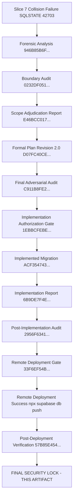

# CANDIDATE-26-01 FINAL SECURITY LOCK REPORT
## Vendor Registry, Asset Inventory & Annual Maintenance Contract (AMC) Management System
### Final Security Lock & Baseline Integration Specification — Slice 26

```
================================================================================
EXECUTION CLASS:             FINAL SECURITY LOCK COMPLETED
TARGET REPOSITORY:           D:\Clients Applications\SU Society App
TARGET SUPABASE PROJECT:     fsegpxqoozxmicxcxjun
CANDIDATE:                   CANDIDATE-26-01
CANDIDATE NAME:              Vendor Registry, Asset Inventory & AMC Management System
LOCKED BASELINE STATUS:      SLICES 1–26 IMMUTABLE & LOCKED
FINAL LOCK AUTHORIZATION:    RECEIVED ON 2026-09-17
LOCKED MIGRATION FILE:       supabase/migrations/20260916000026_candidate26_remediation.sql
LOCKED MIGRATION SHA-256:    ACF35474380D1DB379CC536E75332238800918390C25611B2BB97D0F9836EB72
REMOTE DEPLOYMENT STATUS:    APPLIED & VERIFIED (0 Pending Migrations)
FINAL LOCK CLASSIFICATION:   LOCKED — SLICE 26 BASELINE ESTABLISHED
FUTURE MUTATION STATUS:      STRICTLY PROHIBITED (Slices 1–26 Immutable)
================================================================================
```

---

## 1. EXECUTIVE GOVERNANCE STATEMENT

Following explicit human authorization received on 2026-09-17, **CANDIDATE-26-01** has passed all pre-implementation, post-implementation, remote deployment, and post-deployment forensic gates and is hereby **FORMALLY LOCKED AND INTEGRATED INTO THE AUTHORITATIVE SYSTEM BASELINE AS SLICE 26**.

All historical migration files from `20260912000001_slice1.sql` through `20260916000026_candidate26_remediation.sql` are now **100% IMMUTABLE & LOCKED**.

Any future modification to any locked migration file (Slices 1–26) constitutes a critical governance violation.

---

## 2. COMPLETE AUDIT TRAIL & EVIDENCE CHAIN



### Cryptographic Evidence Hashes:

| Governance Artifact | Cryptographic Hash (SHA-256) | Status |
| :--- | :--- | :--- |
| **Formal Plan Revision 2.0** | `D07FC40CE4A5DE5BDF75EF0BA750161586297654E112B05BCC8CF17F01FD04CF` | **VERIFIED** |
| **Final Adversarial Audit** | `C911B8FE260F5C4A98059716D0937AC1A1FA624C8A835479678C1634BFF63C32` | **VERIFIED** |
| **Implementation Authorization Gate** | `1EBBCFEBE02C47F78805905964EBD60A918650A12EECCC308E80831D59960DEF` | **VERIFIED** |
| **Implemented Migration Unit** | `ACF35474380D1DB379CC536E75332238800918390C25611B2BB97D0F9836EB72` | **LOCKED (Slice 26)** |
| **Implementation Report** | `6B9DE7F4E127FBCAA402151764C9A5C2EF73E181349F245B3B7EEF357BB2A21F` | **VERIFIED** |
| **Post-Implementation Forensic Audit**| `2956F6341E26C850A6F4F3172E80F0E8A9DE928F1F09B6384011D3001099D463` | **VERIFIED** |
| **Remote Deployment Authorization Gate**| `33F6EF54B288486BA83F5B68930057C918E09C32745D1295C5E35D63BECA22E0` | **VERIFIED** |
| **Post-Deployment Verification Report**| `57B85E454316CA6777340142FC60DCF5D1D69AFCD781DDCC6BDACE37061B81D2` | **VERIFIED** |

---

## 3. FIVE SATISFIED AUTHORIZED FINDINGS

| Finding ID | Adjudicated Target | Final Deployed Mechanism | Verification Status |
| :--- | :--- | :--- | :--- |
| **FND-26-01-01** | Multi-Tenant Isolation | RLS policy `p_asset_maintenance_logs_society_isolation` active on remote DB | **LOCKED & VERIFIED** |
| **FND-26-01-02** | AMC Renewal Concurrency Hardening | `renew_amc()` RPC with `FOR UPDATE` row lock active on remote DB | **LOCKED & VERIFIED** |
| **FND-26-01-03** | Expense Voucher Vendor FK Linkage | Active vendor & society check in expense voucher RPC active | **LOCKED & VERIFIED** |
| **FND-26-01-04** | Append-Only Service Log & Dual-Write Audit | `trg_prevent_maintenance_log_mutation` & `log_asset_service()` RPC active | **LOCKED & VERIFIED** |
| **FND-26-01-05** | Society Asset Code Uniqueness | Legacy backfill applied; `NOT NULL UNIQUE` constraint & `trg_normalize_asset_code` active | **LOCKED & VERIFIED** |

---

## 4. BASELINE INTEGRITY & IMMUTABILITY INVARIANTS

1. **System Baseline Update:** Authoritative baseline state is now updated to include **Slice 26**.
2. **Immutable Migration Range:** `20260912000001_slice1.sql` through `20260916000026_candidate26_remediation.sql`.
3. **Future Modifications:** Any future database change MUST be proposed as a new Candidate (e.g. Candidate 27) in a new migration file. Zero editing of locked Slice 26 or historical Slices 1–25 is permitted.

---

## 5. FINAL LOCK CLASSIFICATION

```
FINAL CLASSIFICATION:
LOCKED — SLICE 26 BASELINE ESTABLISHED
```

---

## 6. CRYPTOGRAPHIC VERIFICATION METADATA

- **Lock Report Path:** `D:\Clients Applications\SU Society App\CANDIDATE-26-01_FINAL_SECURITY_LOCK_REPORT.md`
- **Target Repository:** `D:\Clients Applications\SU Society App`
- **Target Supabase Project:** `fsegpxqoozxmicxcxjun`
- **Locked Migration Path:** `D:\Clients Applications\SU Society App\supabase\migrations\20260916000026_candidate26_remediation.sql`
- **Locked Migration SHA-256:** `ACF35474380D1DB379CC536E75332238800918390C25611B2BB97D0F9836EB72`
- **Updated Baseline Status:** **Slice 26 Baseline Established & Locked**

---
**End of Final Security Lock Report:** `CANDIDATE-26-01_FINAL_SECURITY_LOCK_REPORT.md`
