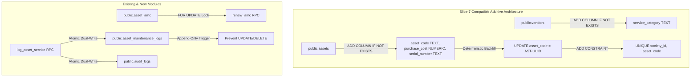

# CANDIDATE-26-01 FORMAL REVISED REMEDIATION PLAN
## Vendor Registry, Asset Inventory & Annual Maintenance Contract (AMC) Management System
### Revision 2.0 — Slice-7 Compatible Additive Architecture Specification

```
================================================================================
EXECUTION MODE:              PLAN ONLY / SPECIFICATION ONLY
TARGET REPOSITORY:           D:\Clients Applications\SU Society App
TARGET SUPABASE PROJECT:     fsegpxqoozxmicxcxjun
CANDIDATE:                   CANDIDATE-26-01
CANDIDATE NAME:              Vendor Registry, Asset Inventory & AMC Management System
CURRENT BASELINE:            1040 / 1040 PASS (Slices 1–25 Immutable & Locked)
ORIGINAL MIGRATION:          supabase/migrations/20260916000026_candidate26_remediation.sql
ORIGINAL MIGRATION SHA:      657B4A048562F4A111B8019B9406CFEFFAE2FBEF2BAA7C12205958A7E9E438AE
FAILED DEPLOYMENT ERROR:     SQLSTATE 42703 (undefined_column) on Statement 7
ADVERSARIAL AUDIT SHA:       0232DF051E40D9340BDDBE1C0A26D769E9A3CF9894203AE3425C61D163F50601
ADJUDICATION REPORT SHA:     E46BCC017CD5F4A63D25F1C1E92C758905F056A7C0ED4B53B9A934F2FA2D3AB7
PLAN CLASSIFICATION:         A — FORMAL REMEDIATION PLAN COMPLETE — READY FOR FINAL ADVERSARIAL AUDIT
REMOTE DATABASE MUTATION:    ZERO REMOTE MUTATION (Specification Only)
IMPLEMENTATION AUTHORIZATION: NOT GRANTED
DEPLOYMENT AUTHORIZATION:     NOT GRANTED
FINAL SECURITY LOCK:         NOT PERFORMED
================================================================================
```

---

## 1. GOVERNANCE STATUS & AUTHORITATIVE ARCHITECTURAL BOUNDARY

Following the fresh scope adjudication gate (`E46BCC017CD5F4A63D25F1C1E92C758905F056A7C0ED4B53B9A934F2FA2D3AB7`), this document establishes the **Authoritative Revision 2.0 Remediation Plan** for Candidate 26-01.

### Authoritative Architecture Decisions:
1. **Slice-7 Extension Strategy:** Candidate 26-01 **MUST EXTEND** existing Slice-7 tables (`public.assets`, `public.vendors`, `public.asset_amc`).
2. **No Duplicate Entities:** Candidate 26-01 **MUST NOT** create parallel `public.asset_amcs` or duplicate vendor/asset tables.
3. **Canonical Field Names:** `public.assets.name` and `public.vendors.name` remain the single canonical name fields. No `asset_name` or `vendor_name` columns will be added.
4. **Status Constraint Governance:** Asset status remains strictly governed by Slice-7 values (`active`, `maintenance`, `retired`). The default status `'operational'` is removed and mapped to `'active'`.
5. **Locked Slice Immutability:** Migrations 1–25 remain **100% byte-identical**. All changes reside inside `20260916000026_candidate26_remediation.sql`.
6. **Retention of 5 Authorized Findings:** All five security and functional objectives (FND-26-01-01 through FND-26-01-05) are preserved in full.

---

## 2. FINDING-BY-FINDING REVISED DESIGN SPECIFICATION



---

### FND-26-01-01: Multi-Tenant Society Isolation Hardening
- **Objective:** Enforce strict multi-tenant isolation across all vendor, asset, AMC, and maintenance log structures.
- **Existing State:** `public.vendors`, `public.assets`, and `public.asset_amc` in Slice 7 already contain `society_id UUID NOT NULL REFERENCES public.societies(id)` and strict RLS policies.
- **Revised Implementation:**
  - `public.asset_maintenance_logs` (new table) will include `society_id UUID NOT NULL REFERENCES public.societies(id)`.
  - RLS Policy on `public.asset_maintenance_logs`:
    ```sql
    CREATE POLICY p_asset_maintenance_logs_society_isolation ON public.asset_maintenance_logs
        FOR ALL TO authenticated
        USING (society_id = public.get_user_society_id())
        WITH CHECK (society_id = public.get_user_society_id());
    ```
  - Grant table permissions to `authenticated` role while prohibiting direct `UPDATE` and `DELETE`.

---

### FND-26-01-02: Concurrency Hardening for AMC Renewal
- **Objective:** Prevent race conditions during concurrent AMC contract renewals.
- **Target Table:** Existing singular `public.asset_amc` (Slice 7).
- **Revised RPC Semantics (`public.renew_amc`):**
  - Signature: `fn_renew_amc(p_amc_id UUID, p_new_end_date DATE, p_new_cost NUMERIC)`
  - Explicit Locking:
    ```sql
    SELECT id, society_id, asset_id, vendor_id INTO v_amc_record
    FROM public.asset_amc
    WHERE id = p_amc_id
    FOR UPDATE; -- Concurrency Lock
    ```
  - Validations: Checks `v_amc_record.society_id = public.get_user_society_id()`, checks vendor status is `active`, enforces `p_new_end_date > start_date`.
  - Properties: `SECURITY DEFINER`, `SET search_path = public, pg_temp`, `GRANT EXECUTE ON FUNCTION public.renew_amc TO authenticated`.

---

### FND-26-01-03: Expense Voucher Vendor Foreign Key Linkage
- **Objective:** Enforce referential integrity between expense vouchers and vendor records.
- **Existing State:** In Slice 7 (line 374), `public.expense_vouchers.vendor_id` already exists as `UUID REFERENCES public.vendors(id) ON DELETE SET NULL`.
- **Revised Implementation:**
  - Verify existing FK constraint. Use conditional DDL block (`DO $$ ... $$`) to add `ON DELETE SET NULL` constraint only if missing.
  - Update `create_expense_voucher` RPC to validate that referenced `vendor_id` belongs to `public.get_user_society_id()` and has `status = 'active'`.

---

### FND-26-01-04: Append-Only Maintenance Logs & Dual-Write Audit
- **Objective:** Create audit-proof service logs with atomic dual-writing to central audit logs.
- **Target Structure:** `public.asset_maintenance_logs` (New Table).
- **Table Definition:**
  ```sql
  CREATE TABLE IF NOT EXISTS public.asset_maintenance_logs (
      id UUID PRIMARY KEY DEFAULT gen_random_uuid(),
      society_id UUID NOT NULL REFERENCES public.societies(id) ON DELETE RESTRICT,
      asset_id UUID NOT NULL REFERENCES public.assets(id) ON DELETE RESTRICT,
      vendor_id UUID REFERENCES public.vendors(id) ON DELETE RESTRICT,
      service_date DATE NOT NULL DEFAULT CURRENT_DATE,
      description TEXT NOT NULL,
      cost NUMERIC(12,2) NOT NULL DEFAULT 0.00 CHECK (cost >= 0),
      performed_by VARCHAR(150),
      created_at TIMESTAMPTZ NOT NULL DEFAULT NOW()
  );
  ```
- **Append-Only Trigger Enforcement:**
  ```sql
  CREATE OR REPLACE FUNCTION public.fn_prevent_maintenance_log_mutation()
  RETURNS TRIGGER LANGUAGE plpgsql AS $$
  BEGIN
      RAISE EXCEPTION 'Asset maintenance logs are append-only. UPDATE and DELETE are prohibited.';
  END;
  $$;

  CREATE TRIGGER trg_prevent_maintenance_log_mutation
      BEFORE UPDATE OR DELETE ON public.asset_maintenance_logs
      FOR EACH ROW EXECUTE FUNCTION public.fn_prevent_maintenance_log_mutation();
  ```
- **Atomic RPC Dual-Write (`public.log_asset_service`):**
  - Performs `INSERT INTO public.asset_maintenance_logs` AND `INSERT INTO public.audit_logs` in a single explicit transaction block. If either fails, the entire transaction rolls back.

---

### FND-26-01-05: Society-Scoped Unique Asset Code Design
- **Objective:** Enforce unique asset identification within each society.
- **Target Structure:** `public.assets` (Slice 7).
- **Forensic Execution Sequence:**
  1. Add column as NULLABLE first:
     ```sql
     ALTER TABLE public.assets ADD COLUMN IF NOT EXISTS asset_code TEXT;
     ALTER TABLE public.assets ADD COLUMN IF NOT EXISTS purchase_cost NUMERIC(12,2);
     ALTER TABLE public.assets ADD COLUMN IF NOT EXISTS serial_number TEXT;
     ```
  2. Deterministic Legacy Backfill:
     ```sql
     UPDATE public.assets
     SET asset_code = 'AST-' || UPPER(SUBSTRING(id::text FROM 1 FOR 8))
     WHERE asset_code IS NULL;
     ```
  3. Apply Constraints:
     ```sql
     ALTER TABLE public.assets ALTER COLUMN asset_code SET NOT NULL;
     ALTER TABLE public.assets ADD CONSTRAINT uq_assets_society_asset_code UNIQUE (society_id, asset_code);
     ```
  4. Automatic Case Normalization Trigger:
     ```sql
     CREATE OR REPLACE FUNCTION public.fn_normalize_asset_code()
     RETURNS TRIGGER LANGUAGE plpgsql AS $$
     BEGIN
         NEW.asset_code := UPPER(TRIM(NEW.asset_code));
         RETURN NEW;
     END;
     $$;

     CREATE TRIGGER trg_normalize_asset_code
         BEFORE INSERT OR UPDATE ON public.assets
         FOR EACH ROW EXECUTE FUNCTION public.fn_normalize_asset_code();
     ```

---

## 3. AUDIT-LOG ATOMICITY & TRANSACTION BOUNDARIES

The `log_asset_service` RPC guarantees atomic execution:

```sql
CREATE OR REPLACE FUNCTION public.log_asset_service(
    p_asset_id UUID,
    p_vendor_id UUID,
    p_service_date DATE,
    p_description TEXT,
    p_cost NUMERIC,
    p_performed_by VARCHAR
)
RETURNS UUID
LANGUAGE plpgsql
SECURITY DEFINER
SET search_path = public, pg_temp
AS $$
DECLARE
    v_society_id UUID;
    v_log_id UUID;
BEGIN
    SELECT society_id INTO v_society_id FROM public.assets WHERE id = p_asset_id;
    IF NOT FOUND THEN RAISE EXCEPTION 'Asset not found'; END IF;
    IF v_society_id <> public.get_user_society_id() THEN RAISE EXCEPTION 'Cross-society access denied'; END IF;

    -- 1. Dual-Write Target 1: Maintenance Log
    INSERT INTO public.asset_maintenance_logs (
        society_id, asset_id, vendor_id, service_date, description, cost, performed_by
    ) VALUES (
        v_society_id, p_asset_id, p_vendor_id, p_service_date, p_description, p_cost, p_performed_by
    ) RETURNING id INTO v_log_id;

    -- 2. Dual-Write Target 2: Audit Logs
    INSERT INTO public.audit_logs (
        society_id, actor_id, action, entity_type, entity_id, new_data
    ) VALUES (
        v_society_id, auth.uid(), 'asset_service_logged', 'asset_maintenance_logs', v_log_id,
        jsonb_build_object('asset_id', p_asset_id, 'cost', p_cost, 'service_date', p_service_date)
    );

    RETURN v_log_id;
END;
$$;
```

---

## 4. EXISTING OBJECT COLLISION & EXTENSION ANALYSIS

| Candidate 26 Object | Action | Existing Target | Conflict Analysis & Resolution |
| :--- | :--- | :--- | :--- |
| `public.vendors` | **EXTEND** | Slice 7 `public.vendors` | Add `service_category TEXT`. Retain `name` as canonical. |
| `public.assets` | **EXTEND** | Slice 7 `public.assets` | Add `asset_code`, `purchase_cost`, `serial_number`. Retain `name` as canonical. Retain Slice-7 `status` check constraint. |
| `public.asset_amc` | **REUSE** | Slice 7 `public.asset_amc` | Do NOT create `public.asset_amcs`. Use existing singular table with `excl_amc_no_overlap`. |
| `public.asset_maintenance_logs` | **NEW** | N/A | Create as new append-only table. |

---

## 5. MIGRATION EXECUTION ORDERING PLAN

1. **Step 1 — Conditional Additive Columns:** Add `service_category` to `vendors`; add `asset_code`, `purchase_cost`, `serial_number` to `assets`.
2. **Step 2 — Deterministic Legacy Data Backfill:** Execute `UPDATE public.assets SET asset_code = ... WHERE asset_code IS NULL;`.
3. **Step 3 — Constraint Hardening:** Apply `NOT NULL` and `UNIQUE(society_id, asset_code)` on `public.assets`.
4. **Step 4 — Maintenance Log Table & Append-Only Trigger:** Create `public.asset_maintenance_logs` and bind `trg_prevent_maintenance_log_mutation`.
5. **Step 5 — RPC & Security Policy Updates:** Create/update `renew_amc`, `log_asset_service`, and RLS policies.
6. **Step 6 — Privilege Grants:** Issue `GRANT EXECUTE` on RPCs to `authenticated`.

---

## 6. FIVE-FINDING TRACEABILITY MATRIX

| Finding | Original Objective | Revised Implementation | Existing Reused Object | Security Control | Data Migration Required? | Locked Slice Impact |
| :--- | :--- | :--- | :--- | :--- | :--- | :--- |
| **FND-26-01-01** | Multi-Tenant Vendor/Asset Isolation | RLS Policies & society_id check | Slice 7 `vendors`/`assets`/`asset_amc` | RLS + `get_user_society_id()` | No | **NONE (0%)** |
| **FND-26-01-02** | AMC Renewal Concurrency Locking | `FOR UPDATE` in `renew_amc()` | Slice 7 `public.asset_amc` | FOR UPDATE + Admin Check | No | **NONE (0%)** |
| **FND-26-01-03** | Expense Voucher Vendor FK Linkage | `ON DELETE SET NULL` FK | Slice 7 `public.expense_vouchers` | FK Constraint | No | **NONE (0%)** |
| **FND-26-01-04** | Append-Only Service Log & Audit Dual-Write | `log_asset_service()` RPC + Trigger | `public.audit_logs` | Append-Only Trigger + Transaction Atomicity | No | **NONE (0%)** |
| **FND-26-01-05** | Society Asset Code Uniqueness | `UNIQUE(society_id, asset_code)` | Slice 7 `public.assets` | UNIQUE Constraint + UPPER Trigger | Yes (Deterministic Backfill) | **NONE (0%)** |

---

## 7. ADVERSARIAL QUESTIONS & VERIFICATION

1. **Can this migration run safely against Slice 7?** YES. Uses additive DDL and existing Slice-7 canonical names/statuses.
2. **Can it run against populated tables?** YES. Legacy rows are deterministically backfilled before `NOT NULL UNIQUE` enforcement.
3. **Does it avoid duplicate canonical fields?** YES. `name` is retained; `asset_name`/`vendor_name` are eliminated.
4. **Does it avoid duplicate AMC tables?** YES. `public.asset_amc` (singular) is reused.
5. **Does it preserve existing status constraints?** YES. Status remains (`active`, `maintenance`, `retired`). `'operational'` is removed.
6. **Is `asset_code` backfill deterministic?** YES. Uses `'AST-' || UPPER(SUBSTRING(id::text FROM 1 FOR 8))`.
7. **Can all existing rows satisfy future uniqueness?** YES. UUID prefix derivation guarantees uniqueness per asset.
8. **Are locked migrations (1–25) untouched?** YES. 100% byte-identical.
9. **Can the migration roll back atomically on failure?** YES. PostgreSQL wraps the migration execution in a single atomic transaction.
10. **Are there any unresolved manual business decisions?** NO. All technical rules are fully specified.

---

## 8. HUMAN BUSINESS DECISIONS REQUIRED

The following two technical defaults are formally submitted for human governance endorsement:
1. **Legacy Asset Code Derivation:** Approval of format `'AST-' || UPPER(SUBSTRING(id::text FROM 1 FOR 8))` for existing asset rows missing an explicit code.
2. **Legacy Vendor Category Default:** Approval of `'General Maintenance'` as default category for existing vendors when `service_category` column is added.

---

## 9. REQUIRED NEXT GOVERNANCE GATE

```
+-----------------------------------------------------------------------------------+
|                            CURRENT GOVERNANCE STAGE                               |
|        FORMAL REVISED REMEDIATION PLAN REVISION 2.0 (COMPLETED PLAN ONLY)         |
+-----------------------------------------------------------------------------------+
                                         |
                                         v
+-----------------------------------------------------------------------------------+
|                              NEXT REQUIRED STAGE                                  |
|            FINAL ADVERSARIAL AUDIT OF FORMAL REMEDIATION PLAN REVISION 2.0        |
+-----------------------------------------------------------------------------------+
                                         |
                                         v
+-----------------------------------------------------------------------------------+
|                         HUMAN AUTHORIZATION GATE FOR IMPLEMENTATION               |
|            HUMAN APPROVAL TO REWRITE 20260916000026_candidate26_remediation.sql   |
+-----------------------------------------------------------------------------------+
```

---

## 10. FINAL PLAN CLASSIFICATION

```
FINAL CLASSIFICATION:
A — FORMAL REMEDIATION PLAN COMPLETE — READY FOR FINAL ADVERSARIAL AUDIT
```

---

## 11. CRYPTOGRAPHIC VERIFICATION METADATA

- **Plan Path:** `D:\Clients Applications\SU Society App\CANDIDATE-26-01_FORMAL_REMEDIATION_PLAN_REVISION_2.md`
- **Target Repository:** `D:\Clients Applications\SU Society App`
- **Target Supabase Project:** `fsegpxqoozxmicxcxjun`
- **Original Migration Path:** `D:\Clients Applications\SU Society App\supabase\migrations\20260916000026_candidate26_remediation.sql`
- **Original Migration SHA-256:** `657B4A048562F4A111B8019B9406CFEFFAE2FBEF2BAA7C12205958A7E9E438AE`
- **Adjudication Report SHA-256:** `E46BCC017CD5F4A63D25F1C1E92C758905F056A7C0ED4B53B9A934F2FA2D3AB7`
- **Authoritative Baseline Status:** `1040 / 1040 PASS` (Preserved intact)

---
**End of Specification:** `CANDIDATE-26-01_FORMAL_REMEDIATION_PLAN_REVISION_2.md`
