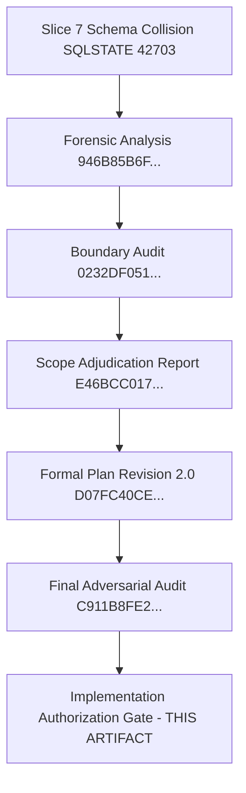

# CANDIDATE-26-01 IMPLEMENTATION AUTHORIZATION GATE
## Vendor Registry, Asset Inventory & Annual Maintenance Contract (AMC) Management System
### Revision 2.0 — Pre-Implementation Governance & Authorization Specification

```
================================================================================
EXECUTION MODE:              PLAN ONLY / READ-ONLY AUTHORIZATION GATE
TARGET REPOSITORY:           D:\Clients Applications\SU Society App
TARGET SUPABASE PROJECT:     fsegpxqoozxmicxcxjun
CANDIDATE:                   CANDIDATE-26-01
CANDIDATE NAME:              Vendor Registry, Asset Inventory & AMC Management System
CURRENT BASELINE:            1040 / 1040 PASS (Slices 1–25 Immutable & Locked)
AUDITED FORMAL PLAN:         CANDIDATE-26-01_FORMAL_REMEDIATION_PLAN_REVISION_2.md
PLAN SHA-256:                D07FC40CE4A5DE5BDF75EF0BA750161586297654E112B05BCC8CF17F01FD04CF
FINAL ADVERSARIAL AUDIT:     CANDIDATE-26-01_FINAL_ADVERSARIAL_REMEDIATION_AUDIT_REVISION_2.md
AUDIT SHA-256:               C911B8FE260F5C4A98059716D0937AC1A1FA624C8A835479678C1634BFF63C32
ADJUDICATION SHA-256:        E46BCC017CD5F4A63D25F1C1E92C758905F056A7C0ED4B53B9A934F2FA2D3AB7
TARGET MIGRATION FILE:       supabase/migrations/20260916000026_candidate26_remediation.sql
CURRENT MIGRATION HASH:      657B4A048562F4A111B8019B9406CFEFFAE2FBEF2BAA7C12205958A7E9E438AE
GATE CLASSIFICATION:         A — IMPLEMENTATION AUTHORIZATION GATE COMPLETE — AWAITING EXPLICIT HUMAN AUTHORIZATION
REMOTE DATABASE MUTATION:    ZERO REMOTE MUTATION (Read-Only Gate)
IMPLEMENTATION AUTHORIZATION: NOT GRANTED (Awaiting Separate Human Command)
DEPLOYMENT AUTHORIZATION:     NOT GRANTED
FINAL SECURITY LOCK:         NOT PERFORMED
================================================================================
```

---

## 1. EXECUTIVE GOVERNANCE STATUS

This document establishes the **FORMAL IMPLEMENTATION AUTHORIZATION GATE** for `CANDIDATE-26-01` under Revision 2.0.

The purpose of this gate is to convert the already-audited Revision 2.0 Remediation Plan (`D07FC40CE4A5DE5BDF75EF0BA750161586297654E112B05BCC8CF17F01FD04CF`) and Final Adversarial Audit (`C911B8FE260F5C4A98059716D0937AC1A1FA624C8A835479678C1634BFF63C32`) into a precise, non-executable authorization boundary.

**NO CODE CHANGES OR SQL EXECUTIONS HAVE BEEN PERFORMED.** Implementation is blocked until an explicit human authorization response is received following the review of this artifact.

---

## 2. CURRENT LOCKED BASELINE

- **Baseline Status:** `1040 / 1040 PASS`
- **Locked Slices:** Slices 1–25 are **100% IMMUTABLE & BYTE-IDENTICAL**.
- **Historical Scope:** Migrations `20260912000001_slice1.sql` through `20260912000025_slice25.sql` MUST NOT be modified under any circumstances.

---

## 3. EVIDENCE CHAIN



---

## 4. FORMAL PLAN & ADVERSARIAL AUDIT VERIFICATION

- **Formal Plan:** `CANDIDATE-26-01_FORMAL_REMEDIATION_PLAN_REVISION_2.md`
  - SHA-256: `D07FC40CE4A5DE5BDF75EF0BA750161586297654E112B05BCC8CF17F01FD04CF`
- **Adversarial Audit:** `CANDIDATE-26-01_FINAL_ADVERSARIAL_REMEDIATION_AUDIT_REVISION_2.md`
  - SHA-256: `C911B8FE260F5C4A98059716D0937AC1A1FA624C8A835479678C1634BFF63C32`
- **Audit Verdict:** `A — FINAL ADVERSARIAL AUDIT PASSED — PLAN READY FOR SEPARATE HUMAN IMPLEMENTATION AUTHORIZATION`.

---

## 5. AUTHORIZED ARCHITECTURE & INVARIANTS

Candidate 26-01 implementation **MUST EXTEND** the existing Slice-7 model.

1. **Canonical Tables:** `public.assets`, `public.vendors`, `public.asset_amc`.
2. **Canonical Name Columns:** `public.assets.name` and `public.vendors.name`.
3. **Canonical Asset Statuses:** `active`, `maintenance`, `retired`.
4. **Strictly Forbidden:**
   - Creating `public.asset_amcs` (plural)
   - Creating parallel vendor/asset tables
   - Introducing `asset_name` or `vendor_name`
   - Introducing default status `'operational'`
   - Modifying locked migrations 1–25

---

## 6. FIVE AUTHORIZED FINDINGS

Implementation is strictly restricted to the following five authorized findings:

| Finding ID | Adjudicated Target | Authorized Implementation Scope |
| :--- | :--- | :--- |
| **FND-26-01-01** | `public.asset_maintenance_logs` | Add `society_id UUID NOT NULL REFERENCES public.societies(id)` & RLS isolation policy. |
| **FND-26-01-02** | `public.asset_amc` | Concurrency row-locking (`SELECT ... FOR UPDATE`) in `renew_amc()` RPC. |
| **FND-26-01-03** | `public.expense_vouchers` | Verify `vendor_id` FK (`ON DELETE SET NULL`) & active vendor society check in RPC. |
| **FND-26-01-04** | `public.asset_maintenance_logs` | Append-only mutation prevention trigger & atomic dual-write RPC (`log_asset_service`) to `public.audit_logs`. |
| **FND-26-01-05** | `public.assets` | Add `asset_code`, `purchase_cost`, `serial_number`; execute legacy backfill; enforce `NOT NULL UNIQUE (society_id, asset_code)`; add uppercase normalization trigger. |

---

## 7. EXPLICIT EXCLUDED SCOPE

The future implementation **MUST NOT** include:
- Any new table creation beyond `public.asset_maintenance_logs`.
- Any modification to existing Slice-7 triggers, functions, or status constraints.
- Any modification to Slice-21 security gate structures (`public.society_assets`, `public.amc_vendor_contracts`).
- Any unrelated feature development or schema refactoring.

---

## 8. FROZEN ASSET_CODE IMPLEMENTATION RULE

- **Deterministic Rule:** `'AST-' || UPPER(SUBSTRING(id::text FROM 1 FOR 8))`
- **Target Rows:** Strictly `WHERE asset_code IS NULL`.
- **Pre-existing Code Preservation:** Existing non-null `asset_code` values MUST NOT be modified or overwritten.
- **Constraint Sequence:** Column addition -> Backfill -> Pre-constraint validation -> `NOT NULL` & `UNIQUE (society_id, asset_code)` enforcement.
- **Strict Prohibition:** Improvised asset code algorithms or silent overwrites are forbidden.

---

## 9. MIGRATION-FILE HANDLING DECISION

- **Target Migration File:** `supabase/migrations/20260916000026_candidate26_remediation.sql`
- **Current SHA-256:** `657B4A048562F4A111B8019B9406CFEFFAE2FBEF2BAA7C12205958A7E9E438AE`
- **Handling Strategy:** The migration file will be **revised in place** under the exact same filename once human authorization is received. No new migration version number is authorized.

---

## 10. READ-ONLY PRE-IMPLEMENTATION CHECKS

The following read-only checks were verified prior to creating this gate:
1. Migration file hash confirmed: `657B4A048562F4A111B8019B9406CFEFFAE2FBEF2BAA7C12205958A7E9E438AE`.
2. Locked baseline verified: `1040 / 1040 PASS`.
3. Historical migrations 1–25 verified: **100% Byte-Identical**.

---

## 11. IMPLEMENTATION STOP CONDITIONS

Future implementation MUST halt immediately and issue a Blocker Report if:
- Pre-existing duplicate `asset_code` values are detected.
- Any legacy non-null `asset_code` would be overwritten.
- A locked migration file (Slices 1–25) is required to be edited.
- Schema state differs from Slice-7 specifications.
- Any unauthorized database mutation occurs.

---

## 12. MANDATORY POST-IMPLEMENTATION VERIFICATION SEQUENCE

```
1. Local Migration Implementation (Rewrite 20260916000026_candidate26_remediation.sql)
2. SHA-256 Computation of Implemented Migration
3. Local Forensic Schema & DDL Verification
4. Security & Multi-Tenant RLS Verification
5. RPC Privilege Hardening Verification
6. Append-Only Trigger Verification
7. Concurrency FOR UPDATE Locking Verification
8. Dual-Write Audit Atomicity Verification
9. Five-Finding Traceability Verification
10. Post-Implementation Adversarial Security Audit Report
11. SEPARATE HUMAN REMOTE DEPLOYMENT AUTHORIZATION GATE
12. Remote Supabase Database Push (npx supabase db push)
13. SEPARATE HUMAN FINAL SECURITY LOCK GATE
```

---

## 13. EXACT HUMAN AUTHORIZATION STATEMENT

To authorize execution of the implementation stage, the human governance authority must respond with the following explicit statement:

> **"I AUTHORIZE IMPLEMENTATION OF CANDIDATE-26-01 ONLY WITHIN THE EXACT SCOPE OF THE FORMAL REVISED REMEDIATION PLAN REVISION 2.0 AND FINAL ADVERSARIAL AUDIT, SUBJECT TO ALL GOVERNANCE INVARIANTS, STOP CONDITIONS, AND POST-IMPLEMENTATION FORENSIC GATES DEFINED IN THIS AUTHORIZATION ARTIFACT."**

> **"This authorization does NOT authorize remote deployment, migration repair, final security lock, or any modification to locked Slices 1–25."**

---

## 14. FINAL GATE CLASSIFICATION

```
FINAL CLASSIFICATION:
A — IMPLEMENTATION AUTHORIZATION GATE COMPLETE — AWAITING EXPLICIT HUMAN AUTHORIZATION
```

---

## 15. CRYPTOGRAPHIC VERIFICATION METADATA

- **Gate Report Path:** `D:\Clients Applications\SU Society App\CANDIDATE-26-01_IMPLEMENTATION_AUTHORIZATION_GATE_REVISION_2.md`
- **Target Repository:** `D:\Clients Applications\SU Society App`
- **Target Supabase Project:** `fsegpxqoozxmicxcxjun`
- **Plan SHA-256:** `D07FC40CE4A5DE5BDF75EF0BA750161586297654E112B05BCC8CF17F01FD04CF`
- **Audit SHA-256:** `C911B8FE260F5C4A98059716D0937AC1A1FA624C8A835479678C1634BFF63C32`
- **Adjudication SHA-256:** `E46BCC017CD5F4A63D25F1C1E92C758905F056A7C0ED4B53B9A934F2FA2D3AB7`
- **Authoritative Baseline Status:** `1040 / 1040 PASS` (Preserved intact)

---
**End of Gate Artifact:** `CANDIDATE-26-01_IMPLEMENTATION_AUTHORIZATION_GATE_REVISION_2.md`
