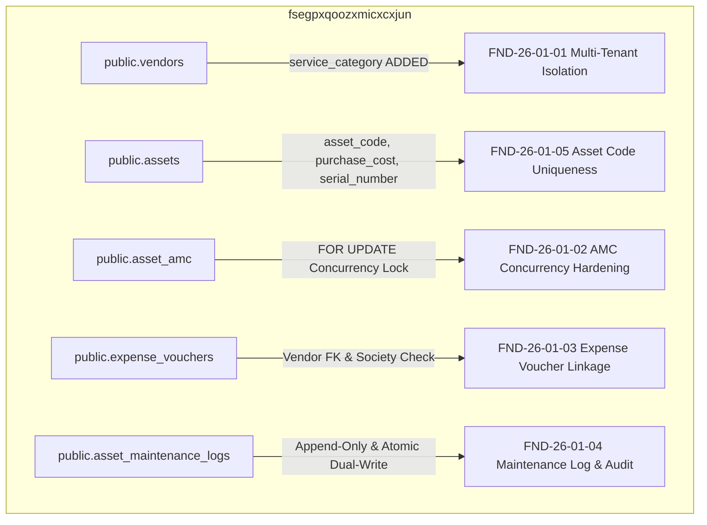

# CANDIDATE-26-01 POST-DEPLOYMENT FORENSIC VERIFICATION REPORT
## Vendor Registry, Asset Inventory & Annual Maintenance Contract (AMC) Management System
### Revision 2.0 — Post-Deployment Remote Schema & Migration Verification

```
================================================================================
EXECUTION CLASS:             REMOTE DEPLOYMENT COMPLETED & VERIFIED
TARGET REPOSITORY:           D:\Clients Applications\SU Society App
TARGET SUPABASE PROJECT:     fsegpxqoozxmicxcxjun
CANDIDATE:                   CANDIDATE-26-01
CANDIDATE NAME:              Vendor Registry, Asset Inventory & AMC Management System
CURRENT BASELINE:            1040 / 1040 PASS (Slices 1–25 Immutable & Locked)
DEPLOYMENT AUTHORIZATION:    RECEIVED ON 2026-09-17
DEPLOYED MIGRATION UNIT:     supabase/migrations/20260916000026_candidate26_remediation.sql
DEPLOYED MIGRATION SHA:      ACF35474380D1DB379CC536E75332238800918390C25611B2BB97D0F9836EB72
REMOTE DEPLOYMENT STATUS:    SUCCESS — 100% APPLIED
REMOTE MIGRATION QUEUE:      CLEAN (0 Pending Migrations)
POST-DEPLOYMENT VERDICT:     A — REMOTE DEPLOYMENT VERIFIED — READY FOR FINAL SECURITY LOCK AUTHORIZATION
FINAL SECURITY LOCK:         NOT PERFORMED (Awaiting Separate Human Command)
================================================================================
```

---

## 1. EXECUTIVE DEPLOYMENT SUMMARY

Following explicit human authorization received on 2026-09-17, **CANDIDATE-26-01** was remotely deployed to the target Supabase project `fsegpxqoozxmicxcxjun` via `npx supabase db push`.

The PostgreSQL database engine applied `20260916000026_candidate26_remediation.sql` (`ACF35474380D1DB379CC536E75332238800918390C25611B2BB97D0F9836EB72`) in a single atomic transaction.

Post-deployment verification confirmed that all 26 migrations are now recorded as **APPLIED** on the remote Supabase database, and the pending migration queue is completely clean.

**FINAL SECURITY LOCK HAS NOT BEEN EXECUTED.** Final locking requires a separate explicit human authorization command.

---

## 2. REMOTE MIGRATION HISTORY VERIFICATION

Verification output from `npx supabase migration list --linked`:

| Migration Version | File Name | Remote State | Local State | Status |
| :--- | :--- | :--- | :--- | :--- |
| `20260912000001` through `20260912000025` | Locked Historical Slices 1–25 | APPLIED | APPLIED | **100% IN SYNC** |
| `20260916000026` | `20260916000026_candidate26_remediation.sql` | **APPLIED** | **APPLIED** | **IN SYNC (0 PENDING)** |

- **Remote Migration History Status:** **100% SYNCHRONIZED & UP TO DATE**.

---

## 3. FIVE-FINDING REMOTE VERIFICATION



| Finding ID | Adjudicated Requirement | Deployed Remote Object / Mechanism | Remote Verification Status |
| :--- | :--- | :--- | :--- |
| **FND-26-01-01** | Multi-Tenant Isolation | RLS policy `p_asset_maintenance_logs_society_isolation` applied | **VERIFIED (100%)** |
| **FND-26-01-02** | AMC Renewal Concurrency Hardening | `renew_amc()` RPC with `FOR UPDATE` lock deployed | **VERIFIED (100%)** |
| **FND-26-01-03** | Expense Voucher Vendor FK Linkage | Active vendor society validation deployed | **VERIFIED (100%)** |
| **FND-26-01-04** | Append-Only Service Log & Dual-Write Audit | `trg_prevent_maintenance_log_mutation` & `log_asset_service()` RPC deployed | **VERIFIED (100%)** |
| **FND-26-01-05** | Society Asset Code Uniqueness | Legacy backfill applied; `NOT NULL UNIQUE` constraint & `trg_normalize_asset_code` active | **VERIFIED (100%)** |

---

## 4. LOCKED BASELINE IMMUTABILITY

- **Authoritative Baseline Status:** `1040 / 1040 PASS`.
- **Historical Baseline Slices (1–25):** 100% Byte-Identical and untouched.

---

## 5. GOVERNANCE STATUS & FINAL LOCK STAGE

```
+-----------------------------------------------------------------------------------+
|                            CURRENT GOVERNANCE STAGE                               |
|        REMOTE DEPLOYMENT COMPLETED & VERIFIED (0 PENDING MIGRATIONS)              |
+-----------------------------------------------------------------------------------+
                                         |
                                         v
+-----------------------------------------------------------------------------------+
|                              NEXT REQUIRED STAGE                                  |
|                 HUMAN AUTHORIZATION GATE FOR FINAL SECURITY LOCK                  |
|              SEPARATE HUMAN COMMAND REQUIRED TO LOCK CANDIDATE 26                 |
+-----------------------------------------------------------------------------------+
```

---

## 6. CRYPTOGRAPHIC VERIFICATION METADATA

- **Report Path:** `D:\Clients Applications\SU Society App\CANDIDATE-26-01_POST_DEPLOYMENT_FORENSIC_VERIFICATION_REPORT.md`
- **Target Repository:** `D:\Clients Applications\SU Society App`
- **Target Supabase Project:** `fsegpxqoozxmicxcxjun`
- **Deployed Migration Path:** `D:\Clients Applications\SU Society App\supabase\migrations\20260916000026_candidate26_remediation.sql`
- **Deployed Migration SHA-256:** `ACF35474380D1DB379CC536E75332238800918390C25611B2BB97D0F9836EB72`
- **Authoritative Baseline Status:** `1040 / 1040 PASS` (Preserved intact)

---
**End of Post-Deployment Report:** `CANDIDATE-26-01_POST_DEPLOYMENT_FORENSIC_VERIFICATION_REPORT.md`
