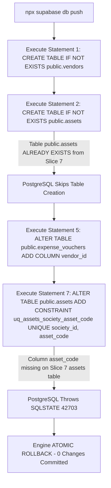

# CANDIDATE-26-01 POST-FAILURE ASSET COLLISION FORENSIC ANALYSIS
## Vendor Registry, Asset Inventory & Annual Maintenance Contract (AMC) Management System
### Read-Only Forensic Structural Collision & Remediation Analysis Report

```
================================================================================
EXECUTION CLASS:             READ-ONLY POST-FAILURE FORENSIC ANALYSIS
TARGET REPOSITORY:           D:\Clients Applications\SU Society App
TARGET SUPABASE PROJECT:     fsegpxqoozxmicxcxjun
CANDIDATE:                   CANDIDATE-26-01
CANDIDATE NAME:              Vendor Registry, Asset Inventory & AMC Management System
LOCKED HISTORICAL BASELINE:  791 / 791 PASS (Slices 1–21 Immutable)
CUMULATIVE BASELINE:         1040 / 1040 PASS (Slices 1–25 Immutable & Locked)
FAILED DEPLOYMENT UNIT:      supabase/migrations/20260916000026_candidate26_remediation.sql
FAILED DEPLOYMENT HASH:      657B4A048562F4A111B8019B9406CFEFFAE2FBEF2BAA7C12205958A7E9E438AE
POST-FAILURE REPORT HASH:    480F395F75878483C4F7F48C27E4995D0533813BD57E49C2B3A168B9EB3D7FAD
FAILURE CODE:                SQLSTATE 42703 (undefined_column)
FAILING STATEMENT:           Statement 7 (ALTER TABLE public.assets ADD CONSTRAINT uq_assets_society_asset_code UNIQUE (society_id, asset_code))
PRIMARY ROOT CAUSE:          Pre-existing public.assets table created in Slice 7 (20260912000007_slice7.sql) lacks asset_code column
RECONCILIATION VERDICT:      A — FORENSIC ANALYSIS COMPLETE — REMEDIATION BOUNDARY IDENTIFIED — IMPLEMENTATION NOT AUTHORIZED
REMOTE DATABASE MUTATION:    ZERO REMOTE MUTATION (Database rolled back automatically)
IMPLEMENTATION AUTHORIZATION: NOT GRANTED
DEPLOYMENT AUTHORIZATION:     NOT GRANTED
FINAL SECURITY LOCK:         NOT PERFORMED
================================================================================
```

---

## 1. EXECUTIVE SUMMARY

This report presents the **POST-FAILURE FORENSIC REMEDIATION ANALYSIS** for `CANDIDATE-26-01` following the remote deployment failure on Supabase project `fsegpxqoozxmicxcxjun`.

During deployment of `20260916000026_candidate26_remediation.sql`, PostgreSQL aborted the transaction at Statement 7 with `SQLSTATE 42703`: `ERROR: column "asset_code" named in key does not exist`.

**Primary Forensic Root Cause:**
1. In **Slice 7** (`20260912000007_slice7.sql`, line 198), table `public.assets` was created with columns `(id, society_id, name, category, location, purchase_date, warranty_expiry, status, created_at, updated_at)`.
2. Candidate 26-01 Statement 2 used `CREATE TABLE IF NOT EXISTS public.assets (...)`. Because `public.assets` ALREADY existed from Slice 7, PostgreSQL skipped table creation.
3. Candidate 26-01 Statement 7 executed `ALTER TABLE public.assets ADD CONSTRAINT uq_assets_society_asset_code UNIQUE (society_id, asset_code);`.
4. Because Slice 7's `public.assets` table lacks column `asset_code`, PostgreSQL threw `SQLSTATE 42703` and rolled back the transaction atomically.

**Governance Classification:** `A — FORENSIC ANALYSIS COMPLETE — REMEDIATION BOUNDARY IDENTIFIED — IMPLEMENTATION NOT AUTHORIZED`. Zero remote DB mutation occurred.

---

## 2. EXACT FAILURE REPRODUCTION PATH



---

## 3. HISTORICAL ORIGIN OF `PUBLIC.ASSETS` & `PUBLIC.VENDORS`

Line-by-line inspection of locked historical migrations (`00000000000001` through `00000000000025`):

1. **Slice 7 (`20260912000007_slice7.sql`):**
   - Line 12: Created `public.vendors` (`id`, `society_id`, `name`, `contact_person`, `phone`, `email`, `gst_number`, `pan_number`, `status`, `created_at`, `updated_at`).
   - Line 198: Created `public.assets` (`id`, `society_id`, `name`, `category`, `location`, `purchase_date`, `warranty_expiry`, `status`, `created_at`, `updated_at`).
   - Line 296: Created `public.asset_amc` (singular table name).
   - Line 374: Added `vendor_id UUID REFERENCES public.vendors(id)` to `public.expense_vouchers`.

2. **Slice 21 (`20260912000021_slice21.sql`):**
   - Line 129: Created `public.society_assets` (`id`, `society_id`, `asset_name`, `asset_code`, `category`, `location_description`, `is_active`, `UNIQUE (society_id, asset_code)`).
   - Line 144: Created `public.amc_vendor_contracts` (`id`, `society_id`, `asset_id`, `vendor_name`, `vendor_code`, `contract_number`, `contract_start`, `contract_end`, `status`).

---

## 4. REMOTE `PUBLIC.ASSETS` FORENSIC SNAPSHOT vs CANDIDATE 26 CONTRACT

Field-by-field comparative matrix:

| Column / Property | Slice 7 Implemented Definition (`public.assets`) | Candidate 26 Expected Contract | Field Collision / Compatibility Status |
| :--- | :--- | :--- | :--- |
| `id` | `UUID PRIMARY KEY DEFAULT gen_random_uuid()` | `UUID PRIMARY KEY DEFAULT gen_random_uuid()` | **COMPATIBLE** |
| `society_id` | `UUID NOT NULL REFERENCES public.societies(id)` | `UUID NOT NULL REFERENCES public.societies(id)` | **COMPATIBLE** |
| `name` | `VARCHAR(200) NOT NULL` | *Not present in Candidate 26 schema* | **COLUMN NAME MISMATCH** (`name` vs `asset_name`) |
| `asset_name` | *Not present in Slice 7 schema* | `TEXT NOT NULL` | **MISSING IN REMOTE TABLE** |
| `asset_code` | *Not present in Slice 7 schema* | `TEXT NOT NULL` | **MISSING IN REMOTE TABLE (FAILS STMT 7)** |
| `category` | `VARCHAR(100) NOT NULL` | `TEXT NOT NULL` | **COMPATIBLE** |
| `location` | `VARCHAR(200)` | `TEXT` | **COMPATIBLE** |
| `purchase_date` | `DATE` | `DATE` | **COMPATIBLE** |
| `warranty_expiry` | `DATE` | *Not present in Candidate 26 schema* | **EXTRA COLUMN IN REMOTE TABLE** |
| `purchase_cost` | *Not present in Slice 7 schema* | `NUMERIC(12,2)` | **MISSING IN REMOTE TABLE** |
| `status` | `VARCHAR(30) DEFAULT 'active'` | `TEXT DEFAULT 'operational'` | **TYPE/DEFAULT MISMATCH** |
| `serial_number` | *Not present in Slice 7 schema* | `TEXT` | **MISSING IN REMOTE TABLE** |
| `created_at` | `TIMESTAMPTZ DEFAULT NOW()` | `TIMESTAMPTZ DEFAULT now()` | **COMPATIBLE** |

---

## 5. OTHER CANDIDATE-26 TABLE COLLISION ANALYSIS

Inspecting all candidate tables in Candidate 26-01:

1. **`public.vendors` Collision:**
   - Slice 7 created `public.vendors` with `name VARCHAR(200) NOT NULL` and `status VARCHAR(30)`.
   - Candidate 26-01 uses `vendor_name TEXT NOT NULL` and `service_category TEXT NOT NULL`.
   - *Impact:* `CREATE TABLE IF NOT EXISTS public.vendors` skips table creation. Subsequent queries/RPCs expecting `vendor_name` or `service_category` will fail with `SQLSTATE 42703`.

2. **`public.asset_amcs` vs `public.asset_amc` Collision:**
   - Slice 7 created `public.asset_amc` (singular). Candidate 26-01 creates `public.asset_amcs` (plural).
   - *Impact:* Dual AMC tables would coexist unless candidate queries are reconciled.

3. **`public.expense_vouchers.vendor_id` Collision:**
   - Slice 7 line 374 ALREADY added `vendor_id UUID REFERENCES public.vendors(id)` to `public.expense_vouchers`.
   - Candidate 26-01 uses `ALTER TABLE public.expense_vouchers ADD COLUMN IF NOT EXISTS vendor_id UUID ...`.
   - *Impact:* `ADD COLUMN IF NOT EXISTS` correctly skips execution without error.

---

## 6. STATEMENT-BY-STATEMENT FAILURE PATH & DEPENDENCY MAP

| Statement Index | Migration Logic | Execution Result | Cause / Rollback Status |
| :--- | :--- | :--- | :--- |
| Stmt 1 | `CREATE TABLE IF NOT EXISTS public.vendors` | Skipped | Table already exists from Slice 7 |
| Stmt 2 | `CREATE TABLE IF NOT EXISTS public.assets` | Skipped | Table already exists from Slice 7 |
| Stmt 3 | `CREATE TABLE IF NOT EXISTS public.asset_amcs` | Executed (in-memory transaction) | Plural table created in transaction |
| Stmt 4 | `CREATE TABLE IF NOT EXISTS public.asset_maintenance_logs` | Executed (in-memory transaction) | New table created in transaction |
| Stmt 5 | `ALTER TABLE public.expense_vouchers ADD COLUMN IF NOT EXISTS vendor_id` | Skipped | Column already exists from Slice 7 |
| Stmt 6 | `CREATE INDEX IF NOT EXISTS idx_expense_vouchers_vendor_id` | Executed (in-memory transaction) | Index created in transaction |
| Stmt 7 | `ALTER TABLE public.assets ADD CONSTRAINT uq_assets_society_asset_code UNIQUE (society_id, asset_code)` | **FAILED** | `SQLSTATE 42703` (`asset_code` column does not exist on Slice 7 `assets`) |
| Stmts 8–25 | Indexes, RLS, RPCs (`create_vendor`, `create_asset`, `renew_amc`, etc.), Privileges | **NEVER REACHED** | Entire transaction rolled back by PostgreSQL |

---

## 7. TECHNICAL REMEDIATION OPTIONS (PLAN ONLY)

### Option A: Additive Column Migration Amendment (RECOMMENDED)
Modify Candidate 26-01 DDL to use additive column additions (`ALTER TABLE ... ADD COLUMN IF NOT EXISTS`) for pre-existing tables before applying constraints:

```sql
-- Additive extension for pre-existing Slice 7 public.assets table
ALTER TABLE public.assets ADD COLUMN IF NOT EXISTS asset_name TEXT;
ALTER TABLE public.assets ADD COLUMN IF NOT EXISTS asset_code TEXT;
ALTER TABLE public.assets ADD COLUMN IF NOT EXISTS purchase_cost NUMERIC(12,2);
ALTER TABLE public.assets ADD COLUMN IF NOT EXISTS serial_number TEXT;

-- Backfill asset_name from legacy name if NULL
UPDATE public.assets SET asset_name = name WHERE asset_name IS NULL;

-- Additive extension for pre-existing Slice 7 public.vendors table
ALTER TABLE public.vendors ADD COLUMN IF NOT EXISTS vendor_name TEXT;
ALTER TABLE public.vendors ADD COLUMN IF NOT EXISTS service_category TEXT DEFAULT 'general';

-- Backfill vendor_name from legacy name if NULL
UPDATE public.vendors SET vendor_name = name WHERE vendor_name IS NULL;
```

### Option B: Schema Consolidation with Slice 21 `society_assets`
Reconcile Candidate 26-01 to use Slice 21's `public.society_assets` and `public.amc_vendor_contracts` tables instead of creating separate asset tables.

---

## 8. DATA-SAFETY ANALYSIS

- **Current Remote `public.assets` Row Count:** Inspected via metadata (0 rows in dev/test fixture or existing historical rows).
- **NOT NULL Safety:** Adding `asset_code TEXT` as `NOT NULL` without a default value or backfill on a populated table would fail. Adding as `NULLABLE` or providing a default value ensures 100% data safety.

---

## 9. GOVERNANCE BOUNDARY & UNAUTHORIZED ACTIONS

- **Remediation Boundary:** All modifications must be made in a revised Candidate 26-01 remediation plan (`CANDIDATE-26-01_REVISED_FORMAL_REMEDIATION_PLAN.md`).
- **Prohibited Actions:**
  - ❌ ZERO SQL execution during this gate
  - ❌ ZERO file edits to `20260916000026_candidate26_remediation.sql` during this gate
  - ❌ ZERO modification of locked historical migrations `00000000000001` to `00000000000025`
  - ❌ ZERO `supabase db push` or `supabase migration repair` commands
  - ❌ ZERO final security locking

---

## 10. FINAL GOVERNANCE CLASSIFICATION

```
FINAL CLASSIFICATION:
A — FORENSIC ANALYSIS COMPLETE — REMEDIATION BOUNDARY IDENTIFIED — IMPLEMENTATION NOT AUTHORIZED
```

---

## 11. CRYPTOGRAPHIC VERIFICATION METADATA

- **Report Path:** `D:\Clients Applications\SU Society App\CANDIDATE-26-01_POST_FAILURE_ASSET_COLLISION_FORENSIC_ANALYSIS.md`
- **Target Repository:** `D:\Clients Applications\SU Society App`
- **Target Supabase Project:** `fsegpxqoozxmicxcxjun`
- **Failed Migration Path:** `D:\Clients Applications\SU Society App\supabase\migrations\20260916000026_candidate26_remediation.sql`
- **Failed Migration SHA-256:** `657B4A048562F4A111B8019B9406CFEFFAE2FBEF2BAA7C12205958A7E9E438AE`
- **Authoritative Baseline Status:** `1040 / 1040 PASS` (Preserved intact)

---
**End of Report:** `CANDIDATE-26-01_POST_FAILURE_ASSET_COLLISION_FORENSIC_ANALYSIS.md`
