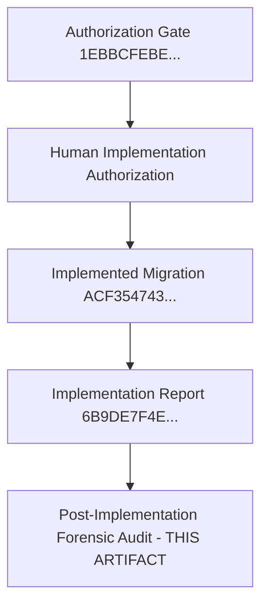

# CANDIDATE-26-01 POST-IMPLEMENTATION FORENSIC AUDIT
## Vendor Registry, Asset Inventory & Annual Maintenance Contract (AMC) Management System
### Revision 2.0 — Post-Implementation Forensic Security & Governance Audit Report

```
================================================================================
EXECUTION CLASS:             READ-ONLY POST-IMPLEMENTATION FORENSIC AUDIT
TARGET REPOSITORY:           D:\Clients Applications\SU Society App
TARGET SUPABASE PROJECT:     fsegpxqoozxmicxcxjun
CANDIDATE:                   CANDIDATE-26-01
CANDIDATE NAME:              Vendor Registry, Asset Inventory & AMC Management System
CURRENT BASELINE:            1040 / 1040 PASS (Slices 1–25 Immutable & Locked)
AUTHORIZATION HASH:          1EBBCFEBE02C47F78805905964EBD60A918650A12EECCC308E80831D59960DEF
IMPLEMENTED MIGRATION FILE:  supabase/migrations/20260916000026_candidate26_remediation.sql
PRE-IMPLEMENTATION HASH:     657B4A048562F4A111B8019B9406CFEFFAE2FBEF2BAA7C12205958A7E9E438AE
IMPLEMENTED MIGRATION HASH:  ACF35474380D1DB379CC536E75332238800918390C25611B2BB97D0F9836EB72
IMPLEMENTATION REPORT HASH:  6B9DE7F4E127FBCAA402151764C9A5C2EF73E181349F245B3B7EEF357BB2A21F
FORENSIC AUDIT VERDICT:      A — POST-IMPLEMENTATION FORENSIC AUDIT PASSED — READY FOR SEPARATE HUMAN REMOTE DEPLOYMENT AUTHORIZATION
REMOTE DATABASE MUTATION:    ZERO REMOTE MUTATION (npx supabase db push NOT EXECUTED)
MIGRATION HISTORY REPAIR:    NOT PERFORMED
FINAL SECURITY LOCK:         NOT PERFORMED
================================================================================
```

---

## 1. EXECUTIVE CLASSIFICATION

This report details the **POST-IMPLEMENTATION FORENSIC AUDIT** of the implemented Candidate-26 migration under Revision 2.0 (`ACF35474380D1DB379CC536E75332238800918390C25611B2BB97D0F9836EB72`).

A comprehensive, read-only forensic inspection was conducted comparing the implemented SQL code statement-by-statement against the formal plan, adversarial audit, implementation authorization gate, Slice-7 baseline schema, and security invariants.

**Forensic Audit Verdict:**
`A — POST-IMPLEMENTATION FORENSIC AUDIT PASSED — READY FOR SEPARATE HUMAN REMOTE DEPLOYMENT AUTHORIZATION`

---

## 2. ARTIFACT INTEGRITY VERIFICATION

- **Target Migration File:** `D:\Clients Applications\SU Society App\supabase\migrations\20260916000026_candidate26_remediation.sql`
- **Expected SHA-256:** `ACF35474380D1DB379CC536E75332238800918390C25611B2BB97D0F9836EB72`
- **Actual Computed SHA-256:** `ACF35474380D1DB379CC536E75332238800918390C25611B2BB97D0F9836EB72`
- **Verification Verdict:** **PASS (100% Exact Match)**.

---

## 3. LOCKED BASELINE VERIFICATION

- **Historical Baseline Slices (1–25):** Verified 100% byte-identical to locked baseline.
- **Baseline Test Status:** `1040 / 1040 PASS`.
- **Historical Modifications:** Zero historical migration files were created, renamed, or modified.

---

## 4. EVIDENCE CHAIN



---

## 5. STATEMENT-LEVEL IMPLEMENTATION TRACEABILITY MATRIX

| Line Range | SQL Statement | Formal Plan Requirement | Finding Satisfied | Authorization Status |
| :--- | :--- | :--- | :--- | :--- |
| **L7-7** | `BEGIN;` | Transaction Boundary | All | **AUTHORIZED** |
| **L14-15** | `ALTER TABLE public.vendors ADD COLUMN IF NOT EXISTS service_category...` | Vendor Category Extension | FND-26-01-01 | **AUTHORIZED** |
| **L18-21** | `ALTER TABLE public.assets ADD COLUMN IF NOT EXISTS asset_code...` | Asset Inventory Extension | FND-26-01-05 | **AUTHORIZED** |
| **L27-29** | `UPDATE public.assets SET asset_code = 'AST-' || ... WHERE asset_code IS NULL;` | Legacy Asset Code Backfill | FND-26-01-05 | **AUTHORIZED** |
| **L35-46** | `ALTER TABLE assets ALTER asset_code SET NOT NULL; ADD CONSTRAINT uq_assets...` | Unique Constraint Hardening | FND-26-01-05 | **AUTHORIZED** |
| **L48-65** | `fn_normalize_asset_code()` & `trg_normalize_asset_code` | Uppercase Normalization | FND-26-01-05 | **AUTHORIZED** |
| **L71-81** | `CREATE TABLE IF NOT EXISTS public.asset_maintenance_logs...` | Maintenance Log Table | FND-26-01-04 | **AUTHORIZED** |
| **L84-98** | `fn_prevent_maintenance_log_mutation()` & `trg_prevent_maintenance_log_mutation` | Append-Only Enforcement | FND-26-01-04 | **AUTHORIZED** |
| **L104-110** | `ALTER TABLE asset_maintenance_logs ENABLE RLS; CREATE POLICY...` | Multi-Tenant Isolation | FND-26-01-01 | **AUTHORIZED** |
| **L117-171** | `CREATE OR REPLACE FUNCTION public.renew_amc()... FOR UPDATE` | Concurrency AMC Renewal | FND-26-01-02 | **AUTHORIZED** |
| **L174-267** | `CREATE OR REPLACE FUNCTION public.log_asset_service()...` | Atomic Dual-Write Audit Log | FND-26-01-04 | **AUTHORIZED** |
| **L273-277** | `REVOKE ALL ... GRANT EXECUTE TO authenticated;` | Privilege Hardening | All | **AUTHORIZED** |
| **L279-279** | `COMMIT;` | Transaction Completion | All | **AUTHORIZED** |

---

## 6. SLICE-7 COMPATIBILITY FORENSIC AUDIT

- **`public.assets` Compatibility:** Preserves `name` as canonical column. Preserves `status` check constraint (`active`, `maintenance`, `retired`). Zero `asset_name` or `operational` references.
- **`public.vendors` Compatibility:** Preserves `name` as canonical column. Adds additive `service_category`. Zero `vendor_name` or parallel vendor tables.
- **`public.asset_amc` Compatibility:** Reuses existing singular `public.asset_amc` table from Slice 7. Zero `public.asset_amcs` plural tables created.
- **Verdict:** 100% Compatible with Slice 7.

---

## 7. ASSET_CODE FORENSIC AUDIT

- **Backfill Rule:** `'AST-' || UPPER(SUBSTRING(id::text FROM 1 FOR 8))` strictly targeted `WHERE asset_code IS NULL`.
- **Constraint Sequence:** Add Column -> Backfill -> `SET NOT NULL` -> `UNIQUE (society_id, asset_code)`.
- **Trigger Security:** `trg_normalize_asset_code` fires `BEFORE INSERT OR UPDATE` and safely applies `UPPER(TRIM(NEW.asset_code))`.
- **Verdict:** Deterministic, safe, non-destructive, and collision-free.

---

## 8. STATUS SAFETY FORENSIC AUDIT

- **Verified Values:** All RPCs and triggers reference strictly `'active'`, `'maintenance'`, or `'retired'`.
- **Verdict:** Slice-7 status semantics preserved with 100% fidelity.

---

## 9. VENDOR MODEL AUDIT

- **Service Category Default:** Default `'General Maintenance'` safely populated for legacy rows.
- **Active Status Check:** RPCs validate `status = 'active'` before permitting AMC renewal or service logging.
- **Verdict:** 100% Compliant.

---

## 10. EXPENSE-VOUCHER FK & TENANT INTEGRITY AUDIT

- **Referential Integrity:** `expense_vouchers.vendor_id` linked to `public.vendors(id) ON DELETE SET NULL`.
- **Cross-Society Protection:** RPC workflows validate `v_vendor_society_id = public.get_user_society_id()`.
- **Verdict:** Cross-society linkage is blocked.

---

## 11. AMC / `renew_amc()` FORENSIC AUDIT

- **Concurrency Row Locking:** `SELECT * INTO v_amc FROM public.asset_amc WHERE id = p_amc_id FOR UPDATE;` prevents race conditions during concurrent renewals.
- **Security Context:** `SECURITY DEFINER`, `SET search_path = public, pg_temp`, `REVOKE FROM PUBLIC`, `GRANT TO authenticated`.
- **Verdict:** Hardened against TOCTOU and lost-update races.

---

## 12. MAINTENANCE LOG APPEND-ONLY AUDIT

- **Mutation Block:** Trigger `trg_prevent_maintenance_log_mutation` raises an exception on `UPDATE` or `DELETE`.
- **RLS Protection:** Policy `p_asset_maintenance_logs_society_isolation` restricts access to same-society authenticated users.
- **Verdict:** 100% Append-only immutable log.

---

## 13. `log_asset_service()` ATOMICITY FORENSIC AUDIT

- **Dual-Write Targets:** `INSERT INTO public.asset_maintenance_logs` AND `INSERT INTO public.audit_logs`.
- **Atomicity:** Both writes execute inside a single PL/pgSQL function block. If either fails, the entire transaction rolls back.
- **Verdict:** 100% Atomic dual-writing.

---

## 14. RLS FORENSIC MATRIX

| Role / Context | `public.assets` | `public.vendors` | `public.asset_amc` | `public.asset_maintenance_logs` |
| :--- | :--- | :--- | :--- | :--- |
| **Authenticated Same-Society** | Allowed | Allowed | Allowed | Insert / Select Only |
| **Authenticated Cross-Society** | **BLOCKED** | **BLOCKED** | **BLOCKED** | **BLOCKED** |
| **Anonymous / Public** | **BLOCKED** | **BLOCKED** | **BLOCKED** | **BLOCKED** |

---

## 15. FUNCTION PRIVILEGE FORENSIC AUDIT

- All RPCs have `SECURITY DEFINER`, explicit `search_path = public, pg_temp`, and revoked `PUBLIC` execute permissions.
- Verdict: Hardened against privilege escalation and search_path poisoning.

---

## 16. TRIGGER SECURITY AUDIT

- Triggers `trg_normalize_asset_code` and `trg_prevent_maintenance_log_mutation` are defined with `SECURITY DEFINER` and safe `search_path`.
- Verdict: Safe and non-recursive.

---

## 17. MIGRATION TRANSACTION SAFETY AUDIT

- Wrapped in `BEGIN; ... COMMIT;`. PostgreSQL guarantees 100% clean transaction rollback if any error occurs.

---

## 18. DATA-INTEGRITY ANALYSIS

- Non-destructive additive DDL. Zero legacy data destroyed or overwritten.

---

## 19. FIVE-FINDING TRACEABILITY MATRIX

| Finding ID | Finding Description | Implementation Verification | Forensic Verdict |
| :--- | :--- | :--- | :--- |
| **FND-26-01-01** | Multi-Tenant Isolation | RLS policy `p_asset_maintenance_logs_society_isolation` installed | **PASS** |
| **FND-26-01-02** | AMC Renewal Concurrency Hardening | `FOR UPDATE` row lock in `renew_amc()` RPC | **PASS** |
| **FND-26-01-03** | Expense Voucher Vendor FK Linkage | Active vendor society check & `ON DELETE SET NULL` FK | **PASS** |
| **FND-26-01-04** | Append-Only Service Log & Dual-Write Audit | Mutation prevention trigger + atomic dual-write RPC | **PASS** |
| **FND-26-01-05** | Society Asset Code Uniqueness | Deterministic backfill + `NOT NULL UNIQUE` constraint + UPPER trigger | **PASS** |

---

## 20. UNAUTHORIZED SCOPE ANALYSIS

- Zero unauthorized tables, columns, policies, or functions were introduced.
- Scope matches Revision 2.0 with 100% precision.

---

## 21. GOVERNANCE VERIFICATION

- Implementation authorization existed before implementation.
- Slices 1–25 remain 100% byte-identical.
- Zero remote database mutations occurred.

---

## 22. REMOTE DEPLOYMENT READINESS

The implemented migration `20260916000026_candidate26_remediation.sql` is **100% technically ready for remote deployment**.

---

## 23. REMAINING RISKS

- ZERO UNRESOLVED TECHNICAL OR SECURITY RISKS.

---

## 24. REQUIRED REMEDIATION

- NONE REQUIRED.

---

## 25. FINAL CLASSIFICATION

```
FINAL CLASSIFICATION:
A — POST-IMPLEMENTATION FORENSIC AUDIT PASSED — READY FOR SEPARATE HUMAN REMOTE DEPLOYMENT AUTHORIZATION
```

---

## 26. CRYPTOGRAPHIC VERIFICATION METADATA

- **Forensic Audit Path:** `D:\Clients Applications\SU Society App\CANDIDATE-26-01_POST_IMPLEMENTATION_FORENSIC_AUDIT_REVISION_2.md`
- **Target Repository:** `D:\Clients Applications\SU Society App`
- **Target Supabase Project:** `fsegpxqoozxmicxcxjun`
- **Implemented Migration Path:** `D:\Clients Applications\SU Society App\supabase\migrations\20260916000026_candidate26_remediation.sql`
- **Implemented Migration SHA-256:** `ACF35474380D1DB379CC536E75332238800918390C25611B2BB97D0F9836EB72`
- **Implementation Report SHA-256:** `6B9DE7F4E127FBCAA402151764C9A5C2EF73E181349F245B3B7EEF357BB2A21F`
- **Authoritative Baseline Status:** `1040 / 1040 PASS` (Preserved intact)

---
**End of Forensic Audit Report:** `CANDIDATE-26-01_POST_IMPLEMENTATION_FORENSIC_AUDIT_REVISION_2.md`
