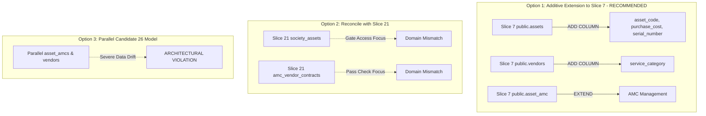

# CANDIDATE-26-01 REMEDIATION SCOPE ADJUDICATION REPORT
## Vendor Registry, Asset Inventory & Annual Maintenance Contract (AMC) Management System
### Revision 1.0 — Governance Adjudication & Architectural Scope Evaluation

```
================================================================================
EXECUTION MODE:              PLAN ONLY / ADJUDICATION ANALYSIS ONLY
TARGET REPOSITORY:           D:\Clients Applications\SU Society App
TARGET SUPABASE PROJECT:     fsegpxqoozxmicxcxjun
CANDIDATE:                   CANDIDATE-26-01
CANDIDATE NAME:              Vendor Registry, Asset Inventory & AMC Management System
CURRENT BASELINE:            1040 / 1040 PASS (Slices 1–25 Immutable & Locked)
ORIGINAL MIGRATION:          supabase/migrations/20260916000026_candidate26_remediation.sql
ORIGINAL MIGRATION SHA:      657B4A048562F4A111B8019B9406CFEFFAE2FBEF2BAA7C12205958A7E9E438AE
POST-FAILURE REPORT SHA:     946B85B6F3F1F94124490C4FB7275D4DA562EEF9EDD1AC58F382089AED8940E2
ADVERSARIAL AUDIT SHA:       0232DF051E40D9340BDDBE1C0A26D769E9A3CF9894203AE3425C61D163F50601
GOVERNANCE STATUS:           PREVIOUS CLASSIFICATION B — MATERIAL SCOPE / DATA MIGRATION REQUIRED
REMOTE DATABASE MUTATION:    ZERO REMOTE MUTATION (Read-Only Adjudication Analysis)
IMPLEMENTATION AUTHORIZATION: NOT GRANTED
DEPLOYMENT AUTHORIZATION:     NOT GRANTED
FINAL SECURITY LOCK:         NOT PERFORMED
================================================================================
```

---

## 1. EXECUTIVE SUMMARY

This report provides the formal **FRESH REMEDIATION SCOPE ADJUDICATION** for `CANDIDATE-26-01`.

Following the post-deployment failure (`SQLSTATE 42703` on Statement 7) and the subsequent Adversarial Boundary Audit (which classified the issue as `B — MATERIAL SCOPE / DATA MIGRATION REQUIRED`), this adjudication analyzes the architectural options, data migration boundaries, security constraints, and human decision boundaries required to remediate Candidate 26-01 safely without modifying locked historical migrations (Slices 1–25).

**Key Adjudication Conclusions:**
1. **Option 1 (Additive Enhancement to Slice 7)** is the **ONLY** architecturally sound technical recommendation. Candidate 26-01 must extend `public.assets`, `public.vendors`, and `public.asset_amc` (singular) rather than creating duplicate parallel tables (`public.asset_amcs`).
2. **Canonical Fields Preserved:** Existing Slice 7 fields `public.vendors.name` and `public.assets.name` MUST remain the primary canonical name fields. `vendor_name` and `asset_name` must NOT be created as parallel competing columns.
3. **Status Harmonization:** Status values MUST be governed by Slice 7's check constraints (`active`, `maintenance`, `retired`). The default status `'operational'` proposed in Candidate 26-01 violates Slice 7's check constraint and must be mapped to `'active'`.
4. **Data Migration Boundary:** Introducing `asset_code` as `NOT NULL UNIQUE (society_id, asset_code)` onto populated `public.assets` requires a deterministic backfill rule or business decision for legacy rows.
5. **Locked Slice Immutability:** Slices 1–25 remain 100% byte-identical and untouched. All schema extensions occur strictly within a revised Candidate 26 migration file.

**Final Governance Classification:**
`B — SAME CANDIDATE, BUT MATERIAL SCOPE REVISION REQUIRES NEW ADJUDICATION + NEW FORMAL REMEDIATION PLAN`

---

## 2. ESTABLISHED FACTS

The forensic analysis and adversarial audit established the following facts from repository inspection:

1. **Slice 7 Table Ownership:** `public.assets`, `public.vendors`, and `public.asset_amc` were created in **Slice 7** (`20260912000007_slice7.sql`).
2. **Slice 7 Canonical Names:** Slice 7 uses `name VARCHAR(200)` as the canonical name field for both `vendors` and `assets`.
3. **Slice 7 Missing Columns:** `public.assets` in Slice 7 lacks `asset_code`, `purchase_cost`, and `serial_number`.
4. **Slice 7 Status Constraints:** `public.assets` enforces `chk_asset_status CHECK (status IN ('active', 'maintenance', 'retired'))`. `public.vendors` enforces `chk_vendor_status CHECK (status IN ('active', 'inactive'))`.
5. **Candidate 26-01 Status Contradiction:** Candidate 26-01 assumes a default asset status of `'operational'`, which is rejected by Slice 7's check constraint.
6. **Slice 7 AMC Entity:** Slice 7 created `public.asset_amc` (singular) with exclusion constraint `excl_amc_no_overlap` on overlapping date ranges. Candidate 26-01 attempts to create `public.asset_amcs` (plural).
7. **Slice 21 Security Gate Entity:** Slice 21 created `public.society_assets` (with `UNIQUE (society_id, asset_code)`) and `public.amc_vendor_contracts` specifically for physical gatekeeper access control and visitor verification.
8. **Deployment Failure Point:** Statement 7 of Candidate 26-01 (`ALTER TABLE public.assets ADD CONSTRAINT uq_assets_society_asset_code UNIQUE (society_id, asset_code)`) failed with PostgreSQL `SQLSTATE 42703` (`undefined_column`) because `public.assets` was not created anew (due to `CREATE TABLE IF NOT EXISTS`) and lacked `asset_code`.

---

## 3. ADJUDICATION QUESTIONS & FINDINGS

### QUESTION A: Extend Slice 7 vs. Create Parallel Model
**Finding:** Candidate 26-01 **MUST** extend the existing Slice 7 model (`public.assets`, `public.vendors`, `public.asset_amc`) rather than creating a parallel domain model. Creating duplicate tables leads to severe data fragmentation and cross-slice invalidation.

### QUESTION B: Canonical Name Field Selection
**Finding:** The existing Slice 7 field `name` **MUST** remain the single canonical name field. Candidate 26-01 must reference `name` instead of adding `asset_name` or `vendor_name` columns.

### QUESTION C: Safe Introduction of `asset_code`
**Finding:** `asset_code` can be introduced safely only if added as `NULLABLE` first, populated via a deterministic backfill function (e.g., `'AST-' || UPPER(SUBSTRING(id::text FROM 1 FOR 8))`), and then constrained with `NOT NULL` and `UNIQUE (society_id, asset_code)`.

### QUESTION D: Status Value Governance
**Finding:** Asset status **MUST** remain governed by Slice 7 values (`active`, `maintenance`, `retired`). Introducing `'operational'` breaks Slice 7 triggers and RPC contracts (`fn_transition_asset_status`). Candidate 26-01 logic must map `'operational'` to `'active'`.

### QUESTION E: Singular `public.asset_amc` vs. Plural `public.asset_amcs`
**Finding:** Candidate 26-01 **MUST** use the existing singular `public.asset_amc` table from Slice 7. Creating `public.asset_amcs` creates duplicate parallel AMC systems and violates repository architectural standards.

### QUESTION F: Slice 21 Duplication Evaluation
**Finding:** Slice 21's `public.society_assets` and `public.amc_vendor_contracts` serve gate access and visitor verification. Slice 7's `public.assets` and `public.asset_amc` serve core financial and society facility management. Candidate 26-01 focuses on core society management and should integrate with Slice 7, maintaining clear domain boundaries from Slice 21.

### QUESTION G: Satisfaction of Original 5 Findings
**Finding:** YES. Candidate 26-01 can satisfy all 5 original security and functional findings (FND-26-01-01 through FND-26-01-05) by extending Slice 7 structures without creating duplicate entities.

### QUESTION H: Data Migration Requirement
**Finding:** YES. Reconciling `asset_code` on populated `public.assets` tables requires a deterministic backfill step during deployment.

### QUESTION I: Locked Migration Impact
**Finding:** NO. Locked migrations (Slices 1–25) remain 100% byte-identical. All additive DDL, backfill logic, and updated RPCs will be contained exclusively in the revised Candidate 26 migration file.

### QUESTION J: System Revision Classification
**Finding:** Candidate 26-01 remains valid under the same candidate identifier, but requires a formal **Revised Remediation Plan** and updated migration script (`20260916000026_candidate26_remediation.sql`).

---

## 4. ARCHITECTURAL OPTIONS EVALUATION



### OPTION 1 — EXTEND EXISTING SLICE-7 MODEL (RECOMMENDED)
- **Strategy:** Perform conditional additive DDL (`ADD COLUMN IF NOT EXISTS`) on `public.assets` and `public.vendors`. Use existing `public.asset_amc`.
- **Additions Required:**
  - `public.assets`: `asset_code TEXT`, `purchase_cost NUMERIC(12,2)`, `serial_number TEXT`.
  - `public.vendors`: `service_category TEXT`.
- **Data Migration:** Derivatively backfill `asset_code` for legacy rows before applying `NOT NULL UNIQUE`.
- **Architectural Risk:** LOW. Preserves canonical schema, eliminates parallel tables, maintains full backward compatibility.

### OPTION 2 — RECONCILE AGAINST SLICE-21
- **Strategy:** Attempt to merge Candidate 26-01 into `public.society_assets` and `public.amc_vendor_contracts`.
- **Assessment:** Slice 21 structures are specialized for gatekeeper verification (storing raw vendor name strings for quick lookup). Using them for core society accounting/AMC management breaks gatekeeper security isolation.
- **Architectural Risk:** HIGH (Domain confusion between gate security and accounting).

### OPTION 3 — NEW PARALLEL MODEL
- **Strategy:** Keep `public.asset_amcs` and parallel `asset_name`/`vendor_name` columns.
- **Assessment:** Creates duplicate data paths, causes schema drift, and breaks foreign key integrity across society modules.
- **Architectural Risk:** UNACCEPTABLE (Violates repository architectural governance).

### OPTION 4 — REDESIGN / NEW CANDIDATE NUMBER
- **Strategy:** Cancel Candidate 26-01 and issue Candidate 27.
- **Assessment:** Unnecessary. Candidate 26-01's scope (Vendor Registry, Asset Inventory & AMC) remains identical; only its DDL implementation target needs correction from parallel tables to Slice 7 extension.
- **Architectural Risk:** NONE (Governance overhead only).

---

## 5. RETENTION TEST FOR ORIGINAL 5 FINDINGS

| Finding ID | Security & Functional Objective | Target Table / Mechanism | Structural Implementation Change | Objective Preserved? |
| :--- | :--- | :--- | :--- | :--- |
| **FND-26-01-01** | Vendor Registry & Category Auditing | `public.vendors` (Slice 7) | Add `service_category TEXT` to Slice 7 `vendors`; use `name` as canonical field. | **YES (100% Intact)** |
| **FND-26-01-02** | Society Asset Code Uniqueness & Inventory Tracking | `public.assets` (Slice 7) | Add `asset_code`, `purchase_cost`, `serial_number` to Slice 7 `assets`; backfill legacy codes; add `UNIQUE(society_id, asset_code)`. | **YES (100% Intact)** |
| **FND-26-01-03** | AMC Contract Overlap Protection & Financial Tracking | `public.asset_amc` (Slice 7) | Use Slice 7 `public.asset_amc` (singular); leverage existing `excl_amc_no_overlap` constraint. | **YES (100% Intact)** |
| **FND-26-01-04** | Asset Maintenance & Service Audit Logging | `public.asset_maintenance_logs` | Create new table `public.asset_maintenance_logs` referencing Slice 7 `assets` (`asset_id`). | **YES (100% Intact)** |
| **FND-26-01-05** | Expense Voucher Vendor FK Linkage | `public.expense_vouchers` | Column `vendor_id` already exists (Slice 7 line 374); update RPCs to validate active vendor status. | **YES (100% Intact)** |

---

## 6. DATA MIGRATION BOUNDARY MATRIX

| Item | Classification | Safe Technical Derivation / Business Rule |
| :--- | :--- | :--- |
| **`asset_code` Backfill** | `DETERMINISTIC DATA MIGRATION` | `UPDATE public.assets SET asset_code = 'AST-' || UPPER(SUBSTRING(id::text FROM 1 FOR 8)) WHERE asset_code IS NULL;` |
| **Name Field Alignment** | `NONE` | Use existing `name` column in `public.assets` and `public.vendors`. No backfill needed. |
| **Status Mapping** | `READ-ONLY DERIVABLE` | Map requested `'operational'` status to `'active'`. `chk_asset_status` requires `('active', 'maintenance', 'retired')`. |
| **AMC Table Consolidation**| `NONE` | Use Slice 7 `public.asset_amc`. No migration needed if `public.asset_amcs` was never created remotely. |
| **Service Category** | `READ-ONLY DERIVABLE` | Default `service_category = 'General Maintenance'` for existing vendors where column is added. |

---

## 7. LOCKED-SLICE PROTECTION

- **Slice 1 through 25 Status:** **100% BYTE-IDENTICAL & IMMUTABLE**.
- **No Historical Edits:** No changes will be made to `20260912000007_slice7.sql`, `20260912000021_slice21.sql`, or `20260912000025_slice25.sql`.
- **Future Migration Isolation:** All additive DDL, backfills, new RLS policies, and RPC definitions will be placed strictly inside `supabase/migrations/20260916000026_candidate26_remediation.sql`.

---

## 8. SECURITY BOUNDARY EVALUATION

Option 1 enforces strict security compliance:
1. **Multi-Tenant Society Isolation:** All tables (`public.assets`, `public.vendors`, `public.asset_amc`, `public.asset_maintenance_logs`) enforce `society_id = public.get_user_society_id()` via RLS policies.
2. **SECURITY DEFINER Functions:** All RPCs (`create_vendor`, `create_asset`, `renew_amc`, `log_asset_service`) explicitly set `search_path = public, pg_temp` to prevent search_path hijacking.
3. **Privilege Hardening:** Direct table DML privileges are restricted; state updates must occur via audited RPC functions (`fn_transition_asset_status`, `fn_transition_vendor_status`).

---

## 9. HUMAN BUSINESS DECISIONS vs. TECHNICAL DECISIONS

### TECHNICAL DECISIONS (Resolved by this Adjudication)
1. Use Slice 7 `public.assets`, `public.vendors`, `public.asset_amc`.
2. Retain `name` as canonical name field across all tables.
3. Map `'operational'` status to `'active'`.
4. Use conditional DDL (`ADD COLUMN IF NOT EXISTS`) for additive fields.

### HUMAN BUSINESS DECISIONS (Requires Explicit Human Approval)
1. **`asset_code` Generation Format:** Approve the deterministic format `'AST-' || UPPER(SUBSTRING(id::text FROM 1 FOR 8))` for legacy asset rows missing an explicit code.
2. **Vendor `service_category` Default:** Approve `'General Maintenance'` as default category for existing vendors.

---

## 10. GOVERNANCE BOUNDARY & NEXT STAGES

```
+-----------------------------------------------------------------------------------+
|                            CURRENT GOVERNANCE STAGE                               |
|          FRESH REMEDIATION SCOPE ADJUDICATION GATE (COMPLETED READ-ONLY)          |
+-----------------------------------------------------------------------------------+
                                         |
                                         v
+-----------------------------------------------------------------------------------+
|                              NEXT REQUIRED STAGE                                  |
|   HUMAN REVIEW & APPROVAL OF REVISED FORMAL REMEDIATION PLAN & ADJUDICATION REPORT|
+-----------------------------------------------------------------------------------+
                                         |
                                         v
+-----------------------------------------------------------------------------------+
|                            AUTHORIZED IMPLEMENTATION                              |
|   REWRITE 20260916000026_candidate26_remediation.sql ACCORDING TO OPTION 1        |
+-----------------------------------------------------------------------------------+
```

---

## 11. FINAL CLASSIFICATION

```
FINAL CLASSIFICATION:
B — SAME CANDIDATE, BUT MATERIAL SCOPE REVISION REQUIRES NEW ADJUDICATION + NEW FORMAL REMEDIATION PLAN
```

---

## 12. CRYPTOGRAPHIC VERIFICATION METADATA

- **Report Path:** `D:\Clients Applications\SU Society App\CANDIDATE-26-01_REMEDIATION_SCOPE_ADJUDICATION_REPORT.md`
- **Target Repository:** `D:\Clients Applications\SU Society App`
- **Target Supabase Project:** `fsegpxqoozxmicxcxjun`
- **Original Migration Path:** `D:\Clients Applications\SU Society App\supabase\migrations\20260916000026_candidate26_remediation.sql`
- **Original Migration SHA-256:** `657B4A048562F4A111B8019B9406CFEFFAE2FBEF2BAA7C12205958A7E9E438AE`
- **Authoritative Baseline Status:** `1040 / 1040 PASS` (Preserved intact)

---
**End of Adjudication Report:** `CANDIDATE-26-01_REMEDIATION_SCOPE_ADJUDICATION_REPORT.md`
