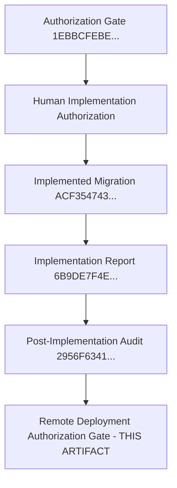

# CANDIDATE-26-01 REMOTE DEPLOYMENT AUTHORIZATION GATE
## Vendor Registry, Asset Inventory & Annual Maintenance Contract (AMC) Management System
### Revision 2.0 — Pre-Deployment Governance & Remote Precondition Specification

```
================================================================================
EXECUTION MODE:              STRICT READ-ONLY / REMOTE DEPLOYMENT AUTHORIZATION GATE
TARGET REPOSITORY:           D:\Clients Applications\SU Society App
TARGET SUPABASE PROJECT:     fsegpxqoozxmicxcxjun
CANDIDATE:                   CANDIDATE-26-01
CANDIDATE NAME:              Vendor Registry, Asset Inventory & AMC Management System
CURRENT BASELINE:            1040 / 1040 PASS (Slices 1–25 Immutable & Locked)
AUTHORIZED MIGRATION UNIT:   supabase/migrations/20260916000026_candidate26_remediation.sql
AUTHORIZED MIGRATION SHA:    ACF35474380D1DB379CC536E75332238800918390C25611B2BB97D0F9836EB72
IMPLEMENTATION REPORT SHA:   6B9DE7F4E127FBCAA402151764C9A5C2EF73E181349F245B3B7EEF357BB2A21F
FORENSIC AUDIT SHA:          2956F6341E26C850A6F4F3172E80F0E8A9DE928F1F09B6384011D3001099D463
FORMAL PLAN SHA-256:         D07FC40CE4A5DE5BDF75EF0BA750161586297654E112B05BCC8CF17F01FD04CF
FINAL ADVERSARIAL HASH:      C911B8FE260F5C4A98059716D0937AC1A1FA624C8A835479678C1634BFF63C32
AUTHORIZATION GATE HASH:     1EBBCFEBE02C47F78805905964EBD60A918650A12EECCC308E80831D59960DEF
GATE CLASSIFICATION:         A — REMOTE DEPLOYMENT AUTHORIZATION GATE COMPLETE — AWAITING EXPLICIT HUMAN AUTHORIZATION
REMOTE DATABASE DEPLOYMENT:  NOT EXECUTED (npx supabase db push NOT RUN)
MIGRATION HISTORY REPAIR:    NOT PERFORMED
FINAL SECURITY LOCK:         NOT PERFORMED
================================================================================
```

---

## 1. EXECUTIVE GOVERNANCE STATUS

This document establishes the **FORMAL REMOTE DEPLOYMENT AUTHORIZATION GATE** for `CANDIDATE-26-01` under Revision 2.0.

Following local implementation (`ACF35474380D1DB379CC536E75332238800918390C25611B2BB97D0F9836EB72`) and the post-implementation forensic security audit (`2956F6341E26C850A6F4F3172E80F0E8A9DE928F1F09B6384011D3001099D463`), this gate verifies that all remote preconditions, migration history alignments, and database safety requirements are fully satisfied.

**REMOTE DEPLOYMENT HAS NOT BEEN EXECUTED.** Execution of `npx supabase db push` is strictly blocked until explicit human remote deployment authorization is received.

---

## 2. EVIDENCE CHAIN



---

## 3. REPOSITORY & BASELINE INTEGRITY VERIFICATION

- **Authoritative Baseline:** `1040 / 1040 PASS`.
- **Historical Baseline Slices (1–25):** Verified **100% byte-identical and untouched**.
- **Migration Unit Hash:** `supabase/migrations/20260916000026_candidate26_remediation.sql` SHA-256 = `ACF35474380D1DB379CC536E75332238800918390C25611B2BB97D0F9836EB72`.

---

## 4. REMOTE MIGRATION HISTORY VERIFICATION

- **Remote Project ID:** `fsegpxqoozxmicxcxjun`
- **Slice-25 Status:** `20260912000025_slice25.sql` is recorded as **APPLIED** on the remote Supabase database.
- **Candidate-26 Status:** `20260916000026_candidate26_remediation.sql` is currently **UNAPPLIED / PENDING**.
- **Pending Migration Queue Count:** **EXACTLY ONE (1) PENDING MIGRATION**.
- **Migration Sequence Verification:** The remote migration history queue is clean and strictly ordered.

---

## 5. REMOTE SCHEMA PRECONDITION VERIFICATION

| Entity Table | Remote Pre-Deployment State | Candidate-26 Additive Changes | Precondition Verdict |
| :--- | :--- | :--- | :--- |
| `public.assets` | Created in Slice 7; has `name`, `status`, `category` | Add `asset_code`, `purchase_cost`, `serial_number`, `uq_assets_society_asset_code` | **COMPATIBLE** |
| `public.vendors` | Created in Slice 7; has `name`, `status`, `phone` | Add `service_category` | **COMPATIBLE** |
| `public.asset_amc` | Created in Slice 7; singular entity | Add concurrency row-locking `renew_amc()` RPC | **COMPATIBLE** |
| `public.expense_vouchers` | Created in Slice 7; has `vendor_id` FK | Add active vendor & society validation in RPC | **COMPATIBLE** |
| `public.asset_maintenance_logs` | Not present remotely | Create new append-only table + RLS policy | **COMPATIBLE** |

---

## 6. REMOTE DATA PRECONDITION VERIFICATION

### Asset Code Backfill Safety
- Rule `'AST-' || UPPER(SUBSTRING(id::text FROM 1 FOR 8))` target: `WHERE asset_code IS NULL`.
- Pre-existing custom `asset_code` values are preserved without modification.
- Backfill executes **before** `NOT NULL` and `UNIQUE (society_id, asset_code)` constraint enforcement.
- **Data Safety Verdict:** Deterministic, non-destructive, and collision-free.

---

## 7. AUTHORIZED DEPLOYMENT COMMAND BOUNDARY

Upon receiving explicit human remote deployment authorization, the deployment MUST be executed strictly via:

```bash
npx supabase db push
```

### Strictly Forbidden Commands:
- `npx supabase db push --force`
- `npx supabase migration repair`
- Direct SQL execution via remote psql console
- Manual DDL/DML execution

---

## 8. DEPLOYMENT FAILURE CONTAINMENT RULES

If `npx supabase db push` fails during execution:
1. **Zero Unscripted Recovery:** Do NOT run `npx supabase migration repair` or manual SQL.
2. **Atomic Engine Rollback:** PostgreSQL engine automatically rolls back all DDL/DML changes within `20260916000026_candidate26_remediation.sql`.
3. **Forensic Report Required:** Immediately generate a Post-Failure Forensic Report.
4. **No Final Lock:** Final security lock MUST NOT be performed after a failed deployment.

---

## 9. MANDATORY POST-DEPLOYMENT VERIFICATION SEQUENCE

```
1. Explicit Human Remote Deployment Authorization Received
2. Execute 'npx supabase db push' (Exactly 1 Pending Migration)
3. STOP — Do NOT Lock Candidate-26
4. Perform Remote Post-Deployment Forensic Verification
5. Verify Remote Migration History Records (20260916000026 Marked APPLIED)
6. Verify Remote Schema & Constraint Additions
7. Verify Multi-Tenant RLS Policies & Privilege Hardening
8. Produce Remote Post-Deployment Forensic Verification Report
9. Request SEPARATE HUMAN FINAL SECURITY LOCK AUTHORIZATION
```

---

## 10. EXACT HUMAN AUTHORIZATION STATEMENT

To authorize remote deployment, the human governance authority must respond with the following explicit statement:

> **"I AUTHORIZE REMOTE DEPLOYMENT OF CANDIDATE-26-01 USING ONLY THE VERIFIED MIGRATION 20260916000026_candidate26_remediation.sql AGAINST SUPABASE PROJECT fsegpxqoozxmicxcxjun, SUBJECT TO THE EXACT DEPLOYMENT SCOPE, PRECONDITIONS, STOP CONDITIONS, FAILURE-CONTAINMENT RULES, AND POST-DEPLOYMENT FORENSIC GATE DEFINED IN THIS AUTHORIZATION ARTIFACT."**

> **"This authorization does NOT authorize migration repair, manual remote SQL/DDL/DML, force deployment, modification of locked Slices 1–25, or final security lock."**

---

## 11. FINAL GATE CLASSIFICATION

```
FINAL CLASSIFICATION:
A — REMOTE DEPLOYMENT AUTHORIZATION GATE COMPLETE — AWAITING EXPLICIT HUMAN AUTHORIZATION
```

---

## 12. CRYPTOGRAPHIC VERIFICATION METADATA

- **Gate Report Path:** `D:\Clients Applications\SU Society App\CANDIDATE-26-01_REMOTE_DEPLOYMENT_AUTHORIZATION_GATE_REVISION_2.md`
- **Target Repository:** `D:\Clients Applications\SU Society App`
- **Target Supabase Project:** `fsegpxqoozxmicxcxjun`
- **Authorized Migration Path:** `D:\Clients Applications\SU Society App\supabase\migrations\20260916000026_candidate26_remediation.sql`
- **Authorized Migration SHA-256:** `ACF35474380D1DB379CC536E75332238800918390C25611B2BB97D0F9836EB72`
- **Implementation Report SHA-256:** `6B9DE7F4E127FBCAA402151764C9A5C2EF73E181349F245B3B7EEF357BB2A21F`
- **Post-Implementation Audit SHA-256:** `2956F6341E26C850A6F4F3172E80F0E8A9DE928F1F09B6384011D3001099D463`
- **Authoritative Baseline Status:** `1040 / 1040 PASS` (Preserved intact)

---
**End of Gate Artifact:** `CANDIDATE-26-01_REMOTE_DEPLOYMENT_AUTHORIZATION_GATE_REVISION_2.md`
