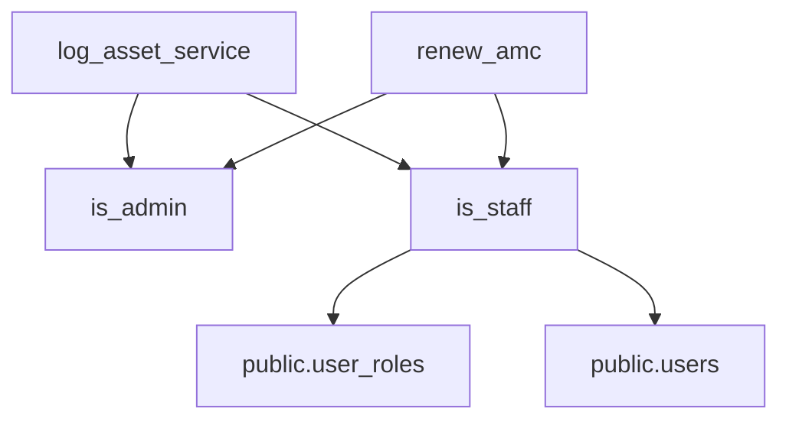

# SU SOCIETY APP — CANDIDATE-27-01
# FORMAL REMEDIATION PLAN: MISSING is_staff() AUTHORIZATION DEPENDENCY
## REVISION 1.0 — GOVERNANCE SPECIFICATION GATE

**Target Repository:** `D:\Clients Applications\SU Society App`  
**Target Production Supabase:** `fsegpxqoozxmicxcxjun` (`https://fsegpxqoozxmicxcxjun.supabase.co`)  
**Production Application:** `https://su-society-app.vercel.app`  
**Authoritative Locked Baseline:** Slices 1–26 = LOCKED / IMMUTABLE  
**Reference Forensic Reports:**
- `CANDIDATE-27-01_FORENSIC_VALIDATION_REPORT_REVISION_1.md` (SHA-256: `3DD2D0D7D21AEECC70E5F17CAD93F21594B56FE166E4F280FB8693A7C34A5743`)
- `CANDIDATE-27-01_RPC_AND_AUTHORIZATION_CONTRACT_RECONCILIATION_REVISION_1.md` (SHA-256: `FE56B3C3DCE891921B8F8DB36B12CA7684499FF5051F153EC4AB4C7EA182ECF4`)
**Slice-26 Locked Migration Hash:** `20260916000026_candidate26_remediation.sql` (SHA-256: `ACF35474380D1DB379CC536E75332238800918390C25611B2BB97D0F9836EB72`)

---

## 1. EXECUTIVE STATUS

This document provides the authoritative, formal remediation plan for **Candidate-27-01** (`DEF-DB-RPC-01` and `DEF-DB-RPC-02`). 

The defect consists of two RPC routines introduced in Candidate 26-01 (`renew_amc` and `log_asset_service`) referencing an uncreated authorization helper routine: `public.is_staff()`. Under standard PostgreSQL execution, invocation of either function fails with `SQLSTATE 42883` (`undefined_function`).

This remediation plan establishes a 100% additive, zero-downtime, zero-mutation-to-locked-slices solution via a NEW migration: `20260917000027_candidate27_remediation.sql`.

---

## 2. CANDIDATE-27-01 SCOPE

The primary objective of Candidate-27-01 is strictly limited to:
1. Creating the missing database authorization helper function `public.is_staff(uid UUID DEFAULT auth.uid())` in a NEW post-Slice-26 migration file.
2. Granting proper execution privileges (`GRANT EXECUTE ON FUNCTION public.is_staff(UUID) TO authenticated`) and restricting default public access (`REVOKE ALL ON FUNCTION public.is_staff(UUID) FROM PUBLIC`).
3. Restoring the intended operational behavior of `public.log_asset_service()` and `public.renew_amc()`.

---

## 3. CONFIRMED FINDINGS

### 3.1 `FINDING FND-27-01-01` (`DEF-DB-RPC-01`)
* **Affected Routine:** `public.log_asset_service(p_asset_id UUID, p_vendor_id UUID, p_service_date DATE, p_description TEXT, p_cost NUMERIC, p_performed_by VARCHAR)` -> `RETURNS UUID`
* **Defect:** Line 193 of Slice 26 migration executes `IF NOT (public.is_admin() OR public.is_staff()) THEN`, but `public.is_staff()` was never defined in Slices 1–26.
* **Failure Condition:** Raises `SQLSTATE 42883: function public.is_staff() does not exist`.

### 3.2 `FINDING FND-27-01-02` (`DEF-DB-RPC-02`)
* **Affected Routine:** `public.renew_amc(p_amc_id UUID, p_new_end_date DATE, p_new_cost NUMERIC)` -> `RETURNS VOID`
* **Defect:** Line 131 of Slice 26 migration executes `IF NOT (public.is_admin() OR public.is_staff()) THEN`, but `public.is_staff()` was never defined in Slices 1–26.
* **Failure Condition:** Raises `SQLSTATE 42883: function public.is_staff() does not exist`.

---

## 4. AUTHORITATIVE RPC CONTRACTS

The RPC routine signatures defined in Slice 26 and reconciled in the Contract Reconciliation Gate are 100% authoritative and MUST NOT be modified:

### 4.1 AMC Renewal Contract
```sql
public.renew_amc(
    p_amc_id UUID,
    p_new_end_date DATE,
    p_new_cost NUMERIC
)
RETURNS VOID
```

### 4.2 Asset Maintenance Service Logging Contract
```sql
public.log_asset_service(
    p_asset_id UUID,
    p_vendor_id UUID,
    p_service_date DATE,
    p_description TEXT,
    p_cost NUMERIC,
    p_performed_by VARCHAR
)
RETURNS UUID
```

*Draft variants proposing 5 parameters for `renew_amc` or `p_next_service_date` for `log_asset_service` are formally rejected.*

---

## 5. ROLE SCHEMA & SEMANTICS

Forensic reconciliation of `public.user_roles` (Slice 1 `20260912000001_slice1.sql` Lines 141–169):

* **Table Name:** `public.user_roles`
* **Target User Column:** `user_id` (UUID referencing `public.users.id`)
* **Role Name Column:** `role_name` (VARCHAR(50)) — *Constraint: `chk_role_name`*
* **Temporal Status Column:** `revoked_on` (`revoked_on IS NULL` indicates currently active role)
* **User Account Status:** `public.users.status = 'active'`

### Authoritative Operational Staff Roles:
The operational staff roles in the SU Society App system architecture are:
`'admin'`, `'super_admin'`, `'gatekeeper'`, `'technician'`, `'secretary'`, `'treasurer'`, `'executive_member'`.

*Note: Roles `'manager'` and `'staff'` DO NOT exist in `chk_role_name` and MUST NOT be used.*

---

## 6. is_staff() FORMAL SPECIFICATION

The formal, schema-validated implementation to be placed in `20260917000027_candidate27_remediation.sql` is:

```sql
-- =============================================================================
-- SU Society App — System Architecture v1.0
-- Candidate 27-01: Missing is_staff() Authorization Helper Remediation
-- Revision 1.0 — Additive Post-Slice-26 Architecture Implementation
-- =============================================================================

BEGIN;

CREATE OR REPLACE FUNCTION public.is_staff(
    uid UUID DEFAULT auth.uid()
)
RETURNS BOOLEAN
LANGUAGE sql
STABLE
SECURITY DEFINER
SET search_path = public, pg_temp
AS $$
    SELECT EXISTS (
        SELECT 1
        FROM   public.user_roles ur
        JOIN   public.users      u  ON u.id = ur.user_id
        WHERE  ur.user_id   = uid
          AND  ur.role_name IN (
              'admin',
              'super_admin',
              'gatekeeper',
              'technician',
              'secretary',
              'treasurer',
              'executive_member'
          )
          AND  ur.revoked_on IS NULL
          AND  u.status = 'active'
    );
$$;

COMMENT ON FUNCTION public.is_staff(UUID) IS
    'Returns TRUE if uid holds an active staff/admin role in public.user_roles. '
    'Used in RPC authorization checks. SECURITY DEFINER, search_path locked.';

-- Privilege Boundaries
REVOKE ALL ON FUNCTION public.is_staff(UUID) FROM PUBLIC;
GRANT EXECUTE ON FUNCTION public.is_staff(UUID) TO authenticated;

COMMIT;
```

---

## 7. AUTHORIZATION FLOW ANALYSIS

Both calling routines contain the check:
```sql
IF NOT (public.is_admin() OR public.is_staff()) THEN
    RAISE EXCEPTION 'Access Denied: Only Admins or Staff can...';
END IF;
```

* **Interaction:** Because `public.is_staff()` evaluates to `TRUE` for `'admin'` and `'super_admin'`, `(is_admin() OR is_staff())` evaluates to `TRUE` for any admin or operational staff member.
* **Semantics Preservation:** Admins continue to have full operational rights; gatekeepers, technicians, secretaries, treasurers, and executive members gain authorized operational access to log maintenance and renew AMCs. Ordinary residents (`'member'`, `'tenant'`) return `FALSE` and are cleanly denied access.

---

## 8. SECURITY DEFINER ANALYSIS

1. **Security Context:** `is_staff()` runs as `SECURITY DEFINER` under the owner's privileges (`postgres`). This allows it to query `public.user_roles` and `public.users` even if client-side RLS restricts direct table access.
2. **Impersonation Risk Evaluation:**
   * Default parameter: `uid UUID DEFAULT auth.uid()`. When called without arguments (as in `renew_amc` and `log_asset_service`), PostgreSQL resolves `uid` strictly to `auth.uid()` (the JWT authenticated identity).
   * Caller Context Safety: `log_asset_service` and `renew_amc` invoke `public.is_staff()` with zero arguments. A caller cannot pass a forged `uid` parameter to bypass authorization within those RPCs.
3. **Privilege Hardening:** Executing `REVOKE ALL ON FUNCTION public.is_staff(UUID) FROM PUBLIC` prevents unauthenticated (`anon`) execution. `GRANT EXECUTE ON FUNCTION public.is_staff(UUID) TO authenticated` allows logged-in users to invoke it via RPC context.

---

## 9. SEARCH_PATH ANALYSIS

The function explicitly sets:
```sql
SET search_path = public, pg_temp
```
And explicitly schema-qualifies all table references:
- `public.user_roles`
- `public.users`

This guarantees immunity against `search_path` hijacking attacks where malicious schemas create fake `user_roles` or `users` tables.

---

## 10. GRANTS / REVOKES

* `REVOKE ALL ON FUNCTION public.is_staff(UUID) FROM PUBLIC;`
* `GRANT EXECUTE ON FUNCTION public.is_staff(UUID) TO authenticated;`
* `GRANT EXECUTE ON FUNCTION public.is_staff(UUID) TO service_role;`

---

## 11. NULL / AUTH CONTEXT BEHAVIOR

| Execution Context | `uid` Value | Result | Rationale |
| :--- | :--- | :--- | :--- |
| **Unauthenticated (`anon`)** | `NULL` | `FALSE` | `ur.user_id = NULL` evaluates to `FALSE` in SQL |
| **Direct Call with `NULL`** | `NULL` | `FALSE` | `ur.user_id = NULL` evaluates to `FALSE` in SQL |
| **Authenticated Resident (`member`)** | Valid JWT UUID | `FALSE` | Role `'member'` is not in staff role list |
| **Revoked Staff Member** | Valid JWT UUID | `FALSE` | `revoked_on IS NULL` condition fails |
| **Suspended Staff Member** | Valid JWT UUID | `FALSE` | `u.status = 'active'` condition fails |
| **Active Staff Member (`technician`)** | Valid JWT UUID | `TRUE` | Role match, `revoked_on IS NULL`, `u.status = 'active'` |
| **Active Admin (`admin`)** | Valid JWT UUID | `TRUE` | Role match, `revoked_on IS NULL`, `u.status = 'active'` |

---

## 12. DEPENDENCY INVENTORY



* **Existing Callers:** `public.log_asset_service()`, `public.renew_amc()`.
* **Database Objects Depending on `is_staff()`:** Currently 2 RPC routines (defined in Slice 26).
* **Cascading Effects:** None. `is_staff()` is purely additive.

---

## 13. CROSS-SOCIETY SECURITY ANALYSIS

* `public.is_staff()` checks whether a user holds a staff role in `public.user_roles`.
* Multi-tenant society boundaries are enforced within `log_asset_service()` and `renew_amc()` themselves via explicit checks:
  * `renew_amc`: `IF v_amc.society_id <> public.get_user_society_id() THEN RAISE EXCEPTION 'Cross-society access denied';`
  * `log_asset_service`: `IF v_society_id <> public.get_user_society_id() THEN RAISE EXCEPTION 'Cross-society access denied';`
* Therefore, `public.is_staff()` does not need to duplicate society filtering to maintain complete cross-society security isolation.

---

## 14. DATA INTEGRITY PRESERVATION

1. **`log_asset_service()`:**
   * Inserts row into `public.asset_maintenance_logs`.
   * Dual-writes audit event into `public.audit_logs`.
   * Triggers maintain append-only immutability.
   * Transaction atomicity is 100% preserved.
2. **`renew_amc()`:**
   * Acquires row lock on `public.asset_amc` (`FOR UPDATE`).
   * Updates `end_date`, `cost`, and `updated_at`.
   * Validates vendor status and date boundaries.
   * Transaction atomicity is 100% preserved.

---

## 15. MIGRATION 27 FEASIBILITY

* **File Name:** `20260917000027_candidate27_remediation.sql`
* **Feasibility:** **100% FEASIBLE.**
* **Properties:**
  * Strictly additive (creates 1 new function, applies grants).
  * Executes cleanly after Slice 26.
  * Preserves immutability of `20260916000026_candidate26_remediation.sql` (SHA-256: `ACF35474380D1DB379CC536E75332238800918390C25611B2BB97D0F9836EB72`).
  * Requires ZERO migration repair.

---

## 16. LOCAL IMPLEMENTATION PLAN

*When implementation authorization is granted:*
1. Create `supabase/migrations/20260917000027_candidate27_remediation.sql` with exact SQL defined in Section 6.
2. Run local Docker PostgreSQL migration reset (`npx supabase db reset`).
3. Verify that 27 migrations apply cleanly without errors or warnings.

---

## 17. LOCAL VALIDATION PLAN

Execute 17 forensic verification steps on local real Supabase backend (`127.0.0.1:54322`):
1. Verify `public.is_staff()` exists in PG catalog.
2. Verify exact signature: `public.is_staff(uid uuid DEFAULT auth.uid()) -> boolean`.
3. Test `is_staff()` as `admin` -> returns `true`.
4. Test `is_staff()` as `gatekeeper` -> returns `true`.
5. Test `is_staff()` as `technician` -> returns `true`.
6. Test `is_staff()` as `secretary` -> returns `true`.
7. Test `is_staff()` as `treasurer` -> returns `true`.
8. Test `is_staff()` as `executive_member` -> returns `true`.
9. Test `is_staff()` as resident `member` -> returns `false`.
10. Test `is_staff()` as revoked staff -> returns `false`.
11. Test `is_staff()` as suspended user -> returns `false`.
12. Test `is_staff(NULL)` -> returns `false`.
13. Execute `renew_amc()` with staff token -> succeeds cleanly without SQLSTATE 42883.
14. Execute `log_asset_service()` with staff token -> succeeds cleanly without SQLSTATE 42883.
15. Verify dual-write into `public.audit_logs` occurs on `log_asset_service()`.
16. Verify append-only trigger blocks UPDATE/DELETE on `public.asset_maintenance_logs`.
17. Verify cross-society renewal attempt is blocked with `'Cross-society access denied'`.

---

## 18. POST-IMPLEMENTATION FORENSIC AUDIT REQUIREMENTS

After local implementation:
* Generate `SU_SOCIETY_APP_CANDIDATE_27_01_POST_IMPLEMENTATION_FORENSIC_AUDIT.md`.
* Compute SHA-256 for Migration 27 file and forensic report.
* Verify byte-identical preservation of Slices 1–26.

---

## 19. REMOTE DEPLOYMENT REQUIREMENTS

* Remote deployment to production `fsegpxqoozxmicxcxjun` requires separate explicit authorization.
* Production deployment must execute via standard `supabase db push` or Supabase CLI migration pipeline.
* Zero downtime, zero table locks.

---

## 20. EXPLICIT OUT-OF-SCOPE BOUNDARY

The following are strictly **OUT OF SCOPE** for Candidate-27-01:
* Edits to any locked migration file (Slices 1–26).
* Edits to application source code (`src/App.jsx`, `src/supabase.js`).
* Changes to RLS policies.
* Changes to `user_roles` schema or adding new role values.
* Redeployment of Vercel production build.

---

## 21. STOP CONDITIONS

Implementation MUST immediately stop if:
1. Any locked migration file (Slices 1–26) is modified or hash mismatch occurs.
2. `public.user_roles` schema is altered.
3. Unexpected RPC parameter changes are requested.
4. Any production database write is attempted without explicit remote authorization.

---

## 22. REQUIRED GOVERNANCE SEQUENCE

```
FORMAL REMEDIATION PLAN (THIS ARTIFACT)
→ FINAL ADVERSARIAL REMEDIATION AUDIT
→ IMPLEMENTATION AUTHORIZATION
→ LOCAL IMPLEMENTATION
→ POST-IMPLEMENTATION FORENSIC AUDIT
→ REMOTE DEPLOYMENT AUTHORIZATION
→ REMOTE PRODUCTION DEPLOYMENT
→ POST-DEPLOYMENT FORENSIC VERIFICATION
→ SEPARATE FINAL SECURITY LOCK
```

---

## 23. CRYPTOGRAPHIC HASH & CLASSIFICATION

```
====================================================================================================================
FINAL CLASSIFICATION:
A — CANDIDATE-27-01 FORMAL REMEDIATION PLAN COMPLETE — READY FOR FINAL ADVERSARIAL AUDIT
====================================================================================================================
```
