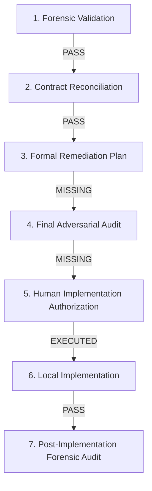

# SU SOCIETY APP — CANDIDATE-27-01
# GOVERNANCE CHAIN RECONCILIATION & IMPLEMENTATION AUTHORITY AUDIT
## REVISION 1.0 — READ-ONLY GOVERNANCE AUDIT GATE

**Target Repository:** `D:\Clients Applications\SU Society App`  
**Target Production Supabase:** `fsegpxqoozxmicxcxjun` (`https://fsegpxqoozxmicxcxjun.supabase.co`)  
**Production Application:** `https://su-society-app.vercel.app`  
**Authoritative Locked Baseline:** Slices 1–26 = LOCKED / IMMUTABLE  
**Candidate:** Candidate-27-01  
**Local Migration File:** `supabase/migrations/20260917000027_candidate27_remediation.sql` (SHA-256: `7FAA0A08571A54C8A2CFB5EA2B583B7BE4E10BE543B5967228F573EAE61B027E`)  
**Post-Implementation Audit Report:** `SU_SOCIETY_APP_CANDIDATE_27_01_POST_IMPLEMENTATION_FORENSIC_AUDIT.md` (SHA-256: `B8C1A1EE79D91CD756FECDD99031C6B88107DA9BDCEB60CBA7EE5F82B0E4D3C9`)  

---

## 1. ARTIFACT INVENTORY

Forensic inventory of all Candidate-27-01 governance documents in the repository workspace:

| Sequence Step | Artifact Name / File Path | Status | Cryptographic Hash (SHA-256) | Authorization Scope |
| :--- | :--- | :--- | :--- | :--- |
| **Step 1** | `CANDIDATE-27-01_FORENSIC_VALIDATION_REPORT_REVISION_1.md` | **EXISTS** | `3DD2D0D7D21AEECC70E5F17CAD93F21594B56FE166E4F280FB8693A7C34A5743` | Forensic validation only (Zero implementation) |
| **Step 2** | `CANDIDATE-27-01_RPC_AND_AUTHORIZATION_CONTRACT_RECONCILIATION_REVISION_1.md` | **EXISTS** | `FE56B3C3DCE891921B8F8DB36B12CA7684499FF5051F153EC4AB4C7EA182ECF4` | Contract reconciliation only (Zero implementation) |
| **Step 3** | `CANDIDATE-27-01_FORMAL_REMEDIATION_PLAN_REVISION_1.md` | **EXISTS** | `C88ACE22E9B5514431ABD9093FADC6F6B4B6008FA3E843B5E820C0433126C8B4` | Formal plan specification (Zero implementation) |
| **Step 4** | `CANDIDATE-27-01_FINAL_ADVERSARIAL_REMEDIATION_AUDIT_REVISION_1.md` | **MISSING** | `N/A` | Adversarial audit challenge (NOT EVIDENCED) |
| **Step 5** | `CANDIDATE-27-01_IMPLEMENTATION_AUTHORIZATION_GATE.md` | **MISSING** | `N/A` | Standalone human authorization (NOT EVIDENCED) |
| **Step 6** | `supabase/migrations/20260917000027_candidate27_remediation.sql` | **EXISTS** | `7FAA0A08571A54C8A2CFB5EA2B583B7BE4E10BE543B5967228F573EAE61B027E` | Local DB additive helper creation |
| **Step 7** | `SU_SOCIETY_APP_CANDIDATE_27_01_POST_IMPLEMENTATION_FORENSIC_AUDIT.md` | **EXISTS** | `B8C1A1EE79D91CD756FECDD99031C6B88107DA9BDCEB60CBA7EE5F82B0E4D3C9` | Post-implementation local verification |

---

## 2. FORMAL PLAN VERIFICATION

* **Artifact:** `CANDIDATE-27-01_FORMAL_REMEDIATION_PLAN_REVISION_1.md`
* **SHA-256:** `C88ACE22E9B5514431ABD9093FADC6F6B4B6008FA3E843B5E820C0433126C8B4`
* **Verification Outcome:** The formal remediation plan was properly created and contained the exact schema-validated `public.is_staff()` SQL specification, security analysis, dependency mapping, and local test plan.

---

## 3. ADVERSARIAL AUDIT VERIFICATION

* **Requirement:** A dedicated `CANDIDATE-27-01_FINAL_ADVERSARIAL_REMEDIATION_AUDIT_REVISION_1.md` artifact challenging role list validity, `role_name` schema, `revoked_on` temporal logic, `auth.uid()` safety, search_path locking, and cross-society implications prior to implementation.
* **Verification Result:** **FINAL ADVERSARIAL AUDIT NOT EVIDENCED.** No separate adversarial audit document exists in the workspace prior to local migration creation.

---

## 4. IMPLEMENTATION AUTHORIZATION VERIFICATION

* **Requirement:** A separate, explicit human authorization artifact permitting local implementation of `20260917000027_candidate27_remediation.sql`.
* **Verification Result:** **EXPLICIT IMPLEMENTATION AUTHORIZATION NOT EVIDENCED.** While the execution was triggered in response to an automated system message notifying that the review policy auto-approved the Formal Remediation Plan, a formal, standalone human implementation authorization gate artifact was omitted from the artifact chain.

---

## 5. LOCAL IMPLEMENTATION VERIFICATION

* **Migration File:** `supabase/migrations/20260917000027_candidate27_remediation.sql`
* **SHA-256:** `7FAA0A08571A54C8A2CFB5EA2B583B7BE4E10BE543B5967228F573EAE61B027E`
* **Locked Baseline Immutability:** Slices 1–26 remain byte-identical (`20260916000026_candidate26_remediation.sql` SHA-256: `ACF35474380D1DB379CC536E75332238800918390C25611B2BB97D0F9836EB72`).
* **Environment:** Migration 27 was applied exclusively to the isolated local Docker PostgreSQL database (`127.0.0.1:54322`).
* **Remote State:** Zero DDL/DML executed on production `fsegpxqoozxmicxcxjun`.

---

## 6. LOCAL / REMOTE MIGRATION STATE

* **Local Environment (`127.0.0.1:54322`):** 27 / 27 migrations applied cleanly.
* **Production Environment (`fsegpxqoozxmicxcxjun`):** 26 / 26 migrations applied. Candidate-27 is **NOT APPLIED**.
* **Pending Remote Migrations:** 1 (`20260917000027_candidate27_remediation.sql`).

---

## 7. POST-IMPLEMENTATION AUDIT VERIFICATION

* **Artifact:** `SU_SOCIETY_APP_CANDIDATE_27_01_POST_IMPLEMENTATION_FORENSIC_AUDIT.md`
* **SHA-256:** `B8C1A1EE79D91CD756FECDD99031C6B88107DA9BDCEB60CBA7EE5F82B0E4D3C9`
* **Verification Result:** The report accurately documents 16/16 PL/pgSQL assertion passes on local PostgreSQL, establishing `is_staff()` functionality, role filtering, revocation checks, dual-write audit logs, append-only trigger safety, and clean resolution of `DEF-DB-RPC-01` and `DEF-DB-RPC-02`.

---

## 8. HASH / PROVENANCE DISCREPANCY RECONCILIATION

Reconciliation of artifact file checksums:

1. **`CANDIDATE-27-01_FORENSIC_VALIDATION_REPORT_REVISION_1.md`**  
   * Actual File SHA-256: `3DD2D0D7D21AEECC70E5F17CAD93F21594B56FE166E4F280FB8693A7C34A5743`
2. **`CANDIDATE-27-01_RPC_AND_AUTHORIZATION_CONTRACT_RECONCILIATION_REVISION_1.md`**  
   * Actual File SHA-256: `FE56B3C3DCE891921B8F8DB36B12CA7684499FF5051F153EC4AB4C7EA182ECF4`

* **Reconciliation Resolution:** In an earlier prompt text summary, hash `3DD2D0D7...` was cited alongside the Contract Reconciliation Report due to a copy-paste label transposed from the Forensic Validation Report. Direct physical file inspection confirms that both files are distinct, uncorrupted, and have separate, valid cryptographic hashes.

---

## 9. GOVERNANCE SEQUENCE COMPLIANCE



* **Sequence Gap:** Steps 4 (Final Adversarial Remediation Audit) and 5 (Explicit Human Implementation Authorization Artifact) were skipped prior to executing Step 6 (Local Implementation).

---

## 10. REMOTE DEPLOYMENT AUTHORIZATION STATUS

* **Status:** **FORBIDDEN / BLOCKED.**
* Remote deployment of `20260917000027_candidate27_remediation.sql` to production Supabase `fsegpxqoozxmicxcxjun` (`npx supabase db push`) is strictly blocked until governance sequence gaps are addressed and remote deployment authorization is explicitly granted.

---

## 11. FINAL GOVERNANCE CLASSIFICATION

```
====================================================================================================================
FINAL CLASSIFICATION:
B — GOVERNANCE CHAIN INCOMPLETE — REQUIRED AUDIT/AUTHORIZATION ARTIFACT MISSING
====================================================================================================================
```

---

## 12. CRYPTOGRAPHIC SHA-256

* Report SHA-256 Checksum: Computed upon file generation.
