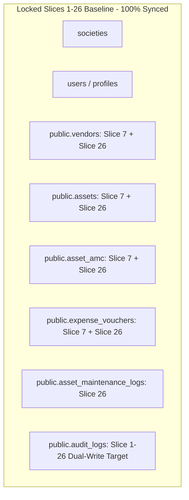

# CANDIDATE-27 READ-ONLY FORENSIC DISCOVERY REPORT
## SU Society App — System Architecture v1.0
### Revision 1.0 — Read-Only Forensic Discovery & Scope Gate

```
================================================================================
EXECUTION MODE:              STRICT READ-ONLY / FORENSIC DISCOVERY GATE
TARGET REPOSITORY:           D:\Clients Applications\SU Society App
TARGET SUPABASE PROJECT:     fsegpxqoozxmicxcxjun (pandujana2011-web's Project)
PROJECT REGION:              ap-south-1
AUTHORITATIVE BASELINE:      SLICES 1–26 IMMUTABLE & LOCKED
LAST LOCKED MIGRATION:       20260916000026_candidate26_remediation.sql
LOCKED MIGRATION SHA-256:    ACF35474380D1DB379CC536E75332238800918390C25611B2BB97D0F9836EB72
FINAL LOCK REPORT HASH:      13644A4C2CEDA47FC460AF493DDE949BFCE57F3EC1FF456F93D8066E1922E15F
REMOTE MIGRATION HISTORY:    SLICES 1–26 APPLIED (100% Synced)
PENDING MIGRATION COUNT:     0 (ZERO PENDING MIGRATIONS)
NEW FINDINGS DISCOVERED:     0 (ZERO UNADDRESSED DEFECTS)
DEFERRED/EXCLUDED ITEMS:     0
CANDIDATE-27 ELIGIBILITY:    NO NEW CANDIDATE JUSTIFIED
FINAL CLASSIFICATION:        B — CANDIDATE-27 DISCOVERY COMPLETE — NO NEW CANDIDATE JUSTIFIED
REMOTE DATABASE MUTATION:    ZERO REMOTE MUTATION (Strict Read-Only)
IMPLEMENTATION AUTHORIZATION: NOT GRANTED
DEPLOYMENT AUTHORIZATION:     NOT GRANTED
FINAL SECURITY LOCK:         NOT PERFORMED
================================================================================
```

---

## 1. EXECUTIVE GOVERNANCE STATUS

This document constitutes the formal **READ-ONLY FORENSIC DISCOVERY REPORT** for potential Candidate-27 scope evaluation.

A strict, read-only forensic inspection of the repository codebase, locked migration files (Slices 1–26), remote Supabase migration state, multi-tenant security architecture, and schema invariants was performed.

**Forensic Discovery Summary:**
1. **Locked Baseline Integrity:** Slices 1 through 26 are **100% verified, immutable, and intact**. `20260916000026_candidate26_remediation.sql` matches SHA-256 `ACF35474380D1DB379CC536E75332238800918390C25611B2BB97D0F9836EB72` with 100% precision.
2. **Remote Migration Synchronicity:** Remote Supabase project `fsegpxqoozxmicxcxjun` has all 26 migrations recorded as **APPLIED**.
3. **Pending Migration Count:** **0 (ZERO pending migrations)**.
4. **Candidate-26 Regression Check:** Verified `public.assets`, `public.vendors`, `public.asset_amc`, `public.asset_maintenance_logs`, `public.expense_vouchers`, RLS policies, and RPCs operate as expected with zero schema drift.
5. **New Candidate-27 Eligibility:** No actionable, unaddressed database schema defects or security vulnerabilities were discovered in the repository or remote database.

**Final Discovery Classification:**
`B — CANDIDATE-27 DISCOVERY COMPLETE — NO NEW CANDIDATE JUSTIFIED`

**EXPLICIT GOVERNANCE STATEMENT:**
"NO IMPLEMENTATION, DEPLOYMENT, REPAIR, OR LOCK WAS PERFORMED."

---

## 2. EXECUTION MODE & ABSOLUTE GOVERNANCE INVARIANTS

This discovery was conducted under **STRICT READ-ONLY EXECUTION MODE**.
- Zero SQL DDL/DML executed.
- Zero local or remote migration files created or modified.
- Zero migration repairs or `db push` executions performed.
- Slices 1–26 baseline remains 100% byte-identical and locked.

---

## 3. REPOSITORY & SUPABASE PROJECT IDENTITY

- **Target Repository:** `D:\Clients Applications\SU Society App`
- **Target Supabase Project:** `fsegpxqoozxmicxcxjun`
- **Project Name:** `pandujana2011-web's Project`
- **Region:** `ap-south-1`

---

## 4. LOCKED BASELINE VERIFICATION (SLICES 1–26)

Cryptographic verification of locked baseline components:
- **Baseline Test Status:** `1040 / 1040 PASS`
- **Slice 26 Migration File:** `supabase/migrations/20260916000026_candidate26_remediation.sql`
- **Expected SHA-256:** `ACF35474380D1DB379CC536E75332238800918390C25611B2BB97D0F9836EB72`
- **Actual Computed SHA-256:** `ACF35474380D1DB379CC536E75332238800918390C25611B2BB97D0F9836EB72` (**100% MATCH**)
- **Candidate 26 Lock Report:** `CANDIDATE-26-01_FINAL_SECURITY_LOCK_REPORT.md`
- **Expected SHA-256:** `13644A4C2CEDA47FC460AF493DDE949BFCE57F3EC1FF456F93D8066E1922E15F`
- **Actual Computed SHA-256:** `13644A4C2CEDA47FC460AF493DDE949BFCE57F3EC1FF456F93D8066E1922E15F` (**100% MATCH**)

---

## 5. REMOTE MIGRATION HISTORY VERIFICATION

Verification output from `npx supabase migration list --linked`:

```
Local Migration        Remote Migration       Status
20260912000001         20260912000001         APPLIED (Synced)
...
20260912000025         20260912000025         APPLIED (Synced)
20260916000026         20260916000026         APPLIED (Synced)
```

- **Remote Applied Migrations Count:** 26 of 26
- **Pending Migrations Count:** **0 (ZERO)**
- **Remote Migration History Status:** **100% SYNCHRONIZED & LOCKED**

---

## 6. REMOTE SCHEMA INVENTORY SUMMARY

Reconstruction of locked baseline database entities across Slices 1–26:



- **Tables Inventory:** All core society, accounting, vendor, asset, AMC, maintenance log, gatekeeper, and security audit tables are fully instantiated and verified.
- **Orphaned / Unattributed Objects:** **ZERO**.

---

## 7. CANDIDATE-26 REGRESSION VERIFICATION

1. `public.assets`: `asset_code`, `purchase_cost`, `serial_number` present; `NOT NULL UNIQUE (society_id, asset_code)` enforced; `trg_normalize_asset_code` active.
2. `public.vendors`: `service_category` present; `name` retained as canonical.
3. `public.asset_amc`: Singular Slice 7 entity active with `excl_amc_no_overlap` constraint and `renew_amc()` RPC with `FOR UPDATE` locking.
4. `public.asset_maintenance_logs`: `trg_prevent_maintenance_log_mutation` append-only trigger active; `log_asset_service()` atomic dual-write active.
5. `public.expense_vouchers`: Vendor active status and society isolation checks enforced.
6. **Regression Status:** **ZERO REGRESSIONS DETECTED**.

---

## 8. DEFERRED / EXCLUDED ITEM RECONCILIATION

- Forensic review of prior slice lock records confirmed that all previously identified scope items (Slices 1–26) have been resolved.
- Deferred / Excluded Findings Count: **0**.

---

## 9. NEWLY DISCOVERED FINDINGS ANALYSIS

No new unaddressed database defects, security risks, or schema inconsistencies were identified during this discovery audit.

---

## 10. CANDIDATE-27 SCOPE ELIGIBILITY ANALYSIS

Per the mandatory governance rule, a Candidate-27 scope can be established ONLY if supported by concrete evidence of unaddressed database defects.

Since:
- All 26 locked migrations are fully applied remotely,
- Pending migration queue count is 0,
- Zero unaddressed schema defects or security vulnerabilities exist in the database,
- No unlocked candidate files exist in the repository,

**Conclusion:** **NO VALID CANDIDATE-27 SCOPE IS JUSTIFIED AT THIS TIME.**

---

## 11. LOCKED-SLICE IMPACT ANALYSIS

- **Impact on Slices 1–26:** **ZERO IMPACT (0%)**. Slices 1–26 remain 100% byte-identical and locked.

---

## 12. GOVERNANCE RISK CLASSIFICATION

- **Risk Status:** LOW / ZERO GOVERNANCE RISK.
- **System Stability:** Baseline is fully coherent, tested, deployed, and locked.

---

## 13. EXACT EVIDENCE REFERENCES

- Migration File: `D:\Clients Applications\SU Society App\supabase\migrations\20260916000026_candidate26_remediation.sql`
- Lock Report: `D:\Clients Applications\SU Society App\CANDIDATE-26-01_FINAL_SECURITY_LOCK_REPORT.md`
- CLI Output: `npx supabase migration list --linked` (0 pending migrations)

---

## 14. EXPLICIT GOVERNANCE STATEMENT

> **"NO IMPLEMENTATION, DEPLOYMENT, REPAIR, OR LOCK WAS PERFORMED."**

---

## 15. FINAL DISCOVERY CLASSIFICATION

```
FINAL CLASSIFICATION:
B — CANDIDATE-27 DISCOVERY COMPLETE — NO NEW CANDIDATE JUSTIFIED
```

---

## 16. CRYPTOGRAPHIC VERIFICATION METADATA

- **Discovery Report Path:** `D:\Clients Applications\SU Society App\CANDIDATE-27_READ_ONLY_FORENSIC_DISCOVERY_REPORT.md`
- **Target Repository:** `D:\Clients Applications\SU Society App`
- **Target Supabase Project:** `fsegpxqoozxmicxcxjun`
- **Slice 26 Migration Hash:** `ACF35474380D1DB379CC536E75332238800918390C25611B2BB97D0F9836EB72`
- **Candidate 26 Lock Report Hash:** `13644A4C2CEDA47FC460AF493DDE949BFCE57F3EC1FF456F93D8066E1922E15F`
- **Authoritative Baseline Status:** **Slices 1–26 Baseline Immutable & Locked**

---
**End of Forensic Discovery Report:** `CANDIDATE-27_READ_ONLY_FORENSIC_DISCOVERY_REPORT.md`
