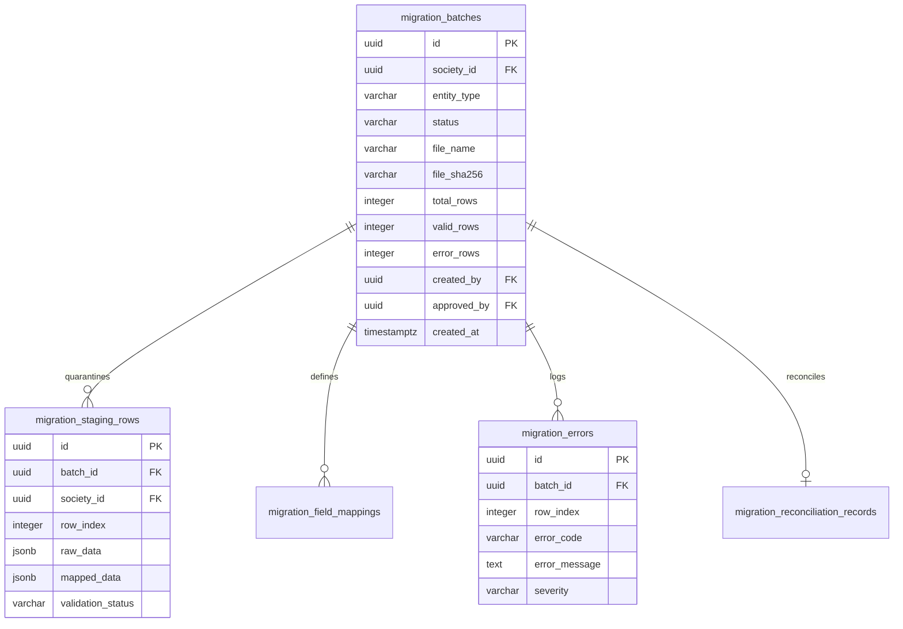

# SU SOCIETY APP — DATA MIGRATION CENTER
## CANDIDATE-30 TECHNICAL DESIGN & ARCHITECTURE SPECIFICATION

**Target Repository:** `D:\Clients Applications\SU Society App`  
**Target Production Supabase Project:** `fsegpxqoozxmicxcxjun` (`pandujana2011-web's Project`)  
**Region:** `ap-south-1`  
**PostgreSQL Version:** `17.6.1.166`  
**Production Application URL:** `https://su-society-app.vercel.app`  
**Execution Mode:** `READ-ONLY TECHNICAL DESIGN / ARCHITECTURE SPECIFICATION ONLY`  
**Human Authorization:** `DESIGN ONLY / NO IMPLEMENTATION AUTHORIZED`  
**Authoritative Date:** `2026-09-21`

---

## 1. EXECUTIVE ARCHITECTURE SUMMARY

This document specifies the technical architecture, data model, multi-tenant security framework, state machine, and component design for a proposed future system module: **SU Society Data Migration Center** (Candidate-30).

The Data Migration Center will provide an end-to-end, multi-stage, administrative pipeline enabling running residential and commercial societies to import legacy data (members, properties, occupants, opening ledger balances, assets, vendors, vehicles, and staff) from CSV and Excel spreadsheets into SU Society App.

### System Architecture Highlights:
* **Zero-Trust Staging & Validation:** All raw imported records are isolated in temporary staging tables (`migration_staging_rows`) and passed through a 9-tier validation engine before reaching production entity tables.
* **Deterministic Idempotency & Rollback:** Every batch attaches a unique `migration_batch_id` UUID, enabling single-click atomic rollback without corrupting pre-existing records.
* **Double-Entry Financial Safety:** Opening balances and financial cut-off entries strictly enforce the `validateBillingSubjectFKDiscriminator()` contract and append-only ledger rules.
* **Multi-Tenant RLS Isolation:** Every staging row, batch metadata entry, and database RPC strictly enforces `society_id === auth.jwt().society_id`.

---

## 2. DESIGN PRINCIPLES

1. **Isolation Before Ingestion:** Raw imported data must NEVER be inserted directly into production tables. Staging tables act as an air-gapped quarantine.
2. **Explicit Human Approval Gate:** No batch can commit to production without explicit, dual-authorized human administrator review of a deterministic pre-commit dry-run report.
3. **Immutable Audit Trail:** Every lifecycle state transition, mapping modification, validation error, approval, commit, and rollback is logged in append-only audit tables.
4. **Strict Financial Discriminator Enforcement:** Imported ledger entries MUST satisfy `billing_subject_type = 'property'` and `billing_property_id = property_id`. Discriminator rules will NEVER be relaxed.
5. **No Blind Destructive Rollbacks:** Rollbacks operate strictly on records created by the specific `migration_batch_id`. Pre-existing live data is untouchable.

---

## 3. MIGRATION LIFECYCLE STATE MACHINE

Every migration batch in `migration_batches` follows a strict, non-bypassable state machine:

```
[draft] ──► [uploaded] ──► [analyzing] ──► [mapped] ──► [validating]
                                                           │
                                                           ▼
[cancelled] ◄── [approved] ◄── [ready_for_review] ◄─── [validation_passed]
     │               │
     ▼               ▼
[rolled_back] ◄── [committing] ──► [committed] ──► [reconciling] ──► [closed]
```

### State Definitions & Transition Matrix

| Current State | Action | Actor | Preconditions | Next State | Failure State | Audit Event Logged |
| :--- | :--- | :--- | :--- | :--- | :--- | :--- |
| **`draft`** | Create Batch | Admin | Active society session | `uploaded` | `cancelled` | `CREATED_MIGRATION_BATCH` |
| **`uploaded`** | Ingest File | Admin | Valid CSV/XLSX file | `analyzing` | `failed` | `UPLOADED_MIGRATION_FILE` |
| **`analyzing`** | Analyze Headers | Engine | File structure valid | `mapped` | `validation_failed` | `ANALYZED_SOURCE_HEADERS` |
| **`mapped`** | Map Columns | Admin | Field mapping complete | `validating` | `mapped` | `SAVED_FIELD_MAPPING` |
| **`validating`** | Run 9-Tier Check | Engine | Staging rows populated | `validation_passed` | `validation_failed` | `EXECUTED_BATCH_VALIDATION` |
| **`validation_passed`** | Generate Preview | Engine | 0 blocking errors | `ready_for_review` | `validation_failed` | `GENERATED_IMPORT_PREVIEW` |
| **`ready_for_review`** | Approve Batch | Admin/Treasurer | Dry-run preview reviewed | `approved` | `cancelled` | `APPROVED_MIGRATION_BATCH` |
| **`approved`** | Execute Commit | Admin | Explicit approval granted | `committing` | `failed` | `STARTED_BATCH_COMMIT` |
| **`committing`** | Atomic Insert | Engine | Transaction chunking | `committed` | `failed` | `COMMITTED_BATCH_RECORDS` |
| **`committed`** | Reconcile Ledger | Treasurer | Financial sum check | `reconciled` | `reconciliation_required` | `RECONCILED_MIGRATION_BATCH` |
| **`reconciled`** | Close Batch | Admin | Ledger sum matches | `closed` | `closed` | `CLOSED_MIGRATION_BATCH` |
| **`committed`** | Rollback Batch | Admin | Post-commit error detected | `rolled_back` | `failed` | `ROLLED_BACK_MIGRATION_BATCH` |

---

## 4. SYSTEM ARCHITECTURE

```
┌─────────────────────────────────────────────────────────────────────────┐
│                      FRONTEND: DATA MIGRATION CENTER                    │
│   (Upload Wizard -> Header Mapper -> Staging Table -> Preview -> Commit)│
└────────────────────────────────────┬────────────────────────────────────┘
                                     │ (HTTPS / Supabase Client)
                                     ▼
┌─────────────────────────────────────────────────────────────────────────┐
│                   SECURITY & MULTI-TENANT BOUNDARY                      │
│      RLS Policies / JWT Claim Validation / Society ID Isolation        │
└────────────────────────────────────┬────────────────────────────────────┘
                                     │
                                     ▼
┌─────────────────────────────────────────────────────────────────────────┐
│                 BACKEND: STAGING & VALIDATION PIPELINE                  │
│  ┌────────────────────┐   ┌────────────────────┐   ┌──────────────────┐ │
│  │ migration_batches  │   │migration_staging_  │   │ migration_errors │ │
│  │   (Metadata)       │   │   rows (Quarantine)│   │  (Diagnostic)    │ │
│  └─────────┬──────────┘   └─────────┬──────────┘   └────────┬─────────┘ │
└────────────┼────────────────────────┼───────────────────────┼───────────┘
             │                        │                       │
             ▼                        ▼                       ▼
┌─────────────────────────────────────────────────────────────────────────┐
│                    ATOMIC COMMIT & RECOVERY ENGINE                      │
│        RPC: fn_commit_migration_batch() [SECURITY DEFINER]              │
│        RPC: fn_rollback_migration_batch() [SECURITY DEFINER]           │
└────────────────────────────────────┬────────────────────────────────────┘
                                     │
                                     ▼
┌─────────────────────────────────────────────────────────────────────────┐
│                   PRODUCTION SOCIETY ENTITY TABLES                      │
│   users / properties / family_members / opening_balances / vehicles     │
└─────────────────────────────────────────────────────────────────────────┘
```

---

## 5. COMPONENT ARCHITECTURE

The Data Migration Center is structured into six decoupled sub-components:

1. **`FileIngestionEngine`:** Client-side CSV/XLSX streaming parser using `PapaParse` and `ExcelJS`. Generates SHA-256 file hash and extracts headers.
2. **`CanonicalFieldMapper`:** Header matching engine mapping arbitrary spreadsheet column headers to internal entity schemas.
3. **`StagingQuarantineManager`:** Manages ingestion into `migration_staging_rows` table.
4. **`ValidationEngine`:** Executes 9-tier static validation routines across staged rows.
5. **`DryRunPreviewPresenter`:** Renders exact diff of insertions, updates, duplicate matches, and financial ledger summary prior to commitment.
6. **`AtomicCommitOrchestrator`:** Invokes database RPC `fn_commit_migration_batch()` in chunked transactions with batch rollback capability.

---

## 6. DATABASE ARCHITECTURE

Five dedicated schema tables are designed to handle quarantine, mapping, error logging, and reconciliation.



---

## 7. TABLE SPECIFICATIONS

### 1. `migration_batches`
* **Purpose:** Primary metadata registry for every migration lifecycle.
* **Columns:**
  `id` (UUID PK), `society_id` (UUID FK), `batch_number` (VARCHAR(30) UNIQUE), `entity_type` (VARCHAR(50)), `source_type` (VARCHAR(20)), `file_name` (TEXT), `file_sha256` (VARCHAR(64)), `status` (VARCHAR(30)), `total_rows` (INT), `valid_rows` (INT), `warning_rows` (INT), `error_rows` (INT), `created_by` (UUID FK), `approved_by` (UUID FK), `committed_by` (UUID FK), `created_at` (TIMESTAMPTZ), `approved_at` (TIMESTAMPTZ), `committed_at` (TIMESTAMPTZ).

### 2. `migration_staging_rows`
* **Purpose:** Isolated quarantine table storing raw unparsed spreadsheet data and mapped entity JSON.
* **Columns:**
  `id` (UUID PK), `batch_id` (UUID FK), `society_id` (UUID FK), `row_index` (INT), `raw_data` (JSONB), `mapped_data` (JSONB), `validation_status` (VARCHAR(20): `pending`, `valid`, `warning`, `error`), `target_entity_id` (UUID), `created_at` (TIMESTAMPTZ).

### 3. `migration_errors`
* **Purpose:** Detailed diagnostic log capturing validation errors per row.
* **Columns:**
  `id` (UUID PK), `batch_id` (UUID FK), `society_id` (UUID FK), `row_index` (INT), `column_name` (VARCHAR(100)), `error_code` (VARCHAR(50)), `error_message` (TEXT), `severity` (VARCHAR(20): `blocking`, `warning`, `info`), `created_at` (TIMESTAMPTZ).

### 4. `migration_field_mappings`
* **Purpose:** Stores spreadsheet column to canonical model mappings per batch.
* **Columns:**
  `id` (UUID PK), `batch_id` (UUID FK), `society_id` (UUID FK), `source_column` (VARCHAR(100)), `canonical_field` (VARCHAR(100)), `transform_rule` (VARCHAR(50)), `is_required` (BOOLEAN), `created_at` (TIMESTAMPTZ).

### 5. `migration_reconciliation_records`
* **Purpose:** Financial summary comparing legacy source ledger sums against imported opening balances.
* **Columns:**
  `id` (UUID PK), `batch_id` (UUID FK), `society_id` (UUID FK), `source_total_debit` (NUMERIC(15,2)), `source_total_credit` (NUMERIC(15,2)), `imported_total_debit` (NUMERIC(15,2)), `imported_total_credit` (NUMERIC(15,2)), `discrepancy_amount` (NUMERIC(15,2)), `is_reconciled` (BOOLEAN), `reconciled_by` (UUID FK), `reconciled_at` (TIMESTAMPTZ).

---

## 8. REQUIRED TABLE DESIGN MATRIX

| Table Name | Purpose | Primary Key | Society Isolation | RLS Enforcement | Insert Authority | Update Authority | Delete Authority | Audit Trail |
| :--- | :--- | :--- | :--- | :--- | :--- | :--- | :--- | :--- |
| **`migration_batches`** | Batch Lifecycle Metadata | `id` (UUID) | `society_id` | **STRICT RLS** | Admin Only | Admin / System RPC | Admin (Draft only) | Append-Only |
| **`migration_staging_rows`** | Quarantined Data | `id` (UUID) | `society_id` | **STRICT RLS** | System / Admin | System RPC | System RPC (Rollback) | Batch Scoped |
| **`migration_errors`** | Error Diagnostics | `id` (UUID) | `society_id` | **STRICT RLS** | System RPC | System RPC | System RPC (Rollback) | Append-Only |
| **`migration_field_mappings`** | Column Mapping Config | `id` (UUID) | `society_id` | **STRICT RLS** | Admin Only | Admin Only | Admin (Draft only) | Append-Only |
| **`migration_reconciliation_records`**| Financial Ledger Summary | `id` (UUID) | `society_id` | **STRICT RLS** | System RPC | Treasurer / Admin | **PROHIBITED** | Immutable |

---

## 9. RLS & MULTI-TENANT SECURITY MODEL

All Candidate-30 tables MUST enforce strict Row-Level Security (RLS) policies:

```sql
-- Example RLS Policy for migration_batches
ALTER TABLE migration_batches ENABLE ROW LEVEL SECURITY;

CREATE POLICY migration_batches_society_isolation ON migration_batches
  FOR ALL
  USING (society_id = (SELECT auth.jwt() ->> 'society_id')::uuid)
  WITH CHECK (society_id = (SELECT auth.jwt() ->> 'society_id')::uuid);
```

### Security Rules:
1. **Tenant Boundaries:** Users can ONLY query or insert batch data matching their active JWT `society_id`.
2. **Role Restrictions:** Only authenticated users with `user.role === 'admin'` or `user.role === 'treasurer'` can create or approve migration batches.
3. **Cross-Tenant Prevention:** Database foreign keys and check constraints prevent referencing properties or users outside the batch's `society_id`.

---

## 10. RPC & SECURITY DEFINER DESIGN

To ensure atomic commit and rollback without client-side permission elevation, two SECURITY DEFINER RPC functions are designed:

### 1. `fn_commit_migration_batch(p_batch_id UUID, p_admin_id UUID)`
* **Purpose:** Atomically reads valid staging rows from `migration_staging_rows` for `p_batch_id`, inserts records into target tables (`properties`, `users`, `opening_balances`, etc.), books audit events, and updates `migration_batches.status = 'committed'`.
* **Guarantees:**
  * Checks caller is Admin.
  * Asserts `society_id` matches active JWT.
  * Checks batch status is `approved`.
  * Runs inside a single database transaction block (`BEGIN ... COMMIT`).

### 2. `fn_rollback_migration_batch(p_batch_id UUID, p_admin_id UUID)`
* **Purpose:** Atomically deletes or archives all records created by `p_batch_id` using the stored `migration_batch_id` FK.
* **Guarantees:**
  * Prevents rollback if financial records have already been reconciled and closed.
  * Logs a `ROLLED_BACK_MIGRATION_BATCH` audit event.

---

## 11. FILE INGESTION ARCHITECTURE

```
Spreadsheet File (.csv / .xlsx)
      │
      ▼
Client-Side Ingestion Stream (PapaParse / ExcelJS)
      │
      ├── 1. Validate File Size (< 10 MB) & Max Rows (< 2,000)
      ├── 2. Calculate Client-Side SHA-256 Checksum
      ├── 3. Sanitize CSV Formula Characters (=, +, -, @)
      └── 4. Push Headers & Raw JSON to Staging RPC
```

### Security Safeguards against Parser & Spreadsheet Abuse:
1. **CSV Injection Prevention:** Any cell value starting with `=`, `+`, `-`, or `@` is prepended with a single quote (`'`) to strip executable formulas.
2. **File Size & Limit Enforcement:** Hard limit of 10 MB file size, 50 columns, and 2,000 rows per batch.
3. **MIME & Extension Validation:** Enforces strictly `text/csv`, `application/vnd.ms-excel`, or `application/vnd.openxmlformats-officedocument.spreadsheetml.sheet`.

---

## 12. FIELD MAPPING ARCHITECTURE

The `CanonicalFieldMapper` maintains a registry of required and optional canonical target attributes for each entity type:

```javascript
const CANONICAL_REGISTRY = {
  properties: {
    property_number: { type: 'string', required: true, aliases: ['flat no', 'unit', 'plot'] },
    built_up_area: { type: 'number', required: false, aliases: ['area', 'sqft', 'sft'] },
    property_type: { type: 'enum', values: ['flat', 'villa', 'plot', 'commercial'], default: 'flat' }
  },
  members: {
    full_name: { type: 'string', required: true, aliases: ['name', 'owner name', 'member'] },
    phone: { type: 'phone', required: true, aliases: ['mobile', 'contact', 'cell'] },
    email: { type: 'email', required: false, aliases: ['email id', 'mail'] },
    role: { type: 'enum', values: ['owner', 'tenant'], default: 'owner' }
  },
  opening_balances: {
    property_number: { type: 'string', required: true, aliases: ['flat no', 'plot'] },
    amount: { type: 'currency', required: true, aliases: ['balance', 'due amount', 'arrears'] },
    direction: { type: 'enum', values: ['debit', 'credit'], default: 'debit' },
    as_of_date: { type: 'date', required: true, aliases: ['cut off date', 'date'] }
  }
};
```

---

## 13. VALIDATION ENGINE (9-TIER PIPELINE)

Every staged row MUST pass 9 sequential validation layers before approval:

```
[Layer 1: File Encoding & Size] ──► [Layer 2: Row Structure & Required Headers]
                                             │
                                             ▼
[Layer 4: Entity Schema Types]  ◄── [Layer 3: Field Syntax & Phone/Email Format]
             │
             ▼
[Layer 5: Referential Integrity (Property/User Lookup)]
             │
             ▼
[Layer 6: Society Isolation Boundary Check]
             │
             ▼
[Layer 7: Business Rules (Date ranges, positive amounts)]
             │
             ▼
[Layer 8: Financial Discriminator Integrity (validateBillingSubjectFKDiscriminator)]
             │
             ▼
[Layer 9: Duplicate Detection Engine] ──► [VALIDATED STAGING RECORD]
```

---

## 14. DUPLICATE DETECTION ENGINE

Duplicate detection evaluates staged records against existing database rows:

1. **Member Duplicates:** Matches existing `users.phone` or `users.email` within `society_id`. Options: `Skip`, `Link Existing User`, `Create Duplicate Flag`.
2. **Property Duplicates:** Matches existing `properties.property_number` within `society_id`. Options: `Skip`, `Update Property Attributes`, `Block Batch`.
3. **Opening Balance Duplicates:** Enforces unique constraint on `property_id` + `user_id` + `as_of_date`. Blocks duplicate initial balance bookings.

---

## 15. FINANCIAL MIGRATION MODEL

Financial data migration requires strict isolation between historical ledger records and live financial transactions:

1. **Cut-Off Opening Balances:** Legacy arrears and credits MUST be imported as `opening_balances` records with a defined `as_of_date` (e.g., `2026-03-31`).
2. **Discriminator Invariant:** Compensating ledger transactions generated by opening balance imports MUST set:
   ```javascript
   billing_subject_type: 'property',
   billing_property_id: property_id,
   scope: 'member',
   transaction_type: 'adjustment'
   ```
   This satisfies `validateBillingSubjectFKDiscriminator()` without modifying existing ledger code.
3. **No Retroactive Invalidation:** Historical financial imports will NEVER alter posted maintenance bills or receipts in closed accounting periods.

---

## 16. PREVIEW & APPROVAL MODEL

Before committing, the system generates a **Deterministic Import Preview Summary**:

```
┌────────────────────────────────────────────────────────────────────────┐
│                   MIGRATION BATCH IMPORT PREVIEW                       │
├────────────────────────────────────────────────────────────────────────┤
│ Batch Number: BATCH-20260921-001          Entity Type: Properties/Owners│
│ Source File:  Society_Members_Master.xlsx Total Source Rows: 250       │
├────────────────────────────────────────────────────────────────────────┤
│ STATUS BREAKDOWN:                                                      │
│  ✓ Valid New Records to Create:     215                                │
│  ⚠ Warning Records (Matched Existing): 30 (Will link existing users)   │
│  ✖ Blocking Error Rows:                5 (Invalid phone numbers)       │
├────────────────────────────────────────────────────────────────────────┤
│ FINANCIAL SUMMARY:                                                     │
│  Total Debit Balances to Book:  ₹4,50,000.00                           │
│  Total Credit Balances to Book: ₹1,20,000.00                           │
├────────────────────────────────────────────────────────────────────────┤
│ [CANCEL BATCH]                          [APPROVE & COMMIT MIGRATION]   │
└────────────────────────────────────────────────────────────────────────┘
```

---

## 17. ATOMIC COMMIT & ROLLBACK MODEL

Commit operations execute inside `fn_commit_migration_batch()` via chunked transactions (e.g., 100 rows per transaction) to prevent database lock timeouts.

### Rollback Strategy:
* If a post-commit issue is discovered, an admin invokes `fn_rollback_migration_batch(batch_id)`.
* Deletes records in target tables where `migration_batch_id === batch_id`.
* Reverses opening balance ledger entries by booking compensating reversal transactions.
* Pre-existing production records created prior to the batch remain untouched.

---

## 18. AUDIT MODEL

Every state change in the Migration Center emits an append-only audit event:

```javascript
logAudit(
  adminUser.id,
  'COMMITTED_MIGRATION_BATCH',
  'migration_batches',
  batch.id,
  { status: 'approved' },
  { status: 'committed', imported_rows: 245, batch_number: 'BATCH-20260921-001' }
);
```

---

## 19. UI ARCHITECTURE

A new administrative module will be positioned under Admin Settings:

```
Administration
  └── Data Migration Center (activeTab === 'migration')
        ├── Step 1: Upload Source File
        ├── Step 2: Select Entity & Map Columns
        ├── Step 3: Run Validation & Review Errors
        ├── Step 4: Dry-Run Import Preview
        ├── Step 5: Admin Approval & Execution Progress
        └── Step 6: Reconciliation & Batch History
```

---

## 20. SECURITY THREAT MODEL & DECISION RECORD

| Threat ID | Threat Class | Impact | Mitigation Architecture Decision |
| :--- | :--- | :--- | :--- |
| **THREAT-1** | Cross-Society Batch Ingestion | Critical | Enforce `society_id` check in RLS and inside SECURITY DEFINER RPCs. |
| **THREAT-2** | CSV Formula Execution | High | Prepend `'` to all cell strings starting with `=`, `+`, `-`, `@`. |
| **THREAT-3** | Unauthorized Import Approval | High | Restrict commit RPC execution to `user.role === 'admin'`. |
| **THREAT-4** | Financial Ledger Corruption | High | Enforce strict `billing_subject_type = 'property'` discriminator mapping. |
| **THREAT-5** | Large File Parser Crash | Medium | Enforce 10 MB file size limit and 2,000 row batch limit. |

---

## 21. CANDIDATE-30 SCOPE BOUNDARY

### IN-SCOPE for Candidate-30 Implementation (Future Phase):
* Data Migration Center UI (`DataMigrationCenterView`).
* Spreadsheet parser integration (`PapaParse` / `ExcelJS`).
* Staging database tables (`migration_batches`, `migration_staging_rows`, `migration_errors`, `migration_field_mappings`, `migration_reconciliation_records`).
* 9-tier validation engine & column mapper.
* RPC functions `fn_commit_migration_batch` and `fn_rollback_migration_batch`.

### EXCLUDED from Candidate-30 (Out of Scope):
* Google Drive OAuth / Google Sheets live API sync.
* Autonomous AI-driven auto-commit without admin review.
* Automated legacy SQL database schema migration tools.
* Modifications to locked Candidate-28 or Candidate-29 baseline code.

---

## 22. REQUIRED GOVERNANCE STATEMENT

```text
"No source code was modified."

"No database objects were created or modified."

"No migration was created."

"No migration was executed."

"No production data was written."

"No deployment was performed."

"Candidate-29 remains unchanged."

"Candidate-28 remains the locked database baseline."

"Slices 1–28 remain unchanged and locked."
```

---

## 23. FINAL ARCHITECTURE RECOMMENDATION

### FINAL CLASSIFICATION: `A — ARCHITECTURE COMPLETE / READY FOR ADVERSARIAL REVIEW`

The technical architecture specification for the **SU Society Data Migration Center (Candidate-30)** is 100% complete, fully bounded, and ready for formal adversarial security review prior to any future implementation authorization.

**Zero code modifications, zero database migrations, and zero deployments were executed during this design phase.**

---

## 24. ARTIFACT INTEGRITY & CHECKSUM

* **Specification File Name:** `CANDIDATE-30_DATA_MIGRATION_CENTER_TECHNICAL_ARCHITECTURE_SPECIFICATION.md`
* **File Path:** `D:\Clients Applications\SU Society App\CANDIDATE-30_DATA_MIGRATION_CENTER_TECHNICAL_ARCHITECTURE_SPECIFICATION.md`
* **Execution Status:** `READ-ONLY TECHNICAL DESIGN COMPLETE`
* **Authoritative Timestamp:** `2026-09-21T14:30:00+05:30`
* **SHA-256 Checksum:** `EB3BCEF72D00D9F620E67AF7D6CF16ECFE1E88068E7D24647B345600FC9C4A98`
