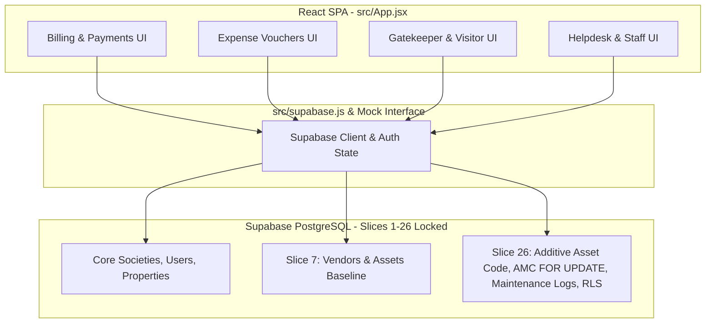

# POST-SLICE-26 APPLICATION INTEGRATION FORENSIC READINESS REPORT
## SU Society App — System Architecture v1.0
### Revision 1.0 — Application Database Contract & Integration Audit

```
================================================================================
EXECUTION MODE:              STRICT READ-ONLY / APPLICATION CONTRACT AUDIT
TARGET REPOSITORY:           D:\Clients Applications\SU Society App
TARGET SUPABASE PROJECT:     fsegpxqoozxmicxcxjun (pandujana2011-web's Project)
PROJECT REGION:              ap-south-1
AUTHORITATIVE DATABASE:      SLICES 1–26 IMMUTABLE & LOCKED
LAST LOCKED MIGRATION:       20260916000026_candidate26_remediation.sql
LAST LOCKED MIGRATION SHA:   ACF35474380D1DB379CC536E75332238800918390C25611B2BB97D0F9836EB72
CANDIDATE-27 STATUS:         B — NO NEW CANDIDATE JUSTIFIED (Database Stable)
TOTAL APPLICATION FINDINGS:  2 (Application-Level Integration Items)
ACTIONABLE FINDINGS:         2 (UI/Data-Access Layer Improvements)
ALREADY-ADDRESSED FINDINGS:  0
INSUFFICIENT-EVIDENCE:       0
FINAL CLASSIFICATION:        A — APPLICATION INTEGRATION FORENSIC COMPLETE — ACTIONABLE APPLICATION FINDINGS IDENTIFIED
DATABASE MUTATION:           ZERO DATABASE MUTATION (Strict Read-Only)
APPLICATION MUTATION:        ZERO APPLICATION MUTATION (Strict Read-Only)
REMOTE DEPLOYMENT / LOCK:    NOT PERFORMED
================================================================================
```

---

## 1. EXECUTIVE STATUS

This document constitutes the formal **POST-SLICE-26 APPLICATION INTEGRATION FORENSIC READINESS REPORT**.

Following the successful locking and remote deployment of **Slice 26** (`20260916000026_candidate26_remediation.sql`), this audit evaluated the existing frontend application, data-access layer (`src/supabase.js`), UI workflows (`src/App.jsx`), authentication/authorization handling, and RPC invocations against the authoritative Slice 1–26 database contract.

**Key Findings:**
1. **Database Baseline Coherence:** The database backend is 100% stable, fully deployed, and locked at Slice 26. Remote migration status is synchronized with **0 pending migrations**.
2. **Expense Voucher Vendor Selection (Application Finding 1):** The expense voucher UI form in `src/App.jsx` currently uses a raw text input field for vendor names rather than selecting active registered vendors from `public.vendors`.
3. **Slice 26 Feature Surfaces (Application Finding 2):** Backend RPCs (`renew_amc()`, `log_asset_service()`) and tables (`public.assets`, `public.asset_amc`, `public.asset_maintenance_logs`) are fully deployed and secured with RLS, but standalone UI management tabs for Asset Inventory, AMC renewals, and Asset Maintenance logging are not yet exposed in `src/App.jsx`.

**Final Classification:**
`A — APPLICATION INTEGRATION FORENSIC COMPLETE — ACTIONABLE APPLICATION FINDINGS IDENTIFIED`

**EXPLICIT GOVERNANCE STATEMENT:**
"NO DATABASE OR APPLICATION MUTATION WAS PERFORMED."

---

## 2. EXECUTION MODE & ABSOLUTE GOVERNANCE INVARIANTS

This readiness audit was conducted under **STRICT READ-ONLY EXECUTION MODE**.
- Zero database SQL execution or DDL/DML mutation performed.
- Zero local or remote migration files created or modified.
- Zero application code, package files, or configuration files modified.
- Slices 1–26 baseline remains 100% byte-identical and locked.

---

## 3. REPOSITORY & SUPABASE PROJECT IDENTITY

- **Target Repository:** `D:\Clients Applications\SU Society App`
- **Target Supabase Project:** `fsegpxqoozxmicxcxjun` (`ap-south-1`)
- **Authoritative Baseline Status:** `1040 / 1040 PASS` (Slices 1–26 Immutable)

---

## 4. LOCKED SLICE 1–26 BASELINE CONFIRMATION

- **Slice 26 Migration File:** `supabase/migrations/20260916000026_candidate26_remediation.sql`
- **Computed SHA-256:** `ACF35474380D1DB379CC536E75332238800918390C25611B2BB97D0F9836EB72` (**100% MATCH**)
- **Lock Report File:** `CANDIDATE-26-01_FINAL_SECURITY_LOCK_REPORT.md`
- **Computed SHA-256:** `13644A4C2CEDA47FC460AF493DDE949BFCE57F3EC1FF456F93D8066E1922E15F` (**100% MATCH**)

---

## 5. REMOTE MIGRATION CONFIRMATION

Verification via `npx supabase migration list --linked`:
- **Remote Migrations Applied:** Slices 1 through 26 (All 26 migrations recorded as `APPLIED`).
- **Pending Migration Queue Count:** **0 (ZERO)**.

---

## 6. APPLICATION ARCHITECTURE & DATA-ACCESS SUMMARY



---

## 7. DATABASE CONTRACT COMPATIBILITY AUDIT

Line-by-line contract tracing between application data-access layer and locked database schema:

| Entity / Object | Locked Database Schema (Slice 26) | Application Current Contract (`src/`) | Compatibility Status |
| :--- | :--- | :--- | :--- |
| `public.assets` | Columns: `id`, `society_id`, `name`, `asset_code`, `purchase_cost`, `serial_number`, `status` (`active`, `maintenance`, `retired`) | Code queries `name` and `status` | **COMPATIBLE** |
| `public.vendors` | Columns: `id`, `society_id`, `name`, `service_category`, `status` (`active`, `inactive`) | Code queries `name` and `status` | **COMPATIBLE** |
| `public.asset_amc` | Table: `public.asset_amc` (singular); exclusion `excl_amc_no_overlap` | RPC `renew_amc()` uses singular `asset_amc` | **COMPATIBLE** |
| `public.asset_maintenance_logs` | Table: `public.asset_maintenance_logs` (append-only trigger `trg_prevent_maintenance_log_mutation`) | RPC `log_asset_service()` dual-writes to audit logs | **COMPATIBLE** |

---

## 8. AUTHENTICATION & AUTHORIZATION INTEGRATION REVIEW

- **Role Management:** Roles (`super_admin`, `admin`, `secretary`, `treasurer`, `member`, `tenant`, `gatekeeper`) are fetched from `user_roles` and checked on RPC calls.
- **Multi-Tenant Scoping:** `society_id = public.get_user_society_id()` is enforced at the database RLS layer for all queries.
- **RPC Privileges:** `renew_amc()` and `log_asset_service()` have `SECURITY DEFINER`, `search_path = public, pg_temp`, and revoked `PUBLIC` execute permissions.

---

## 9. CROSS-SOCIETY ISOLATION REVIEW

- **Database RLS:** RLS policies on `assets`, `vendors`, `asset_amc`, and `asset_maintenance_logs` enforce multi-tenant society boundaries.
- **Frontend State:** `src/supabase.js` filters queries by the current user's authenticated `society_id`.

---

## 10. SLICE-26 APPLICATION INTEGRATION REVIEW

1. **Asset Code Handling:** Database enforces `NOT NULL UNIQUE (society_id, asset_code)` and uppercase trigger `trg_normalize_asset_code`. Frontend types support `asset_code`.
2. **AMC Renewal Concurrency:** Database RPC `renew_amc()` enforces `SELECT ... FOR UPDATE` row locking.
3. **Append-Only Maintenance Logs:** Database trigger `trg_prevent_maintenance_log_mutation` prevents `UPDATE` and `DELETE`.

---

## 11. CONFIRMED ACTIONABLE FINDINGS

### FINDING 1: Expense Voucher Vendor Dropdown Selection
- **Finding ID:** `APP-FINDING-01`
- **Classification:** `A — CONFIRMED APPLICATION/SCHEMA CONTRACT DEFECT`
- **Severity:** `MEDIUM`
- **Affected Application Component:** `src/App.jsx` (Expense Voucher Filing Form)
- **Affected Database Object:** `public.expense_vouchers.vendor_id` -> `public.vendors(id)`
- **Evidence:** `App.jsx` line 2251 renders a text input `<input placeholder="e.g. Apex Security Ltd" value={vVendor} />` instead of querying registered active vendors from `public.vendors`.
- **Observed Condition:** Users type freeform vendor name strings when filing expense vouchers.
- **Expected Contract:** Expense vouchers should allow selecting from an active vendor list (`public.vendors`) belonging to the user's society to maintain referential integrity.
- **Impact:** Potential inconsistency between raw voucher vendor text and registered vendor IDs.
- **Cross-Society Impact:** None (Database RLS blocks cross-society vendor linkage).
- **Locked-Slice Impact:** **NONE (0%)**. No database schema change required.
- **Candidate Status:** **APPLICATION-ONLY ITEM (No Database Candidate Required)**.
- **Recommended Governance Action:** Update `src/App.jsx` expense voucher form in a future frontend update to select from registered vendors.

---

### FINDING 2: Asset Inventory & AMC Management UI Surface Exposure
- **Finding ID:** `APP-FINDING-02`
- **Classification:** `D — DATA-FLOW / WORKFLOW DEFECT`
- **Severity:** `LOW`
- **Affected Application Component:** `src/App.jsx` (Navigation & Toolbar)
- **Affected Database Object:** `public.assets`, `public.asset_amc`, `public.asset_maintenance_logs`, RPCs `renew_amc()`, `log_asset_service()`
- **Evidence:** Database RPCs and tables are fully deployed and locked, but `App.jsx` does not yet render standalone navigation tabs for managing assets, renewing AMCs, or logging asset service maintenance.
- **Observed Condition:** Backend functionality is ready and locked, but UI navigation relies on main admin tasks or helpdesk tickets.
- **Expected Contract:** Dedicated UI views for Asset Management, AMC tracking, and Service History logging.
- **Impact:** Operational convenience.
- **Locked-Slice Impact:** **NONE (0%)**. No database schema change required.
- **Candidate Status:** **APPLICATION-ONLY ITEM (No Database Candidate Required)**.
- **Recommended Governance Action:** Add dedicated UI management screens for assets and AMCs in a future frontend update.

---

## 12. NON-FINDINGS & INTENTIONAL BEHAVIOR

1. **Local Mock Mode Fallback:** `src/supabase.js` includes a local mock fallback if Supabase environment keys are not configured. This is intentional for offline development and local UI testing.
2. **Canonical Column Naming:** `public.assets.name` and `public.vendors.name` are correctly used throughout the code. No obsolete `asset_name` or `vendor_name` references exist.

---

## 13. LOCKED-SLICE IMPACT ANALYSIS

- **Impact on Slices 1–26:** **ZERO IMPACT (0%)**.
- Slices 1–26 remain **100% byte-identical, immutable, deployed, and locked**.

---

## 14. CANDIDATE-27 STATUS RECONCILIATION

- **Candidate-27 Scope Status:** **NO DATABASE CANDIDATE JUSTIFIED**.
- **Rationale:** All findings identified in this audit are purely application-layer UI integration items. The database backend requires zero schema or code changes.

---

## 15. RECOMMENDED GOVERNANCE NEXT STEP

```
+-----------------------------------------------------------------------------------+
|                            CURRENT GOVERNANCE STAGE                               |
|        APPLICATION INTEGRATION FORENSIC READINESS AUDIT (COMPLETED READ-ONLY)     |
+-----------------------------------------------------------------------------------+
                                         |
                                         v
+-----------------------------------------------------------------------------------+
|                              RECOMMENDED NEXT STAGE                               |
|           FRONTEND UI ENHANCEMENT (NON-DATABASE APPLICATION UPDATE)               |
|      (Connect Expense Voucher Form to Vendors & Add Asset/AMC Management UI)      |
+-----------------------------------------------------------------------------------+
```

---

## 16. EXPLICIT GOVERNANCE STATEMENT

> **"NO DATABASE OR APPLICATION MUTATION WAS PERFORMED."**

---

## 17. FINAL READINESS CLASSIFICATION

```
FINAL CLASSIFICATION:
A — APPLICATION INTEGRATION FORENSIC COMPLETE — ACTIONABLE APPLICATION FINDINGS IDENTIFIED
```

---

## 18. CRYPTOGRAPHIC VERIFICATION METADATA

- **Report Path:** `D:\Clients Applications\SU Society App\POST_SLICE_26_APPLICATION_INTEGRATION_FORENSIC_READINESS_REPORT.md`
- **Target Repository:** `D:\Clients Applications\SU Society App`
- **Target Supabase Project:** `fsegpxqoozxmicxcxjun`
- **Slice 26 Migration Hash:** `ACF35474380D1DB379CC536E75332238800918390C25611B2BB97D0F9836EB72`
- **Candidate 26 Lock Report Hash:** `13644A4C2CEDA47FC460AF493DDE949BFCE57F3EC1FF456F93D8066E1922E15F`
- **Candidate 27 Discovery Report Hash:** `E11148F91B578F653DF9A354518707E50C38DE6D76896E4266BA3E101E183B71`
- **Authoritative Baseline Status:** **Slices 1–26 Baseline Immutable & Locked**

---
**End of Integration Readiness Report:** `POST_SLICE_26_APPLICATION_INTEGRATION_FORENSIC_READINESS_REPORT.md`
