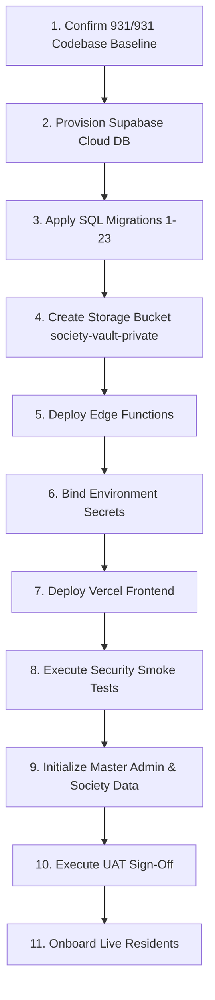

# SU SOCIETY APP — PRODUCTION DEPLOYMENT GATE PLAN

**Target Repository:** `D:\Clients Applications\SU Society App`  
**Execution Timestamp:** 2026-09-11T22:00:00+05:30  
**Authoritative Baseline:** 931 / 931 PASS (100% Locked & Immutable)  
**Current Status:** `CODEBASE READY — PRODUCTION ENVIRONMENT NOT VERIFIED`  
**Authoritative Storage Bucket:** `society-vault-private`  
**Execution Mode:** STRICT READ-ONLY / PRE-DEPLOYMENT PLANNING ONLY  

---

## 1. AUTHORITATIVE CURRENT STATE

* **Codebase Status:** `READY FOR CONTROLLED DEPLOYMENT` (All 931 security assertions across Slices 1–23 pass 100%).
* **Live Production Environment:** `NOT VERIFIED` (No production cloud project has been provisioned or inspected).
* **Final Verdict:** `OPTION A — CODEBASE READY — PRODUCTION ENVIRONMENT NOT VERIFIED`
* **Authoritative Storage Bucket Name:** `society-vault-private` (Validated in SQL schemas, storage RLS policies, Deno TypeScript functions, and security plan specifications).

> [!WARNING]
> This document is a PRE-DEPLOYMENT PLANNING ARTIFACT. It authorizes ZERO deployments, ZERO database migrations, ZERO storage creation, and ZERO environment modifications. All execution steps defined herein require EXPLICIT HUMAN AUTHORIZATION.

---

## 2. COMPONENT STATE CLASSIFICATION MATRIX

For every production component, status is strictly categorized into:
* **`REPOSITORY READY`**: Code, schema, and tests verified within the local codebase repository.
* **`DEPLOYMENT REQUIRED`**: Configuration or deployment steps must still be performed on target host infrastructure.
* **`LIVE PRODUCTION VERIFIED`**: Empirical verification evidence captured from a live production environment.

---

## 3. PRODUCTION COMPONENT INVENTORY

| Component | Repository State | Deployment Action Required | Production State |
| :--- | :--- | :--- | :--- |
| **Database Schemas (1–23)** | `REPOSITORY READY` | Execute sequential SQL migrations on Cloud DB | `DEPLOYMENT REQUIRED` |
| **RLS & RPC Layer** | `REPOSITORY READY` | Deployed automatically via SQL migrations | `DEPLOYMENT REQUIRED` |
| **Storage Bucket `society-vault-private`** | `REPOSITORY READY` | Create private storage bucket in Supabase | `DEPLOYMENT REQUIRED` |
| **Storage RLS Policies** | `REPOSITORY READY` | Apply Storage object security policies | `DEPLOYMENT REQUIRED` |
| **Edge Function: `generate_storage_signed_url`** | `REPOSITORY READY` | `supabase functions deploy generate_storage_signed_url` | `DEPLOYMENT REQUIRED` |
| **Edge Function: `validate_vault_object_payload`** | `REPOSITORY READY` | `supabase functions deploy validate_vault_object_payload` | `DEPLOYMENT REQUIRED` |
| **React 19 / Vite Frontend** | `REPOSITORY READY` | Deploy production bundle to Vercel | `DEPLOYMENT REQUIRED` |
| **PWA Service Worker & Manifest** | `REPOSITORY READY` | Included in production static bundle | `DEPLOYMENT REQUIRED` |
| **Environment Variables & Secrets** | `REPOSITORY READY` | Bind secrets in Vercel & Supabase Cloud | `DEPLOYMENT REQUIRED` |

---

## 4. ENVIRONMENT VARIABLE & SECRETS AUDIT

The following environment variable names are required for production binding. **No actual values are printed or stored.**

| Variable Name | Target Component | Type | Required? | Purpose / Usage | Binding Location |
| :--- | :--- | :--- | :--- | :--- | :--- |
| `VITE_SUPABASE_URL` | Frontend Client | Public Config | **YES** | Supabase HTTPS API Endpoint | Vercel Project Settings |
| `VITE_SUPABASE_ANON_KEY` | Frontend Client | Public Config | **YES** | Supabase Anonymous Client Key | Vercel Project Settings |
| `SUPABASE_URL` | Edge Functions | Public Config | **YES** | Internal Deno Supabase Client | Supabase Secrets Vault |
| `SUPABASE_SERVICE_ROLE_KEY` | Edge Functions | **SECRET** | **YES** | Service role client for payload validation | Supabase Secrets Vault |
| `EDGE_FUNCTION_HMAC_SECRET` | Edge Functions & DB | **SECRET** | **YES** | HMAC token validating worker invocations | Supabase Secrets Vault |

> [!CRITICAL]
> `SUPABASE_SERVICE_ROLE_KEY` and `EDGE_FUNCTION_HMAC_SECRET` MUST NEVER be exposed to client-side JavaScript or committed to git repositories.

---

## 5. SUPABASE DATABASE MIGRATION PLAN

All database changes must be executed sequentially on an empty production PostgreSQL instance.

* **Total Migrations:** 23 Sequential SQL Scripts (`schema_slice1.sql` through `schema_slice23.sql`).
* **Execution Location:** `database/` directory.
* **Prerequisites:** PostgreSQL 15+ instance with `pgcrypto` and `uuid-ossp` extensions enabled.
* **Planned Execution Command (Human Execution Only):**
  ```bash
  # PLANNED — NOT EXECUTED
  # Execute sequentially in bash / psql CLI:
  for f in database/schema_slice*.sql; do
    echo "Applying $f..."
    psql -h <PRODUCTION_HOST> -U postgres -d postgres -f "$f"
  done
  ```
* **Verification Command:**
  ```bash
  # PLANNED — NOT EXECUTED
  psql -h <PRODUCTION_HOST> -U postgres -d postgres -f database/test_runner_pg.sql
  ```

---

## 6. PRODUCTION DATABASE SAFETY GATE

Before applying migrations to a production database, the human operator MUST verify:
- [ ] 1. **Target DB Identity:** Confirm connection string points to the INTENDED production project ID (not staging/dev).
- [ ] 2. **Pre-Migration Backup:** Capture full logical dump (`pg_dump`) prior to executing DDL.
- [ ] 3. **PITR Status:** Confirm Point-In-Time Recovery (PITR) is active in Supabase Cloud Console.
- [ ] 4. **Extension Check:** Confirm `pgcrypto` is available in PostgreSQL extensions schema.
- [ ] 5. **Transactional Rollback Strategy:** Migrations 1–23 use transactional DDL statements (`BEGIN ... COMMIT`). If a script fails, the transaction rolls back cleanly.

---

## 7. STORAGE DEPLOYMENT PLAN

* **Authoritative Bucket Name:** `society-vault-private`
* **Public Access:** `FALSE` (Strictly Private).
* **Storage Path Pattern:** `{society_id}/{document_id}/v{version_number}_{hash}.bin`
* **Max Signed URL TTL:** 900 seconds (15 minutes).
* **Planned Bucket Provisioning Command (Human Execution Only):**
  ```sql
  -- PLANNED — NOT EXECUTED
  INSERT INTO storage.buckets (id, name, public) 
  VALUES ('society-vault-private', 'society-vault-private', FALSE)
  ON CONFLICT (id) DO UPDATE SET public = FALSE;
  ```

---

## 8. EDGE FUNCTION DEPLOYMENT PLAN

| Function Name | Source Path | Target Deployment Command (PLANNED ONLY) |
| :--- | :--- | :--- |
| `generate_storage_signed_url` | `supabase/functions/generate_storage_signed_url/` | `supabase functions deploy generate_storage_signed_url` |
| `validate_vault_object_payload` | `supabase/functions/validate_vault_object_payload/` | `supabase functions deploy validate_vault_object_payload` |

* **Required Secrets Setting (PLANNED ONLY):**
  ```bash
  # PLANNED — NOT EXECUTED
  supabase secrets set EDGE_FUNCTION_HMAC_SECRET=<SECURE_GENERATED_HMAC_TOKEN>
  ```

---

## 9. AUTHENTICATION & ONBOARDING PLAN

1. **Site URL & Redirect Configuration:** Set production domain URL in Supabase Auth Console (e.g., `https://society.domain.com`).
2. **Redirect Whitelist:** Add `/auth/callback`, `/reset-password`, and `/login` to allowed OAuth / magic link redirects.
3. **Session Expiry:** Configure access token lifetime to 3600 seconds (1 hour) with automatic refresh token rotation.
4. **Bootstrap Admin Provisioning:** Initial super admin account must be created via Supabase Auth Console, then assigned the `super_admin` role in `user_roles` via manual SQL insert.

---

## 10. AUTHORIZATION & SECURITY SMOKE TEST MATRIX

Prior to resident onboarding, the human QA operator must run the following manual authorization checks:

| Test ID | Role | Target Action | Expected Result |
| :--- | :--- | :--- | :--- |
| **ST-AUTH-01** | Resident | View own property ledger | **SUCCESS** (200 OK) |
| **ST-AUTH-02** | Resident | View other resident's property ledger | **DENIED** (Empty result / RLS block) |
| **ST-AUTH-03** | Tenant | View tenant-classified document | **SUCCESS** (200 OK) |
| **ST-AUTH-04** | Tenant | View owner-confidential deed document | **DENIED** (403 / Access Denied) |
| **ST-AUTH-05** | Admin | Verify pending maintenance payment | **SUCCESS** (200 OK) |
| **ST-AUTH-06** | Anon / Public | Direct HTTP GET to `society-vault-private` object | **DENIED** (HTTP 403 Forbidden) |
| **ST-AUTH-07** | Resident | Download document with expired grant | **DENIED** (RPC error 42501) |

---

## 11. PRODUCTION SECRETS MANAGEMENT PLAN

* **`EDGE_FUNCTION_HMAC_SECRET`**:
  * *Purpose:* Authenticates communication between Edge Functions and backend database RPC routines.
  * *Generation:* Cryptographically secure 256-bit random hex string.
  * *Rotation Procedure:* Update value in Supabase Secrets Vault, then update database config setting.
* **`SUPABASE_SERVICE_ROLE_KEY`**:
  * *Purpose:* Bypasses RLS strictly inside worker Edge Functions for payload hash verification.
  * *Emergency Revocation:* Rotate service role key in Supabase API settings if compromised.

---

## 12. BACKUP & DISASTER RECOVERY GATE

* **PITR Retention Target:** 7-day or 30-day continuous Point-In-Time Recovery enabled in Supabase Cloud.
* **RPO (Recovery Point Objective):** $< 5$ minutes (Automated WAL archiving).
* **RTO (Recovery Time Objective):** $< 2$ hours (Database instance restoration from dashboard).
* **Disaster Recovery Checklist:**
  - [ ] 1. Confirm PITR toggle is ACTIVE in Supabase Console.
  - [ ] 2. Document database restoration procedure in operator runbook.
  - [ ] 3. Verify nightly logical backup export script is scheduled.

---

## 13. PRODUCTION BUILD & HOSTING PLAN

* **Build Tooling:** Vite static compiler.
* **Planned Build Command (Human Execution Only):**
  ```bash
  # PLANNED — NOT EXECUTED
  npm run build
  ```
* **Output Artifact:** Compiled static SPA assets in `dist/`.
* **Vercel Hosting Configuration:**
  * *Framework Preset:* Vite
  * *Build Command:* `npm run build`
  * *Output Directory:* `dist`
  * *Rewrite Rule (SPA Routing):* Redirect all routes `/*` to `/index.html`.

---

## 14. PRODUCTION DATA INITIALIZATION SEQUENCE

Before onboarding residents, the following domain data must be initialized in strict order:

1. `societies` — Master Housing Society Record (**Admin Created**)
2. `properties` & `units` — Property & Unit Directory (**Admin / Migration Seeded**)
3. `users` & `user_roles` — Initial Super Admin & Society Admin Accounts (**Admin Created**)
4. `billing_rates` — Maintenance & Utility Tariff Rates (**Admin Configured**)
5. `society_vault-private` — Private Storage Bucket (**System Provisioned**)
6. `domestic_staff` & `gate_logs` — Gate Security Baseline (**Admin Configured**)
7. `emergency_contacts` — Emergency SOS Contacts (**Admin Configured**)

---

## 15. PAYMENT WORKFLOW ARCHITECTURE

* **Operating Model:** Verified Manual Admin Ledger Workflow.
* **Gateway Status:** No third-party automated payment gateway (Razorpay/PhonePe API) is integrated.
* **User Workflow:** Resident submits payment reference / receipt $\rightarrow$ Status set to `pending_verification` $\rightarrow$ Administrator verifies/rejects via RPC (`verify_payment` / `reject_payment`) $\rightarrow$ Immutable receipt record generated.
* **Audit Trail:** Payment records cannot be directly edited or deleted via SQL `UPDATE`/`DELETE`; state changes occur exclusively through audit-logged RPCs.

---

## 16. NOTIFICATION SYSTEM CLASSIFICATION

| Channel | Implementation Status | Provider Required? | Production Operational Status |
| :--- | :--- | :--- | :--- |
| **In-App Realtime** | **IMPLEMENTED** | Supabase Realtime (Included) | **READY** |
| **Email Alerts** | **CONFIGURATION REQUIRED** | Custom SMTP / SendGrid / Resend | **CONFIGURATION DEPENDENT** |
| **SMS Notifications** | **EXTERNAL PROVIDER REQ** | Twilio / Msg91 API Key | **NOT IMPLEMENTED / OPTIONAL** |
| **Push Notifications** | **EXTERNAL PROVIDER REQ** | Firebase Cloud Messaging (FCM) | **NOT IMPLEMENTED / OPTIONAL** |

---

## 17. UAT & REAL-DEVICE TESTING MATRIX

Prior to full resident launch, the staging deployment must be validated across:
* **Devices:** Mobile Chrome (Android), Mobile Safari (iOS), Desktop Chrome, Desktop Edge.
* **Core Flows:** Resident Login $\rightarrow$ View Maintenance Dues $\rightarrow$ Record Payment $\rightarrow$ Raise Helpdesk Ticket $\rightarrow$ Upload Vault Document $\rightarrow$ Receive In-App Alert $\rightarrow$ Generate Gate Pass.

---

## 18. GO-LIVE ORDER OF OPERATIONS



---

## 19. GO / NO-GO LAUNCH GATES

* **GATE P0 (Codebase Baseline):** 931 / 931 PASS assertions verified on repository. (**PASS**)
* **GATE P1 (Database Infrastructure):** PostgreSQL 15+ DB active on Supabase Cloud. (**PENDING HUMAN EXECUTION**)
* **GATE P2 (Database Migrations):** Migrations 1–23 applied without error. (**PENDING HUMAN EXECUTION**)
* **GATE P3 (Storage Provisioning):** `society-vault-private` bucket created & RLS applied. (**PENDING HUMAN EXECUTION**)
* **GATE P4 (Edge Functions):** Both functions deployed & HMAC secret bound. (**PENDING HUMAN EXECUTION**)
* **GATE P5 (Frontend Deployment):** Vercel build complete & HTTPS domain active. (**PENDING HUMAN EXECUTION**)
* **GATE P6 (Security Smoke Tests):** All 7 authorization smoke tests pass. (**PENDING HUMAN EXECUTION**)
* **GATE P7 (UAT Approval):** Admin & Resident user journeys accepted. (**PENDING HUMAN EXECUTION**)

---

## 20. COMPONENT ROLLBACK STRATEGY

| Component | Failure Scenario | Rollback Procedure | Data Risk Level |
| :--- | :--- | :--- | :--- |
| **Database Migration** | Migration script error | Rollback PostgreSQL transaction block (`ROLLBACK;`) | **ZERO** (Transactional) |
| **Post-Launch DB Corruption**| Bad administrative action | Restore DB using Supabase PITR to target timestamp | **LOW** (Rolls back to time $T$) |
| **Edge Functions** | Function runtime exception | Redeploy previous stable function version via Supabase CLI | **ZERO** |
| **Vercel Frontend** | UI rendering bug / crash | Instant rollback to previous deployment SHA via Vercel Console | **ZERO** |

---

## 21. CRITICAL SAFETY RULE

> [!CAUTION]
> EVERY STAGE OF PRODUCTION PROVISIONING, MIGRATION EXECUTION, SECRET SETTING, EDGE FUNCTION DEPLOYMENT, AND VERCEL DEPLOYMENT REQUIRES EXPLICIT HUMAN AUTHORIZATION AND HUMAN EXECUTION. NO AUTOMATED AGENT IS AUTHORIZED TO RUN PROD MUTATIONS.

---

## 22. FINAL CLASSIFICATION SUMMARY

| Item / Scope | Classification Status |
| :--- | :--- |
| **Repository Code & Schemas (Slices 1–23)** | **`READY`** |
| **Security Verification Suite (931/931 PASS)** | **`READY`** |
| **Production Storage Bucket (`society-vault-private`)** | **`DEPLOYMENT REQUIRED`** |
| **Cloud DB Migration Execution** | **`DEPLOYMENT REQUIRED`** |
| **Edge Function Cloud Deployment** | **`DEPLOYMENT REQUIRED`** |
| **Vercel Host Secret Binding** | **`CONFIGURATION REQUIRED`** |
| **Real Device UAT Validation** | **`VERIFICATION REQUIRED`** |

### **CURRENT SYSTEM STATUS:**
```
   ┌─────────────────────────────────────────────────────────────┐
   │                                                             │
   │  CODEBASE READY — PRODUCTION ENVIRONMENT NOT VERIFIED      │
   │                                                             │
   └─────────────────────────────────────────────────────────────┘
```

---
**END OF PRODUCTION DEPLOYMENT GATE PLAN — PRE-DEPLOYMENT AUDIT COMPLETE**
