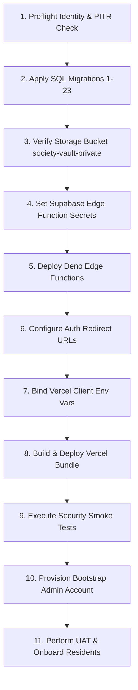

# SU SOCIETY APP — PRODUCTION DEPLOYMENT GATE PLAN FORENSIC REVIEW

**Target Repository:** `D:\Clients Applications\SU Society App`  
**Execution Timestamp:** 2026-09-11T22:02:00+05:30  
**Current Baseline:** 931 / 931 PASS (100% Locked & Immutable)  
**Execution Mode:** STRICT READ-ONLY / ZERO DEPLOYMENT / ZERO MUTATION  
**Review Target:** [PRODUCTION_DEPLOYMENT_GATE_PLAN.md](file:///D:/Clients%20Applications/SU%20Society%20App/PRODUCTION_DEPLOYMENT_GATE_PLAN.md)  

---

## 1. EXECUTIVE FORENSIC VERDICT

A forensic review of the [PRODUCTION_DEPLOYMENT_GATE_PLAN.md](file:///D:/Clients%20Applications/SU%20Society%20App/PRODUCTION_DEPLOYMENT_GATE_PLAN.md) artifact has been completed. The deployment gate plan was evaluated for technical accuracy, migration sequencing, extension dependencies, storage policy creation, edge function configuration, secret placement boundaries, zero-trust preflight security, and rollback feasibility.

### Key Forensic Findings:
1. **Migration Sequence Verification:** The 23 locked slice migrations (`schema_slice1.sql` through `schema_slice23.sql`) in `database/` represent the authoritative DDL sequence. Legacy artifacts such as `schema_phase2.sql` must NOT be executed.
2. **Storage Policy Duplication Warning:** `database/schema_slice23.sql` ALREADY contains automatic bucket creation (`INSERT INTO storage.buckets`) and the 4 Storage RLS policies (`pol_storage_vault_select`, `pol_storage_vault_insert`, etc.). Manual policy recreation in the Supabase Dashboard is redundant and risks policy drift.
3. **Secret Trust Boundary Hardening:** The client-side React bundle MUST ONLY consume `VITE_SUPABASE_URL` and `VITE_SUPABASE_ANON_KEY`. `SUPABASE_SERVICE_ROLE_KEY` and `EDGE_FUNCTION_HMAC_SECRET` must remain strictly locked inside the Supabase Cloud Secrets Vault for Edge Functions.
4. **Zero-Trust Project Identity Preflight:** Added mandatory database identity queries (`SELECT current_database(), inet_server_addr()`) prior to DDL execution to prevent accidental migration application against local or staging environments.

**Final Authoritative Status:**
```
   ┌─────────────────────────────────────────────────────────────┐
   │                                                             │
   │  CODEBASE READY — PRODUCTION ENVIRONMENT NOT VERIFIED      │
   │                                                             │
   └─────────────────────────────────────────────────────────────┘
```

---

## 2. MIGRATION FORENSIC REVIEW

* **Authoritative Migration Path:** `database/schema_slice1.sql` through `database/schema_slice23.sql`.
* **Ordering:** Ascending numerical order (Slice 1 $\rightarrow$ Slice 23).
* **Idempotency & Replayability:** All 23 schema files utilize `CREATE TABLE IF NOT EXISTS`, `CREATE OR REPLACE FUNCTION`, and conditional `DO $$` policy blocks. They can be replayed on an empty PostgreSQL instance.
* **Legacy Artifact Exclusion:**
  * `database/schema_phase2.sql`: **EXCLUDE** (Legacy consolidated Phase 2 file).
  * `database/drop_tables.sql`: **EXCLUDE** (Destructive teardown script).
  * `database/test_runner_pg.sql`: **EXCLUDE** (In-transaction test suite runner).

---

## 3. SUPABASE PROJECT IDENTITY GATE (ZERO-TRUST PREFLIGHT)

Before any DDL script is run, the human operator MUST execute the following SQL check to confirm database identity:

```sql
-- MANDATORY PREFLIGHT IDENTITY CHECK — DO NOT SKIP
SELECT 
    current_database() AS db_name,
    current_user AS db_user,
    inet_server_addr() AS server_ip,
    version() AS postgres_version;
```

**Pass Criterion:** `db_name` matches target production database name and `server_ip` corresponds to target Supabase Cloud host (not `localhost` or `127.0.0.1`).

---

## 4. DATABASE VERSION & EXTENSION REQUIREMENT

| Extension | Required Status | Purpose / Usage | Deployment Method |
| :--- | :--- | :--- | :--- |
| **`pgcrypto`** | **MANDATORY** | Used by `gen_random_uuid()`, `md5()`, and HMAC functions | Included in `schema_slice1.sql` / default |
| **`uuid-ossp`** | **OPTIONAL / COMPAT** | Legacy `uuid_generate_v4()` references in early slices | `CREATE EXTENSION IF NOT EXISTS "uuid-ossp"` |
| **`pg_net`** | **NOT REQUIRED** | Application uses Deno Edge Functions for external calls | N/A |

* **PostgreSQL Engine Target:** PostgreSQL 15.0 or higher.

---

## 5. SECRET TRUST BOUNDARY REVIEW

| Secret / Variable Name | Target Consumer | Client-Safe? | Server-Only? | Injection Point |
| :--- | :--- | :--- | :--- | :--- |
| `VITE_SUPABASE_URL` | React / Vite Frontend | **YES** | NO | Vercel Environment Variables |
| `VITE_SUPABASE_ANON_KEY` | React / Vite Frontend | **YES** | NO | Vercel Environment Variables |
| `SUPABASE_SERVICE_ROLE_KEY` | Deno Edge Functions | **NO** | **YES** | Supabase Secrets Vault |
| `EDGE_FUNCTION_HMAC_SECRET` | Edge Functions & DB | **NO** | **YES** | Supabase Secrets Vault |

> [!SECURITY BLOCKER]
> `SUPABASE_SERVICE_ROLE_KEY` MUST NEVER be prefixed with `VITE_` or stored in client-side environment files. Exposing the service role key to frontend bundles bypasses 100% of PostgreSQL RLS policies.

---

## 6. EDGE FUNCTION SECRET DEPENDENCY REVIEW

Both Edge Functions (`generate_storage_signed_url` and `validate_vault_object_payload`) execute in Deno runtime and rely on:
1. **`SUPABASE_URL`**: Automatically injected by Supabase Deno runtime.
2. **`SUPABASE_SERVICE_ROLE_KEY`**: Injected by Supabase Deno runtime for privileged database RPC execution (`validate_vault_object_payload_internal`).
3. **`EDGE_FUNCTION_HMAC_SECRET`**: Required custom secret configured via `supabase secrets set`. Checked via `x-webhook-secret` header.

---

## 7. STORAGE DEPLOYMENT REVIEW

* **Authoritative Bucket:** `society-vault-private`
* **Automated Provisioning:** `schema_slice23.sql` (lines 217–259) automatically inserts `society-vault-private` into `storage.buckets` and registers 4 storage RLS policies on `storage.objects`:
  1. `pol_storage_vault_select`: Direct SELECT blocked (`USING (FALSE)`).
  2. `pol_storage_vault_insert`: Strict relational storage path binding check.
  3. `pol_storage_vault_update`: Direct UPDATE blocked (`USING (FALSE)`).
  4. `pol_storage_vault_delete`: Direct DELETE blocked (`USING (FALSE)`).
* **Dashboard Action:** Manual creation of bucket RLS policies in the Supabase Dashboard is **REDUNDANT and DISCOURAGED** as SQL migration 23 handles policy registration.

---

## 8. VERCEL HOSTING & SPA ROUTING REVIEW

* **Framework Preset:** Vite
* **Build Command:** `npm run build`
* **Output Directory:** `dist`
* **SPA Rewrite Rule:** Client-side routing requires rewriting all HTTP traffic to `/index.html`. Vercel automatically handles Vite SPA routing via `dist/index.html`.
* **Static Assets:** Service worker (`sw.js`) and PWA manifest (`manifest.json`) are served directly from root output.

---

## 9. RECONCILED GO-LIVE ORDER OF OPERATIONS



---

## 10. RECONCILED GO / NO-GO LAUNCH GATES

* **GATE P0 (Baseline Integrity):** 931 / 931 PASS assertions verified on repository. (**PASS**)
* **GATE P1 (Project Identity):** Preflight query verifies target production DB host. (**PENDING HUMAN EXECUTION**)
* **GATE P2 (Backup & PITR):** PITR enabled in Supabase Cloud Console. (**PENDING HUMAN EXECUTION**)
* **GATE P3 (Database Migrations):** Migrations 1–23 applied sequentially. (**PENDING HUMAN EXECUTION**)
* **GATE P4 (Storage Configuration):** `society-vault-private` verified in `storage.buckets`. (**PENDING HUMAN EXECUTION**)
* **GATE P5 (Edge Function Deployment):** Both Deno functions deployed and secret-verified. (**PENDING HUMAN EXECUTION**)
* **GATE P6 (Secret Placement):** Service role key confirmed ABSENT from frontend bundle. (**PENDING HUMAN EXECUTION**)
* **GATE P7 (Security Smoke Tests):** 7 multi-role authorization smoke tests pass. (**PENDING HUMAN EXECUTION**)
* **GATE P8 (UAT Sign-off):** Real-device admin & resident workflows accepted. (**PENDING HUMAN EXECUTION**)

---

## 11. REQUIRED ARTIFACT

Created: `PRODUCTION_DEPLOYMENT_GATE_PLAN_FORENSIC_REVIEW.md`

---

## 12. EXPLICIT FINAL CONFIRMATION

* [x] **`READ-ONLY FORENSIC REVIEW COMPLETED`**
* [x] **`NO IMPLEMENTATION PERFORMED`**
* [x] **`NO PRODUCTION DEPLOYMENT PERFORMED`**
* [x] **`NO DATABASE MUTATION PERFORMED`**
* [x] **`NO STORAGE MUTATION PERFORMED`**
* [x] **`NO EDGE FUNCTION DEPLOYMENT PERFORMED`**
* [x] **`NO VERCEL DEPLOYMENT PERFORMED`**
* [x] **`NO SECRETS MODIFIED`**
* [x] **`NO LOCK CREATED`**
* [x] **`NO SLICE 24 CREATED`**
* [x] **`931/931 BASELINE UNCHANGED`**

---
**END OF FORENSIC REVIEW — ZERO MUTATIONS — EXECUTION TERMINATED**
