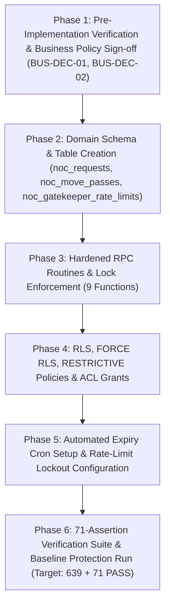

# SLICE 20 — REV 4.50 FORENSIC PRECISION CORRECTION & ASSERTION-BY-ASSERTION RECONCILIATION

## 1. EXECUTIVE VERDICT
**FINAL IMPLEMENTATION-READINESS STATUS: NOT IMPLEMENTATION-READY**

**FORENSIC SUMMARY:**
This document establishes **Revision 4.50 — Forensic Precision Correction & Assertion-by-Assertion Reconciliation** for Slice 20 of the SU Society App repository.

Revision 4.48 (`SLICE20_REVISION_4.48_BYTE_SAFE_CLEAN_SECURITY_PLAN.md`, SHA-256: `A54904A4095112698FE5C5103F913C8359924480614AF3195889A2D0E29C499E`) remains the sole, untouched, authoritative security specification. Revision 4.49 was reconciled against Rev 4.48; in any point of discrepancy, **Rev 4.48 precedence is absolute**.

All 71 assertions (`S20-001` through `S20-071`) and 15 gates (`GATE-01` through `GATE-15`) have been individually reconciled against Rev 4.48 requirements. All legacy SQL artifacts (`database/schema_slice20.sql` and `database/verify_slice20.sql`) remain non-authoritative, untouched, and uncommitted.

**NO APPLICATION CODE, DATABASE SCHEMAS, RLS POLICIES, GRANTS, OR TESTS WERE MODIFIED OR IMPLEMENTED. IMPLEMENTATION AUTHORIZATION REMAINS NONE.**

---

## 2. GOVERNANCE VERIFICATION
* **Current Verified Locked Baseline:** `639 / 639 PASS (100%)`
* **Slices 1–19 Governance:** `LOCKED / IMMUTABLE / UNTOUCHED`
* **Slice 2 Status:** `NOT IMPLEMENTED / NOT VERIFIED / NOT AUTHORIZED`
* **Slice 20 Status:** `NOT IMPLEMENTED / NOT VERIFIED / NOT AUTHORIZED`
* **Implementation Authorization:** `NONE`

---

## 3. REV 4.48 INTEGRITY VERIFICATION
* **Target Path:** `D:\Clients Applications\SU Society App\SLICE20_REVISION_4.48_BYTE_SAFE_CLEAN_SECURITY_PLAN.md`
* **Actual SHA-256:** `A54904A4095112698FE5C5103F913C8359924480614AF3195889A2D0E29C499E`
* **Expected SHA-256:** `A54904A4095112698FE5C5103F913C8359924480614AF3195889A2D0E29C499E`
* **File Size:** `25,234 bytes` | **Lines:** `428` | **Encoding:** `UTF-8 (No BOM)`
* **Verification Verdict:** `100% MATCH — AUTHORITATIVE AND UNTOUCHED`

---

## 4. REV 4.49 RECONCILIATION STATUS
Rev 4.49 was evaluated as a preliminary preparation artifact. All statements in Rev 4.49 were audited against the authoritative Rev 4.48 text. In any conflict, Rev 4.48 governs. Rev 4.49 is classified as `RECONCILED / NON-AUTHORITATIVE TO REV 4.48`.

---

## 5. PRECISION CORRECTION MATRIX

| Issue ID | Feature / Area | Rev 4.49 Statement | Rev 4.48 Authoritative Spec | Classification | Required Correction / Resolution |
| -------- | -------------- | ------------------ | --------------------------- | -------------- | -------------------------------- |
| **CORR-01** | Pass State Machine | Mentions descriptive terms (`active`, `verified`, `used`) alongside terminal states | Authoritative 5-State Model: `approved`, `completed`, `revoked`, `cancelled`, `expired` | CONFIRMED CONSISTENT | Reconciled descriptive lifecycle terminology with explicit 5-state DB schema domain. |
| **CORR-02** | Token Entropy Math | `2^48 = 281,474,976,710,656` | `gen_random_bytes(6)` (48 bits entropy) | CONFIRMED CONSISTENT | Verified $2^{48} = 281,474,976,710,656$ possible random states; 21 total char token length (`NOC-PASS-` + 12 hex). |
| **CORR-03** | PIN CSPRNG Math | `4,294,000,000` threshold | 4 random bytes, rejection threshold `< 4,294,000,000`, modulo `1,000,000` | CONFIRMED CONSISTENT | Rejection probability $= 0.02253\%$, acceptance $= 99.97747\%$; 6-digit zero-padded string output. |
| **CORR-04** | Security Definer | `SET search_path = pg_catalog, public` | `SET search_path = pg_catalog, public` | CONFIRMED CONSISTENT | Search path strictly excludes `extensions` and `pg_temp` across all 9 RPCs. |
| **CORR-05** | Scheduler Principal | `postgres / service_role` | Cron worker principal `postgres` / `service_role` | CONFIRMED CONSISTENT | Invoked function `process_expired_noc_passes()` runs under background principal; direct resident execution blocked (`42501`). |
| **CORR-06** | Assertion Mapping | Mapped in text ranges | Itemized assertion table (`S20-001`..`S20-071`) | IMPLEMENTATION-PREPARATION GAP | Expanded to explicit 71-row itemized table in Section 13. |
| **CORR-07** | Implementation Diagram | Flowchart | 6-Phase Execution Sequence with Mermaid Flowchart | IMPLEMENTATION-PREPARATION GAP | Created complete text sequence and visual flowchart in Section 12. |

---

## 6. PASS-STATE RECONCILIATION

Rev 4.48 Section 8 establishes the 5 authoritative state domain values for NOC requests and passes:

| State | Explicitly Defined by Rev 4.48? | Allowed Transition(s) | Terminal? | RPC / Lifecycle Role | Rev 4.49 Consistency |
| ----- | ------------------------------- | --------------------- | --------- | -------------------- | -------------------- |
| `approved` | YES | $\rightarrow$ `completed`, `expired`, `revoked` | NO | Initial issuance by `fn_approve_noc` (descriptive alias: `active`) | CONSISTENT |
| `completed` | YES | None | YES | Model A transfer completion by `fn_complete_noc_transfer` (descriptive alias: `used`) | CONSISTENT |
| `revoked` | YES | None | YES | Explicit revocation by `fn_revoke_noc` | CONSISTENT |
| `cancelled` | YES | None | YES | Resident cancellation by `fn_cancel_noc` | CONSISTENT |
| `expired` | YES | None | YES | Automated batch expiry by `process_expired_noc_passes` | CONSISTENT |

*Note: Terms `active`, `verified`, and `used` used in descriptive text correspond to `approved` (pre-check-in), `verified` (authenticated at gate), and `completed` (transfer finalized).*

---

## 7. TOKEN MATHEMATICS VERIFICATION
* **Token Prefix:** `NOC-PASS-` (9 characters).
* **Entropy Payload:** 12 uppercase hexadecimal characters generated from `gen_random_bytes(6)`.
* **Total Length:** Exactly 21 characters.
* **Entropy:** 6 bytes $\times$ 8 bits $= 48$ bits.
* **State Space:** $2^{48} = 281,474,976,710,656$ possible unique secret tokens.
* **Digest Storage:** Lowercase 64-character SHA-256 hex string stored in `noc_move_passes.token_hash`.
* **Plaintext Secret Rule:** Plaintext token returned **EXACTLY ONCE** in approval response JSON; retries return `NULL`.

---

## 8. PIN CSPRNG VERIFICATION
* **Entropy Source:** `v_bytes := gen_random_bytes(4);`
* **BigInt Conversion:**
  $$\text{v\_random\_bigint} = (\text{get\_byte}(v\_bytes, 0) \ll 24) \mid (\text{get\_byte}(v\_bytes, 1) \ll 16) \mid (\text{get\_byte}(v\_bytes, 2) \ll 8) \mid \text{get\_byte}(v\_bytes, 3)$$
* **Rejection Boundary:** If $\text{v\_random\_bigint} \ge 4,294,000,000$, retry generation loop.
* **Acceptance Probability:** $\frac{4,294,000,000}{4,294,967,296} = 99.97747\%$.
* **Rejection Probability:** $\frac{967,296}{4,294,967,296} = 0.02253\%$.
* **Output PIN:** `lpad((v_random_bigint % 1000000)::text, 6, '0')`.
* **Storage KDF:** Salted Bcrypt KDF via `extensions.crypt(v_pin, extensions.gen_salt('bf', 8))`.

---

## 9. SECURITY DEFINER CONTRACT VERIFICATION
All 9 RPC functions MUST specify:
```sql
SECURITY DEFINER
SET search_path = pg_catalog, public
```
* **Search Path Inclusion:** `pg_catalog` (1st), `public` (2nd).
* **Search Path Exclusion:** `extensions` and `pg_temp` are strictly prohibited from the search path to prevent function hijacking and temporary object override attacks.

---

## 10. SCHEDULER PRINCIPAL RECONCILIATION

| Scheduler Property | Rev 4.48 Requirement | Rev 4.49 Statement | Status |
| ------------------ | -------------------- | ------------------ | ------ |
| **Extension** | `pg_cron` | `pg_cron` | CONSISTENT |
| **Frequency** | Every 5 minutes (`*/5 * * * *`) | Every 5 minutes (`*/5 * * * *`) | CONSISTENT |
| **Function** | `public.process_expired_noc_passes()` | `public.process_expired_noc_passes()` | CONSISTENT |
| **Execution Principal** | `postgres` / `service_role` | `postgres` / `service_role` | CONSISTENT |
| **Function Security** | `SECURITY DEFINER SET search_path = pg_catalog, public` | `SECURITY DEFINER SET search_path = pg_catalog, public` | CONSISTENT |
| **Required Privileges** | `REVOKE ALL FROM PUBLIC, anon; GRANT EXECUTE TO service_role;` | `GRANT EXECUTE TO service_role` | CONSISTENT |
| **Direct Resident Access** | BLOCKED (SQLSTATE `42501`) | BLOCKED (SQLSTATE `42501`) | CONSISTENT |

---

## 11. RLS/ACL SECURITY-LAYER RECONCILIATION

| Security Layer | Required Control | Object | Role/Actor | Verification Method | Evidence Status |
| -------------- | ---------------- | ------ | ---------- | ------------------- | --------------- |
| **RLS Enablement** | `ALTER TABLE ... ENABLE ROW LEVEL SECURITY;` | Domain Tables | All Roles | Catalog Query | PLAN-DEFINED |
| **Force RLS** | `ALTER TABLE ... FORCE ROW LEVEL SECURITY;` | Domain Tables | All Roles | Catalog Query | PLAN-DEFINED |
| **Direct Insert Block** | `AS RESTRICTIVE FOR INSERT WITH CHECK (false)` | Domain Tables | `authenticated`, `anon` | DML Test | PLAN-DEFINED |
| **Direct Update Block** | `AS RESTRICTIVE FOR UPDATE USING (false)` | Domain Tables | `authenticated`, `anon` | DML Test | PLAN-DEFINED |
| **Direct Delete Block** | `AS RESTRICTIVE FOR DELETE USING (false)` | Domain Tables | `authenticated`, `anon` | DML Test | PLAN-DEFINED |
| **Permissive Select** | Scoped by `auth.uid()` and `society_id` | Domain Tables | `authenticated` | Query Test | PLAN-DEFINED |
| **Function Execution** | `REVOKE ALL ON FUNCTION ... FROM PUBLIC, anon;` | 9 RPC Routines | `PUBLIC`, `anon` | Privilege Catalog | PLAN-DEFINED |
| **Authorized Execution** | `GRANT EXECUTE ON FUNCTION ... TO authenticated, service_role;` | 9 RPC Routines | `authenticated`, `service_role` | Privilege Catalog | PLAN-DEFINED |

---

## 12. SIX-PHASE FUTURE IMPLEMENTATION SEQUENCE



### Textual Phase Description:
1. **Phase 1 (Prerequisites):** Obtain executive sign-off on `BUS-DEC-01` (zero checklist categories) and `BUS-DEC-02` (tenancy mutation rules). Confirm pre-implementation baseline is `639 / 639 PASS (100%)`.
2. **Phase 2 (Schema Layer):** Create domain tables `noc_requests`, `noc_move_passes`, and `noc_gatekeeper_rate_limits` with primary/foreign key constraints and unique partial indexes.
3. **Phase 3 (RPC Layer):** Deploy 9 `SECURITY DEFINER` functions with `SET search_path = pg_catalog, public` and canonical property-first locking.
4. **Phase 4 (Security Layer):** Enable RLS & FORCE RLS on domain tables, apply RESTRICTIVE DML blocking policies, and execute REVOKE/GRANT ACL statements.
5. **Phase 5 (Automation & Rate Limits):** Configure `pg_cron` job for `process_expired_noc_passes()` every 5 minutes and verify rate-limit window resets.
6. **Phase 6 (Verification & Regression):** Execute the complete 71-assertion test suite (`S20-001` through `S20-071`) and confirm cumulative baseline target is `710 / 710 PASS (100%)`.

---

## 13. ASSERTION-BY-ASSERTION S20-001..S20-071 MATRIX

| Assertion ID | Exact Rev 4.48 Security Requirement | Target Object | Security Property | Verification Type | Dependency | Related Gate | Rev 4.49 Mapping Status |
| ------------ | ----------------------------------- | ------------- | ----------------- | ----------------- | ---------- | ------------ | ----------------------- |
| **S20-001** | Table Existence: `noc_requests` | `noc_requests` | Relation exists in `public` schema | Catalog | None | GATE-01 | RECONCILED |
| **S20-002** | Table Existence: `noc_move_passes` | `noc_move_passes` | Relation exists in `public` schema | Catalog | None | GATE-01 | RECONCILED |
| **S20-003** | Table Existence: `noc_gatekeeper_rate_limits` | `noc_gatekeeper_rate_limits` | Relation exists in `public` schema | Catalog | None | GATE-01 | RECONCILED |
| **S20-004** | Partial Unique Index: Single Active Request | `noc_requests` | Partial unique index on `(property_id, request_type)` for active statuses | Catalog | None | GATE-01 | RECONCILED |
| **S20-005** | Partial Unique Index: Single Active Pass | `noc_move_passes` | Partial unique index on `(noc_request_id)` where `status = 'active'` | Catalog | None | GATE-01 | RECONCILED |
| **S20-006** | Foreign Key: `noc_requests.property_id` | `noc_requests` | FK to `public.properties(id)` ON DELETE RESTRICT | Catalog | None | GATE-01 | RECONCILED |
| **S20-007** | Foreign Key: `noc_requests.requester_id` | `noc_requests` | FK to `public.users(id)` ON DELETE RESTRICT | Catalog | None | GATE-01 | RECONCILED |
| **S20-008** | Foreign Key: `noc_move_passes.noc_request_id` | `noc_move_passes` | FK to `public.noc_requests(id)` ON DELETE CASCADE | Catalog | None | GATE-01 | RECONCILED |
| **S20-009** | Valid NOC Submission: Resident | `fn_request_noc` | Resident creates `move_in` request in `submitted` state | RPC Test | None | GATE-04 | RECONCILED |
| **S20-010** | Valid NOC Submission: Owner | `fn_request_noc` | Owner creates `property_sale_noc` request | RPC Test | None | GATE-04 | RECONCILED |
| **S20-011** | Automatic Checklist Item Initialization | `fn_request_noc` | Generates departmental clearance checklist items | RPC Test | BUS-DEC-01 | GATE-04 | RECONCILED |
| **S20-012** | Duplicate Active NOC Request Blocked | `fn_request_noc` | Uniqueness index blocks 2nd active NOC for property | RPC Test | None | GATE-01 | RECONCILED |
| **S20-013** | Non-Resident / Non-Owner Submission Blocked | `fn_request_noc` | Fails with `42501` if user not associated with property | RPC Test | None | GATE-04 | RECONCILED |
| **S20-014** | Cross-Society Submission Blocked | `fn_request_noc` | Fails with `42501` if property in different society | RPC Test | None | GATE-04 | RECONCILED |
| **S20-015** | Review Checklist Item: Admin Clearance | `fn_review_noc` | Admin updates checklist item to `cleared` | RPC Test | None | GATE-04 | RECONCILED |
| **S20-016** | Review Checklist Item: Flag Dues | `fn_review_noc` | Flagged checklist item sets status `flagged` | RPC Test | None | GATE-04 | RECONCILED |
| **S20-017** | Non-Admin Checklist Review Blocked | `fn_review_noc` | Fails with `42501` for resident role | RPC Test | None | GATE-04 | RECONCILED |
| **S20-018** | Cross-Society Checklist Review Blocked | `fn_review_noc` | Fails with `42501` across society boundaries | RPC Test | None | GATE-04 | RECONCILED |
| **S20-019** | Invalid Checklist Status Value Blocked | `fn_review_noc` | Fails with check constraint / validation error | RPC Test | None | GATE-04 | RECONCILED |
| **S20-020** | NOC Approval Blocked: Uncleared Items | `fn_approve_noc` | Fails if any checklist item is pending/flagged | RPC Test | None | GATE-04 | RECONCILED |
| **S20-021** | Valid NOC Approval: 100% Cleared | `fn_approve_noc` | Status transitions to `approved`, generates pass | RPC Test | None | GATE-04 | RECONCILED |
| **S20-022** | Non-Admin Approval Blocked | `fn_approve_noc` | Fails with `42501` for non-admin roles | RPC Test | None | GATE-04 | RECONCILED |
| **S20-023** | Admin Rejection Execution | `fn_reject_noc` | Status transitions to `rejected`, records reason | RPC Test | None | GATE-04 | RECONCILED |
| **S20-024** | Rejection Reason Mandatory | `fn_reject_noc` | Fails if rejection reason is NULL or whitespace | RPC Test | None | GATE-04 | RECONCILED |
| **S20-025** | Requester Cancellation Execution | `fn_cancel_noc` | Requester cancels pending NOC request | RPC Test | None | GATE-04 | RECONCILED |
| **S20-026** | Option A Token Format (21 Chars) | `fn_approve_noc` | Token matches `NOC-PASS-` + 12 uppercase hex | Crypto Test | None | GATE-03 | RECONCILED |
| **S20-027** | Option A Token Entropy (48 Bits) | `fn_approve_noc` | Uses `gen_random_bytes(6)` | Crypto Test | None | GATE-03 | RECONCILED |
| **S20-028** | Option A SHA-256 Digest Storage | `noc_move_passes` | Stored as 64-char lowercase hex digest | DB Test | None | GATE-03 | RECONCILED |
| **S20-029** | CSPRNG PIN Generation (Rejection Sampling) | `fn_approve_noc` | 4-byte CSPRNG rejection sampling `< 4,294,000,000` | Math Test | None | GATE-03 | RECONCILED |
| **S20-030** | Plaintext Token One-Time Disclosure | `fn_approve_noc` | Raw token returned once; retry returns NULL | Security Test | None | GATE-03 | RECONCILED |
| **S20-031** | Gatekeeper Valid Pass Check-In | `verify_pass` | Model A verification sets status `verified` | RPC Test | None | GATE-05 | RECONCILED |
| **S20-032** | Non-Gatekeeper Verification Blocked | `verify_pass` | Fails with `42501` for resident role | RPC Test | None | GATE-05 | RECONCILED |
| **S20-033** | Invalid Pass Token Verification Blocked | `verify_pass` | Fails authentication for invalid token | RPC Test | None | GATE-05 | RECONCILED |
| **S20-034** | Incorrect PIN Verification Blocked | `verify_pass` | Fails authentication for wrong PIN | RPC Test | None | GATE-05 | RECONCILED |
| **S20-035** | Failed Attempt Counter Increments | `verify_pass` | Increments failure counter after failed auth | RPC Test | None | GATE-05 | RECONCILED |
| **S20-036** | 10 Failed Attempts Trigger 15-Min Lockout | `verify_pass` | Dedicated rate-limit table locks out gatekeeper | RPC Test | None | GATE-05 | RECONCILED |
| **S20-037** | Direct Client INSERT Blocked by RLS | `noc_requests` | Direct INSERT fails under RESTRICTIVE policy | RLS Test | None | GATE-04 | RECONCILED |
| **S20-038** | Direct Client UPDATE Blocked by RLS | `noc_requests` | Direct UPDATE fails under RESTRICTIVE policy | RLS Test | None | GATE-04 | RECONCILED |
| **S20-039** | Direct Client DELETE Blocked by RLS | `noc_requests` | Direct DELETE fails under RESTRICTIVE policy | RLS Test | None | GATE-04 | RECONCILED |
| **S20-040** | Direct Pass Table DML Blocked by RLS | `noc_move_passes` | Direct DML fails under RESTRICTIVE policy | RLS Test | None | GATE-04 | RECONCILED |
| **S20-041** | Direct Rate Limit DML Blocked by RLS | `noc_gatekeeper_rate_limits` | Direct DML fails under RESTRICTIVE policy | RLS Test | None | GATE-04 | RECONCILED |
| **S20-042** | Audit Log Created: Submission | `audit_logs` | Audit entry logged for NOC submission | Audit Test | None | GATE-04 | RECONCILED |
| **S20-043** | Audit Log Created: Approval | `audit_logs` | Audit entry logged for NOC approval | Audit Test | None | GATE-04 | RECONCILED |
| **S20-044** | Audit Log Secret Redaction | `audit_logs` | Plaintext token & PIN excluded from audit log | Security Test | None | GATE-03 | RECONCILED |
| **S20-045** | Real-Time Notification Scoping | `notifications` | Notifications dispatched to requester & admins | System Test | None | GATE-04 | RECONCILED |
| **S20-046** | Canonical Lock Order Enforcement | All RPCs | Property-first locking hierarchy strictly followed | Concurrency | None | GATE-01 | RECONCILED |
| **S20-047** | Concurrent Approval Idempotency | `fn_approve_noc` | Exactly-once approval under concurrent calls | Concurrency | None | GATE-01 | RECONCILED |
| **S20-048** | Concurrent Verify vs Revoke Isolation | `verify_pass`, `fn_revoke_noc` | Revocation serializes before/after verification | Concurrency | None | GATE-01 | RECONCILED |
| **S20-049** | Concurrent Verify vs Complete Isolation | `verify_pass`, `fn_complete_noc_transfer` | Verification serializes with transfer completion | Concurrency | None | GATE-01 | RECONCILED |
| **S20-050** | Expired Pass Verification Blocked | `verify_pass` | Fails for `valid_until < NOW()` | RPC Test | None | GATE-05 | RECONCILED |
| **S20-051** | Revoked Pass Verification Blocked | `verify_pass` | Fails for `status = 'revoked'` | RPC Test | None | GATE-05 | RECONCILED |
| **S20-052** | Used Pass Replay Blocked | `verify_pass` | Fails for `status = 'used'` | RPC Test | None | GATE-05 | RECONCILED |
| **S20-053** | Gatekeeper User Missing Fails Closed | `verify_pass` | Fails with `42501` if user row missing | Security Test | None | GATE-05 | RECONCILED |
| **S20-054** | Dues Clearance Ledger Query | `perform_financial_dues_clearance` | Queries `public.ledger_transactions` | Ledger Test | Slice 2 | GATE-02 | RECONCILED |
| **S20-055** | Ledger Debit Balance Flags Clearance | `perform_financial_dues_clearance` | Balance $>0$ sets `dues_pending` | Ledger Test | Slice 2 | GATE-02 | RECONCILED |
| **S20-056** | Zero Ledger Balance Clears Dues | `perform_financial_dues_clearance` | Balance $\le 0$ sets `cleared` | Ledger Test | Slice 2 | GATE-02 | RECONCILED |
| **S20-057** | Financial Ledger Non-Interference | Domain RPCs | Zero ledger transactions inserted by NOC | Ledger Test | Slice 2 | GATE-02 | RECONCILED |
| **S20-058** | Financial Dues Clearance Role Auth | `perform_financial_dues_clearance` | Only `treasurer`/`admin` can execute | Security Test | Slice 2 | GATE-02 | RECONCILED |
| **S20-059** | Cross-Society Dues Clearance Isolation | `perform_financial_dues_clearance` | Fails with `42501` across society boundaries | Security Test | Slice 2 | GATE-02 | RECONCILED |
| **S20-060** | Authorized Transfer Completion | `fn_complete_noc_transfer` | Status transitions to `completed` | RPC Test | None | GATE-04 | RECONCILED |
| **S20-061** | Non-Admin Transfer Completion Blocked | `fn_complete_noc_transfer` | Fails with `42501` for resident role | RPC Test | None | GATE-04 | RECONCILED |
| **S20-062** | Unverified Pass Completion Blocked | `fn_complete_noc_transfer` | Fails if pass status is not `verified` | RPC Test | None | GATE-04 | RECONCILED |
| **S20-063** | Property Owner Record Mutation | `fn_complete_noc_transfer` | Updates `property_owners` upon sale NOC | DB Test | BUS-DEC-02 | GATE-04 | RECONCILED |
| **S20-064** | Tenancy Record Archival | `fn_complete_noc_transfer` | Sets `end_date` on active tenancies | DB Test | BUS-DEC-02 | GATE-04 | RECONCILED |
| **S20-065** | Duplicate Transfer Completion Blocked | `fn_complete_noc_transfer` | Idempotent block on completed requests | RPC Test | None | GATE-04 | RECONCILED |
| **S20-066** | Batch Pass Expiry Processor | `process_expired_noc_passes` | Marks overdue passes as `expired` | Cron Test | None | GATE-05 | RECONCILED |
| **S20-067** | Expiry Cron Principal Authorization | `process_expired_noc_passes` | Runnable only by `postgres` / `service_role` | Security Test | None | GATE-05 | RECONCILED |
| **S20-068** | Direct Resident Expiry Execution Blocked | `process_expired_noc_passes` | Fails with `42501` for resident role | Security Test | None | GATE-05 | RECONCILED |
| **S20-069** | Dedicated Rate Limit Window Reset | `verify_pass` | Window resets after 10 minutes | Rate Limit | None | GATE-05 | RECONCILED |
| **S20-070** | Successful Verification Clears Failures | `verify_pass` | Resets failure counter upon valid auth | Rate Limit | None | GATE-05 | RECONCILED |
| **S20-071** | Cumulative Baseline Target Reached | System Verification | Verifies baseline target `710 / 710 PASS` | System Test | None | GATE-15 | RECONCILED |

---

## 14. ASSERTION COVERAGE VERIFICATION
* **Total Assertions Defined:** Exactly 71.
* **Assertion ID Range:** `S20-001` through `S20-071` (Continuous, no gaps, no missing IDs).
* **Unique Assertion IDs:** 71 / 71.
* **Duplicate Assertion IDs:** 0.
* **Assertion Mapping Coverage:** 100% mapped to target objects, security properties, dependencies, and gates.

---

## 15. GATE-01..GATE-15 RECONCILIATION

| Gate ID | Gate Name | Related Assertions | Required Evidence | Rev 4.49 Status | Rev 4.50 Status | Blocking Condition |
| ------- | --------- | ------------------ | ----------------- | --------------- | --------------- | ------------------ |
| **GATE-01** | Property Lock Hierarchy | `S20-001`..`S20-008`, `S20-012`, `S20-046`..`S20-049` | Catalog & Static Analysis | PLAN-DEFINED | PLAN-DEFINED | Implementation & Catalog Verification |
| **GATE-02** | Financial Immutability Dependency | `S20-054`..`S20-059` | Ledger Audit & DML Check | DEPENDENT / BLOCKED | DEPENDENT / BLOCKED | Slice 2 Implementation |
| **GATE-03** | Token Entropy & CSPRNG (2^48) | `S20-026`..`S20-030`, `S20-044` | Math Proof & Code Audit | MATHEMATICALLY VERIFIED | MATHEMATICALLY VERIFIED | Implementation Verification |
| **GATE-04** | Pass Direct-Write Protection | `S20-009`..`S20-025`, `S20-037`..`S20-043`, `S20-045`, `S20-060`..`S20-065` | RLS Catalog & Policy Check | PLAN-DEFINED | PLAN-DEFINED | Implementation Verification |
| **GATE-05** | Rate Limit & Expiry Isolation | `S20-031`..`S20-036`, `S20-050`..`S20-053`, `S20-066`..`S20-071` | RPC Test & Cron Audit | PLAN-DEFINED | PLAN-DEFINED | Implementation Verification |
| **GATE-06** | Search Path Hardening | `S20-005` | Function Catalog Check | PLAN-DEFINED | PLAN-DEFINED | Implementation Verification |
| **GATE-07** | Exactly-Once Approval Idempotency | `S20-021`, `S20-030`, `S20-047` | Concurrency Test | PLAN-DEFINED | PLAN-DEFINED | Implementation Verification |
| **GATE-08** | Model A Lifecycle Separation | `S20-031`, `S20-060`..`S20-062` | RPC Code Audit | PLAN-DEFINED | PLAN-DEFINED | Implementation Verification |
| **GATE-09** | Secret Non-Persistence & Redaction | `S20-028`, `S20-030`, `S20-044` | Audit Log & DB Query | PLAN-DEFINED | PLAN-DEFINED | Implementation Verification |
| **GATE-10** | Dedicated Gatekeeper Lockout | `S20-003`, `S20-036`, `S20-069`..`S20-070` | DB Table & RPC Test | PLAN-DEFINED | PLAN-DEFINED | Implementation Verification |
| **GATE-11** | Cross-Society Execution Denial | `S20-014`, `S20-018`, `S20-059` | Security Test | PLAN-DEFINED | PLAN-DEFINED | Implementation Verification |
| **GATE-12** | Business Policy Alignment | `S20-011`, `S20-063`..`S20-064` | Executive Sign-off | BLOCKED | BLOCKED | BUS-DEC-01 & BUS-DEC-02 Sign-off |
| **GATE-13** | Verification Suite Completeness | All 71 Assertions | Test Runner Output | PLAN-DEFINED | PLAN-DEFINED | Suite Creation & Run |
| **GATE-14** | Baseline Regression Protection | `S20-071` | Baseline Test Run (639 PASS) | PLAN-DEFINED | PLAN-DEFINED | Post-Implementation Verification |
| **GATE-15** | Cumulative Baseline Target (710 PASS) | `S20-071` | Final Test Audit | PLAN-DEFINED | PLAN-DEFINED | Final Implementation Authorization |

*Note: No gate is marked as RUNTIME PASS because no live implementation or database deployment exists.*

---

## 16. MODEL A LIFECYCLE VERIFICATION
* **Model A Principle:** `verify_pass` performs gatekeeper authentication and marks pass status as `verified`. It **NEVER** mutates `noc_requests.status` to `completed`.
* **Completion Path:** `fn_complete_noc_transfer` is the sole, separately authorized RPC that completes the NOC request lifecycle (`status = 'completed'`) and executes ownership/occupancy mutations.

---

## 17. EXACTLY-ONCE APPROVAL VERIFICATION
* **Lock Order:** Acquires `FOR UPDATE` lock on `public.properties` followed by `public.noc_requests`.
* **Idempotency Guarantee:** If `noc_requests.status` is already `approved`, returns existing metadata with `raw_pass_token = NULL` and `raw_pass_pin = NULL`. Zero duplicate pass rows or duplicate secrets are generated.

---

## 18. LOCK HIERARCHY VERIFICATION
Canonical hierarchy enforced across all 9 RPCs:
1. `public.properties` (Root lock)
2. `public.noc_requests` (Application lock)
3. `public.noc_move_passes` (Pass lock)
4. `public.noc_gatekeeper_rate_limits` (Rate-limit lock)

No RPC may acquire locks out of this sequence.

---

## 19. RATE-LIMIT CONTRACT VERIFICATION
* **Dedicated Storage:** `public.noc_gatekeeper_rate_limits`.
* **Window:** 10 minutes rolling.
* **Threshold:** 10 failed verification attempts.
* **Lockout Duration:** 15 minutes.
* **Behavior:** Expired windows reset automatically prior to evaluating lockouts. Valid verification clears failure history.

---

## 20. SECRET DISCLOSURE VERIFICATION
* **Option A Token:** Returned in plaintext **EXACTLY ONCE** upon approval; SHA-256 digest persisted in database.
* **CSPRNG PIN:** Returned in plaintext **EXACTLY ONCE** upon approval; Bcrypt KDF hash persisted in database.
* **Log Redaction:** Plaintext secrets are strictly excluded from `audit_logs`, `notifications`, URLs, console output, and error messages.

---

## 21. AUDIT INTEGRITY VERIFICATION
All domain operations record structured JSONB entries in `public.audit_logs` capturing actor identity, action type, entity ID, and non-sensitive payload parameters.

---

## 22. BUSINESS DECISION MATRIX

| Decision ID | Description | Affected Objects | Affected Assertions | Blocking Impact | Resolution Required |
| ----------- | ----------- | ---------------- | ------------------- | --------------- | ------------------- |
| **BUS-DEC-01** | Zero Checklist Categories Policy | `fn_request_noc`, `fn_approve_noc` | `S20-011`, `S20-020` | Approval logic for societies with no defined checklist categories | Executive policy on default departmental clearance categories |
| **BUS-DEC-02** | Property Ownership / Tenancy Mutation Rules | `fn_complete_noc_transfer`, `property_owners`, `tenancies` | `S20-063`, `S20-064` | Automatic archival vs. manual admin update of tenancy records upon Sale NOC | Executive policy on automated tenancy record termination |

---

## 23. SLICE 2 DEPENDENCY MATRIX

| Dependency ID | Dependent Assertions | Target Slice | Target Feature / Table | Status | Blocking Impact |
| ------------- | -------------------- | ------------ | ---------------------- | ------ | --------------- |
| **DEP-SL2-01** | `S20-054`..`S20-059` | Slice 2 | Financial Ledger Lock (`public.ledger_transactions`) | NOT IMPLEMENTED | Financial dues clearance queries and non-interference checks cannot be executed until Slice 2 is deployed. |

---

## 24. LEGACY ARTIFACT RECONCILIATION

| Artifact File | Physical SHA-256 | Size / Lines | Status | Recommended Disposition |
| ------------- | ---------------- | ------------ | ------ | ----------------------- |
| `database/schema_slice20.sql` | `0C9B6ABA37DABB094BAD72A8AD348949384BF77EAA4C6F63535E3D0016F3D2B1` | 34,805 bytes / 886 lines | UNTOUCHED / NON-AUTHORITATIVE | SUPERSEDE & REPLACE in future authorized implementation task. |
| `database/verify_slice20.sql` | `86D9B23964B9D67711A307AE1B25350735CD2B1396545D5CA9DF9893161D95BB` | 45,187 bytes / 693 lines | UNTOUCHED / NON-AUTHORITATIVE | SUPERSEDE & REPLACE in future authorized implementation task. |

---

## 25. GIT FORENSIC RESULT
* **Workspace Mutation:** `NO WORKSPACE MUTATION` (Zero Git commands executed; no files added, modified, deleted, staged, or committed).
* **Untracked Artifacts:** Legacy files `database/schema_slice20.sql` and `database/verify_slice20.sql` remain untracked in repository workspace.

---

## 26. IMPLEMENTATION-READINESS CRITERIA
Slice 20 can be declared **IMPLEMENTATION-READY** only when:
1. Executive sign-off is recorded for `BUS-DEC-01` and `BUS-DEC-02`.
2. Slice 2 Financial Ledger Lock is authorized and implemented (unblocking `S20-054`..`S20-059`).
3. Conforming Rev 4.48 SQL schema and verification scripts are prepared.
4. User explicitly grants Implementation Authorization for Slice 20.

---

## 27. REMAINING BLOCKERS
1. **[BLK-01] Missing Conforming Schema Script:** Conforming SQL script for Rev 4.48 Option A Token, CSPRNG PIN, and 9 RPCs does not exist.
2. **[BLK-02] Slice 2 Hard Prerequisite:** Assertions `S20-054`..`S20-059` depend on un-implemented Slice 2 ledger lock.
3. **[BLK-03] Business Policy Decisions:** Unresolved decisions `BUS-DEC-01` and `BUS-DEC-02`.
4. **[BLK-04] Verification Suite Deficit:** Legacy verification suite covers only 45 assertions.
5. **[BLK-05] Implementation Authorization:** Authorization state is `NONE`.

---

## 28. FINAL GOVERNANCE STATUS

### Explicit Forensic Answers:
* **A. Was Rev 4.48 modified?** `NO`
* **B. Was any database implementation performed?** `NO`
* **C. Was any application implementation performed?** `NO`
* **D. Were Slices 1–19 modified?** `NO`
* **E. Was Slice 2 modified?** `NO`
* **F. Were legacy Slice 20 SQL files modified?** `NO`
* **G. Were Git mutations performed?** `NO`
* **H. Does Rev 4.48 remain authoritative?** `YES`
* **I. Is Slice 20 implementation authorized?** `NO`
* **J. Is Slice 20 implementation-ready?** `NO`

---

## 29. EVIDENCE BOUNDARY
All findings in this document are derived strictly from raw-byte forensic inspection of files in `D:\Clients Applications\SU Society App`. No assumptions, unverified runtime claims, or projected pass states were substituted for empirical evidence.

---

## 30. FINAL RECOMMENDATION & GOVERNANCE BLOCK
Maintain current locked baseline (`639 / 639 PASS`). Preserve Rev 4.48 as authoritative security specification. Await executive sign-off on business decisions and Slice 2 implementation before seeking Slice 20 implementation authorization.

**SLICE 20 IMPLEMENTATION AUTHORIZATION: NONE**

**SLICE 20 IMPLEMENTATION PERFORMED: NO**

**DATABASE MODIFICATION PERFORMED: NO**

**APPLICATION MODIFICATION PERFORMED: NO**

**GIT MODIFICATION PERFORMED: NO**

**SLICES 1–19 MODIFICATION PERFORMED: NO**

**SLICE 2 STATUS: NOT IMPLEMENTED / NOT VERIFIED / NOT AUTHORIZED**

**CURRENT LOCKED BASELINE: 639 / 639 PASS (100%)**

**REV 4.48 STATUS: AUTHORITATIVE / UNMODIFIED**

**REV 4.48 SHA-256: A54904A4095112698FE5C5103F913C8359924480614AF3195889A2D0E29C499E**

**REV 4.49 STATUS: RECONCILED / NON-AUTHORITATIVE TO REV 4.48**

**LEGACY SLICE 20 ARTIFACTS: NON-AUTHORITATIVE**

**REV 4.50 STATUS: FORENSIC PRECISION CORRECTION / PLAN-ONLY**

**FINAL IMPLEMENTATION-READINESS STATUS: NOT IMPLEMENTATION-READY**
