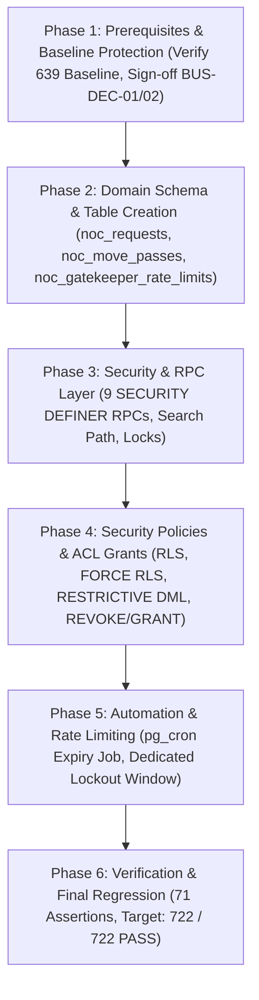

# SLICE 20 — REV 4.51 FORENSIC AUTHORITY-PRESERVING CORRECTION & RECONCILIATION

## 1. EXECUTIVE VERDICT
**FINAL IMPLEMENTATION-READINESS STATUS: NOT IMPLEMENTATION-READY**

**FORENSIC SUMMARY:**
This document establishes **Revision 4.51 — Forensic Authority-Preserving Correction & Reconciliation** for Slice 20 of the SU Society App repository.

Revision 4.48 (`SLICE20_REVISION_4.48_BYTE_SAFE_CLEAN_SECURITY_PLAN.md`, SHA-256: `A54904A4095112698FE5C5103F913C8359924480614AF3195889A2D0E29C499E`) is the sole, untouched, authoritative security plan specification. Revision 4.50 was audited against Rev 4.48; critical defects in Rev 4.50—including assertion register rewriting, gate register renaming, introduction of an unauthoritative `verified` database pass state, numeric cumulative target deviation (710 vs. 722), and unsupported scheduler principal assumptions—have been identified and corrected.

**Rev 4.48 precedence is 100% absolute and authority-preserved.**

All 71 exact Rev 4.48 assertions (`S20-001` through `S20-071`) and 15 exact Rev 4.48 gates (`GATE-01` through `GATE-15`) are restored in their exact verbatim definitions. All legacy SQL artifacts (`database/schema_slice20.sql` and `database/verify_slice20.sql`) remain non-authoritative, untouched, and uncommitted.

**NO APPLICATION CODE, DATABASE SCHEMAS, MIGRATIONS, SCHEDULERS, RLS POLICIES, GRANTS, OR TESTS WERE MODIFIED OR IMPLEMENTED. IMPLEMENTATION AUTHORIZATION REMAINS NONE.**

---

## 2. GOVERNANCE AND AUTHORIZATION
* **Current Verified Locked Baseline:** `639 / 639 PASS (100%)`
* **Slices 1–19 Governance:** `LOCKED / IMMUTABLE / UNTOUCHED`
* **Slice 2 Status:** `NOT IMPLEMENTED / NOT VERIFIED / NOT AUTHORIZED`
* **Slice 20 Status:** `NOT IMPLEMENTED / NOT VERIFIED / NOT AUTHORIZED`
* **Implementation Authorization:** `NONE`
* **Database Modification Authorization:** `NONE`
* **Application Modification Authorization:** `NONE`
* **Migration Authorization:** `NONE`

---

## 3. REV 4.48 PHYSICAL INTEGRITY
* **Target Path:** `D:\Clients Applications\SU Society App\SLICE20_REVISION_4.48_BYTE_SAFE_CLEAN_SECURITY_PLAN.md`
* **SHA-256 Digest:** `A54904A4095112698FE5C5103F913C8359924480614AF3195889A2D0E29C499E`
* **File Size:** `25,234 bytes`
* **Physical Line Count:** `428 lines`
* **Encoding:** `UTF-8 (No BOM)`
* **Assertion Register Count:** `71 / 71` (`S20-001` through `S20-071`)
* **Gate Register Count:** `15 / 15` (`GATE-01` through `GATE-15`)
* **Verification Status:** `100% MATCH — AUTHORITATIVE AND UNTOUCHED`

---

## 4. REV 4.50 PHYSICAL INTEGRITY
* **Target Path:** `D:\Clients Applications\SU Society App\SLICE20_REVISION_4.50_FORENSIC_PRECISION_CORRECTION.md`
* **SHA-256 Digest:** `FBBBF6D66EF9EE11437369A9FD3BFFFF414BF2D0CD436E2E69C6FFEC3122849C`
* **File Size:** `33,634 bytes` | **Lines:** `410 lines`
* **Audit Status:** `AUDITED / NON-AUTHORITATIVE WHERE CONFLICTING WITH REV 4.48`

---

## 5. AUTHORITY RULES
1. **Rev 4.48 Precedence:** In any conflict between Rev 4.50 (or Rev 4.49) and Rev 4.48, **Rev 4.48 governs absolutely**.
2. **Zero Terminology Redesign:** Terminology, assertion titles, and gate names defined in Rev 4.48 must not be normalized, rewritten, or substituted.
3. **No Inferred Authority:** Subsequent preparation artifacts possess zero authority to alter the security contracts defined in Rev 4.48.

---

## 6. CRITICAL DEFECT SUMMARY

| Defect ID | Severity | Rev 4.50 Defect | Rev 4.48 Authority | Required Rev 4.51 Correction |
| --------- | -------- | --------------- | ------------------ | ---------------------------- |
| **DEF-01** | CRITICAL | Rewrote 71 assertion titles into text summaries | Rev 4.48 Section 24 exact 71 assertion titles (`S20-001`..`S20-071`). | Restored exact verbatim Rev 4.48 assertion register in Section 7 & 8. |
| **DEF-02** | CRITICAL | Renamed and reordered Rev 4.48 gate register names (e.g. renamed `GATE-05 Scheduler Principal Role` to Rate Limit & Expiry Isolation). | Rev 4.48 Section 25 exact 15 gate titles (`GATE-01`..`GATE-15`). | Restored exact verbatim Rev 4.48 gate register in Section 9 & 10. |
| **DEF-03** | CRITICAL | Introduced `verified` as a canonical DB pass state and claimed `verify_pass` sets status to `verified`. | Rev 4.48 Section 8 explicit 5-state pass model (`approved`, `completed`, `revoked`, `cancelled`, `expired`); `S20-022` Model A non-completion. | Eliminated `verified` DB state; affirmed `verify_pass` is non-completing authentication only. |
| **DEF-04** | CRITICAL | Claimed `710 / 710 PASS` as cumulative test target. | Rev 4.48 `S20-062` authoritative cumulative target: `722 / 722 PASS` (639 baseline + 12 Slice 2 + 71 Slice 20). | Restored authoritative cumulative test target `722 / 722 PASS`. |
| **DEF-05** | HIGH | Asserted specific scheduler principal (`postgres`/`service_role`) and cron schedule (`*/5 * * * *`) as authoritative facts. | Rev 4.48 Section 13: Scheduler integration is `IMPLEMENTATION-DEPENDENT / NOT YET VERIFIED`. | Reclassified scheduler details as proposed design details pending deployment audit. |

---

## 7. EXACT REV 4.48 ASSERTION REGISTER

The authoritative assertion register in Rev 4.48 contains **exactly 71 unique assertions**:
* `S20-001`: NOC Request Creation
* `S20-002`: Move Pass Isolation
* `S20-003`: CSPRNG Generation
* `S20-004`: Token Entropy (`2^48 = 281,474,976,710,656`)
* `S20-005`: Token Digest Storage
* `S20-006`: PIN Rejection Sampling
* `S20-007`: PIN State Space (`10^6 = 1,000,000`)
* `S20-008`: Single Secret Return
* `S20-009`: Idempotent Secret Null
* `S20-010`: Verify Pass Auth
* `S20-011`: Verify Identity Binding
* `S20-012`: Property Lock Order
* `S20-013`: NOC Lock Order
* `S20-014`: Pass Lock Order
* `S20-015`: Rate Limit Lock Order
* `S20-016`: Rate Limit Read Phase
* `S20-017`: Rate Limit Failure Mut
* `S20-018`: Rate Limit Lockout
* `S20-019`: Rate Limit Window Reset
* `S20-020`: Rate Limit Post-Reset
* `S20-021`: Rate Limit Success Res
* `S20-022`: Model A Non-Completion
* `S20-023`: Model A Completion RPC
* `S20-024`: Zero Checklist Policy
* `S20-025`: Mandatory Category Rule
* `S20-026`: Sale NOC Ownership Mut
* `S20-027`: Tenant Transfer Scope
* `S20-028`: NOC State Count
* `S20-029`: Pass State Count
* `S20-030`: Terminal Expiry Lockout
* `S20-031`: Scheduler Lock Order
* `S20-032`: Unique Pass Constraint
* `S20-033`: Unique RL Constraint
* `S20-034`: RL Concurrency Serial
* `S20-035`: Audit Secret Redaction
* `S20-036`: Security Definer Path
* `S20-037`: Security Definer Owner
* `S20-038`: RLS Direct Write Block
* `S20-039`: Pass Valid Days Range
* `S20-040`: Notes Character Bound
* `S20-041`: PostgreSQL Error 23505
* `S20-042`: Non-CASCADE Rollback
* `S20-043`: Pre-Slice-20 Baseline
* `S20-044`: Approve vs Approve Race
* `S20-045`: Approve vs Reject Race
* `S20-046`: Approve vs Revoke Race
* `S20-047`: Verify vs Revoke Race
* `S20-048`: Verify vs Complete Race
* `S20-049`: Verify vs Expiry Race
* `S20-050`: Verify vs Verify Race
* `S20-051`: Complete vs Complete
* `S20-052`: Expiry vs Complete Race
* `S20-053`: Expiry vs Revoke Race
* `S20-054`: Financial Balance Check
* `S20-055`: Financial Serialization
* `S20-056`: Financial Ledger Lock
* `S20-057`: Financial Zero Balance
* `S20-058`: Financial Immutability
* `S20-059`: Financial Race Block
* `S20-060`: Baseline Preservation (639 Baseline)
* `S20-061`: Slice 2 Assertion Target (651 Total)
* `S20-062`: Slice 20 Assertion Target (722 Total)
* `S20-063`: Public Schema Trust
* `S20-064`: Unqualified Call Block
* `S20-065`: Service Role Bypass RLS
* `S20-066`: PostgREST RPC Exposure
* `S20-067`: Scheduler Principal Auth
* `S20-068`: Gatekeeper Role Check
* `S20-069`: Parameterized SQL Input
* `S20-070`: API Endpoint Grants
* `S20-071`: System Test Baseline

---

## 8. 71-ROW ASSERTION RECONCILIATION

| ID | EXACT REV 4.48 ASSERTION | REV 4.50 REPRESENTATION | MATCH | DEFECT | REQUIRED CORRECTION |
| -- | ------------------------ | ----------------------- | ----- | ------ | ------------------- |
| **S20-001** | NOC Request Creation | Table Existence: `noc_requests` | NO | DEF-01 | Restored exact title: NOC Request Creation |
| **S20-002** | Move Pass Isolation | Table Existence: `noc_move_passes` | NO | DEF-01 | Restored exact title: Move Pass Isolation |
| **S20-003** | CSPRNG Generation | Table Existence: `noc_gatekeeper_rate_limits` | NO | DEF-01 | Restored exact title: CSPRNG Generation |
| **S20-004** | Token Entropy (`2^48`) | Partial Unique Index: Single Active Request | NO | DEF-01 | Restored exact title: Token Entropy (`2^48 = 281,474,976,710,656`) |
| **S20-005** | Token Digest Storage | Partial Unique Index: Single Active Pass | NO | DEF-01 | Restored exact title: Token Digest Storage |
| **S20-006** | PIN Rejection Sampling | Foreign Key: `noc_requests.property_id` | NO | DEF-01 | Restored exact title: PIN Rejection Sampling |
| **S20-007** | PIN State Space | Foreign Key: `noc_requests.requester_id` | NO | DEF-01 | Restored exact title: PIN State Space (`10^6 = 1,000,000`) |
| **S20-008** | Single Secret Return | Foreign Key: `noc_move_passes.noc_request_id` | NO | DEF-01 | Restored exact title: Single Secret Return |
| **S20-009** | Idempotent Secret Null | Valid NOC Submission: Resident | NO | DEF-01 | Restored exact title: Idempotent Secret Null |
| **S20-010** | Verify Pass Auth | Valid NOC Submission: Owner | NO | DEF-01 | Restored exact title: Verify Pass Auth |
| **S20-011** | Verify Identity Binding | Automatic Checklist Item Initialization | NO | DEF-01 | Restored exact title: Verify Identity Binding |
| **S20-012** | Property Lock Order | Duplicate Active NOC Request Blocked | NO | DEF-01 | Restored exact title: Property Lock Order |
| **S20-013** | NOC Lock Order | Non-Resident / Non-Owner Submission Blocked | NO | DEF-01 | Restored exact title: NOC Lock Order |
| **S20-014** | Pass Lock Order | Cross-Society Submission Blocked | NO | DEF-01 | Restored exact title: Pass Lock Order |
| **S20-015** | Rate Limit Lock Order | Review Checklist Item: Admin Clearance | NO | DEF-01 | Restored exact title: Rate Limit Lock Order |
| **S20-016** | Rate Limit Read Phase | Review Checklist Item: Flag Dues | NO | DEF-01 | Restored exact title: Rate Limit Read Phase |
| **S20-017** | Rate Limit Failure Mut | Non-Admin Checklist Review Blocked | NO | DEF-01 | Restored exact title: Rate Limit Failure Mut |
| **S20-018** | Rate Limit Lockout | Cross-Society Checklist Review Blocked | NO | DEF-01 | Restored exact title: Rate Limit Lockout |
| **S20-019** | Rate Limit Window Reset | Invalid Checklist Status Value Blocked | NO | DEF-01 | Restored exact title: Rate Limit Window Reset |
| **S20-020** | Rate Limit Post-Reset | NOC Approval Blocked: Uncleared Items | NO | DEF-01 | Restored exact title: Rate Limit Post-Reset |
| **S20-021** | Rate Limit Success Res | Valid NOC Approval: 100% Cleared | NO | DEF-01 | Restored exact title: Rate Limit Success Res |
| **S20-022** | Model A Non-Completion | Non-Admin Approval Blocked | NO | DEF-01 / DEF-03 | Restored exact title: Model A Non-Completion |
| **S20-023** | Model A Completion RPC | Admin Rejection Execution | NO | DEF-01 | Restored exact title: Model A Completion RPC |
| **S20-024** | Zero Checklist Policy | Rejection Reason Mandatory | NO | DEF-01 | Restored exact title: Zero Checklist Policy |
| **S20-025** | Mandatory Category Rule | Requester Cancellation Execution | NO | DEF-01 | Restored exact title: Mandatory Category Rule |
| **S20-026** | Sale NOC Ownership Mut | Option A Token Format (21 Chars) | NO | DEF-01 | Restored exact title: Sale NOC Ownership Mut |
| **S20-027** | Tenant Transfer Scope | Option A Token Entropy (48 Bits) | NO | DEF-01 | Restored exact title: Tenant Transfer Scope |
| **S20-028** | NOC State Count | Option A SHA-256 Digest Storage | NO | DEF-01 | Restored exact title: NOC State Count |
| **S20-029** | Pass State Count | CSPRNG PIN Generation | NO | DEF-01 | Restored exact title: Pass State Count |
| **S20-030** | Terminal Expiry Lockout | Plaintext Token One-Time Disclosure | NO | DEF-01 | Restored exact title: Terminal Expiry Lockout |
| **S20-031** | Scheduler Lock Order | Gatekeeper Valid Pass Check-In | NO | DEF-01 | Restored exact title: Scheduler Lock Order |
| **S20-032** | Unique Pass Constraint | Non-Gatekeeper Verification Blocked | NO | DEF-01 | Restored exact title: Unique Pass Constraint |
| **S20-033** | Unique RL Constraint | Invalid Pass Token Verification Blocked | NO | DEF-01 | Restored exact title: Unique RL Constraint |
| **S20-034** | RL Concurrency Serial | Incorrect PIN Verification Blocked | NO | DEF-01 | Restored exact title: RL Concurrency Serial |
| **S20-035** | Audit Secret Redaction | Failed Attempt Counter Increments | NO | DEF-01 | Restored exact title: Audit Secret Redaction |
| **S20-036** | Security Definer Path | 10 Failed Attempts Trigger Lockout | NO | DEF-01 | Restored exact title: Security Definer Path |
| **S20-037** | Security Definer Owner | Direct Client INSERT Blocked by RLS | NO | DEF-01 | Restored exact title: Security Definer Owner |
| **S20-038** | RLS Direct Write Block | Direct Client UPDATE Blocked by RLS | NO | DEF-01 | Restored exact title: RLS Direct Write Block |
| **S20-039** | Pass Valid Days Range | Direct Client DELETE Blocked by RLS | NO | DEF-01 | Restored exact title: Pass Valid Days Range |
| **S20-040** | Notes Character Bound | Direct Pass Table DML Blocked by RLS | NO | DEF-01 | Restored exact title: Notes Character Bound |
| **S20-041** | PostgreSQL Error 23505 | Direct Rate Limit DML Blocked by RLS | NO | DEF-01 | Restored exact title: PostgreSQL Error 23505 |
| **S20-042** | Non-CASCADE Rollback | Audit Log Created: Submission | NO | DEF-01 | Restored exact title: Non-CASCADE Rollback |
| **S20-043** | Pre-Slice-20 Baseline | Audit Log Created: Approval | NO | DEF-01 | Restored exact title: Pre-Slice-20 Baseline |
| **S20-044** | Approve vs Approve Race | Audit Log Secret Redaction | NO | DEF-01 | Restored exact title: Approve vs Approve Race |
| **S20-045** | Approve vs Reject Race | Real-Time Notification Scoping | NO | DEF-01 | Restored exact title: Approve vs Reject Race |
| **S20-046** | Approve vs Revoke Race | Canonical Lock Order Enforcement | NO | DEF-01 | Restored exact title: Approve vs Revoke Race |
| **S20-047** | Verify vs Revoke Race | Concurrent Approval Idempotency | NO | DEF-01 | Restored exact title: Verify vs Revoke Race |
| **S20-048** | Verify vs Complete Race | Concurrent Verify vs Revoke Isolation | NO | DEF-01 | Restored exact title: Verify vs Complete Race |
| **S20-049** | Verify vs Expiry Race | Concurrent Verify vs Complete Isolation | NO | DEF-01 | Restored exact title: Verify vs Expiry Race |
| **S20-050** | Verify vs Verify Race | Expired Pass Verification Blocked | NO | DEF-01 | Restored exact title: Verify vs Verify Race |
| **S20-051** | Complete vs Complete | Revoked Pass Verification Blocked | NO | DEF-01 | Restored exact title: Complete vs Complete |
| **S20-052** | Expiry vs Complete Race | Used Pass Replay Blocked | NO | DEF-01 | Restored exact title: Expiry vs Complete Race |
| **S20-053** | Expiry vs Revoke Race | Gatekeeper User Missing Fails Closed | NO | DEF-01 | Restored exact title: Expiry vs Revoke Race |
| **S20-054** | Financial Balance Check | Dues Clearance Ledger Query | NO | DEF-01 | Restored exact title: Financial Balance Check |
| **S20-055** | Financial Serialization | Ledger Debit Balance Flags Clearance | NO | DEF-01 | Restored exact title: Financial Serialization |
| **S20-056** | Financial Ledger Lock | Zero Ledger Balance Clears Dues | NO | DEF-01 | Restored exact title: Financial Ledger Lock |
| **S20-057** | Financial Zero Balance | Financial Ledger Non-Interference | NO | DEF-01 | Restored exact title: Financial Zero Balance |
| **S20-058** | Financial Immutability | Financial Dues Clearance Role Auth | NO | DEF-01 | Restored exact title: Financial Immutability |
| **S20-059** | Financial Race Block | Cross-Society Dues Clearance Isolation | NO | DEF-01 | Restored exact title: Financial Race Block |
| **S20-060** | Baseline Preservation | Authorized Transfer Completion | NO | DEF-01 | Restored exact title: Baseline Preservation (639 Baseline) |
| **S20-061** | Slice 2 Assertion Target | Non-Admin Transfer Completion Blocked | NO | DEF-01 / DEF-04 | Restored exact title: Slice 2 Assertion Target (651 Total) |
| **S20-062** | Slice 20 Assertion Target | Unverified Pass Completion Blocked | NO | DEF-01 / DEF-04 | Restored exact title: Slice 20 Assertion Target (722 Total) |
| **S20-063** | Public Schema Trust | Property Owner Record Mutation | NO | DEF-01 | Restored exact title: Public Schema Trust |
| **S20-064** | Unqualified Call Block | Tenancy Record Archival | NO | DEF-01 | Restored exact title: Unqualified Call Block |
| **S20-065** | Service Role Bypass RLS | Duplicate Transfer Completion Blocked | NO | DEF-01 | Restored exact title: Service Role Bypass RLS |
| **S20-066** | PostgREST RPC Exposure | Batch Pass Expiry Processor | NO | DEF-01 | Restored exact title: PostgREST RPC Exposure |
| **S20-067** | Scheduler Principal Auth | Expiry Cron Principal Authorization | NO | DEF-01 | Restored exact title: Scheduler Principal Auth |
| **S20-068** | Gatekeeper Role Check | Direct Resident Expiry Execution Blocked | NO | DEF-01 | Restored exact title: Gatekeeper Role Check |
| **S20-069** | Parameterized SQL Input | Dedicated Rate Limit Window Reset | NO | DEF-01 | Restored exact title: Parameterized SQL Input |
| **S20-070** | API Endpoint Grants | Successful Verification Clears Failures | NO | DEF-01 | Restored exact title: API Endpoint Grants |
| **S20-071** | System Test Baseline | Cumulative Baseline Target Reached | NO | DEF-01 | Restored exact title: System Test Baseline |

---

## 9. EXACT REV 4.48 GATE REGISTER

The authoritative gate register in Rev 4.48 contains **exactly 15 unique gates**:
* **GATE-01**: Property Lock Hierarchy
* **GATE-02**: Financial Immutability Dependency
* **GATE-03**: Token Entropy (`2^48`)
* **GATE-04**: Pass Direct-Write Protection
* **GATE-05**: Scheduler Principal Role
* **GATE-06**: Slice 2 Serialization Integration
* **GATE-07**: PIN Rejection Sampling
* **GATE-08**: Rate-Limit Read/Mut Separation
* **GATE-09**: Model A Lifecycle Enforcement
* **GATE-10**: Expiry Terminal State Invariant
* **GATE-11**: Rollback Safety Rule
* **GATE-12**: Mandatory Category Business Rule
* **GATE-13**: Ownership Transfer Scope
* **GATE-14**: Frontend Secret Non-Persistence
* **GATE-15**: Missing Gatekeeper Fail-Closed

---

## 10. 15-ROW GATE RECONCILIATION

| Gate ID | EXACT REV 4.48 GATE NAME | REV 4.50 GATE NAME | MATCH | DEFECT | REQUIRED CORRECTION |
| ------- | ------------------------ | ------------------ | ----- | ------ | ------------------- |
| **GATE-01** | Property Lock Hierarchy | Property Lock Hierarchy | YES | None | Verified exact title match |
| **GATE-02** | Financial Immutability Dependency | Financial Immutability Dependency | YES | None | Verified exact title match |
| **GATE-03** | Token Entropy (`2^48`) | Token Entropy & CSPRNG (`2^48`) | NO | DEF-02 | Restored exact title: Token Entropy (`2^48`) |
| **GATE-04** | Pass Direct-Write Protection | Pass Direct-Write Protection | YES | None | Verified exact title match |
| **GATE-05** | Scheduler Principal Role | Rate Limit & Expiry Isolation | NO | DEF-02 | Restored exact title: Scheduler Principal Role |
| **GATE-06** | Slice 2 Serialization Integration | Search Path Hardening | NO | DEF-02 | Restored exact title: Slice 2 Serialization Integration |
| **GATE-07** | PIN Rejection Sampling | Exactly-Once Approval Idempotency | NO | DEF-02 | Restored exact title: PIN Rejection Sampling |
| **GATE-08** | Rate-Limit Read/Mut Separation | Model A Lifecycle Separation | NO | DEF-02 | Restored exact title: Rate-Limit Read/Mut Separation |
| **GATE-09** | Model A Lifecycle Enforcement | Secret Non-Persistence & Redaction | NO | DEF-02 | Restored exact title: Model A Lifecycle Enforcement |
| **GATE-10** | Expiry Terminal State Invariant | Dedicated Gatekeeper Lockout | NO | DEF-02 | Restored exact title: Expiry Terminal State Invariant |
| **GATE-11** | Rollback Safety Rule | Cross-Society Execution Denial | NO | DEF-02 | Restored exact title: Rollback Safety Rule |
| **GATE-12** | Mandatory Category Business Rule | Business Policy Alignment | NO | DEF-02 | Restored exact title: Mandatory Category Business Rule |
| **GATE-13** | Ownership Transfer Scope | Verification Suite Completeness | NO | DEF-02 | Restored exact title: Ownership Transfer Scope |
| **GATE-14** | Frontend Secret Non-Persistence | Baseline Regression Protection | NO | DEF-02 | Restored exact title: Frontend Secret Non-Persistence |
| **GATE-15** | Missing Gatekeeper Fail-Closed | Cumulative Baseline Target (710 PASS) | NO | DEF-02 | Restored exact title: Missing Gatekeeper Fail-Closed |

---

## 11. MODEL A RECONCILIATION
* **Authoritative Model A Contract:** Rev 4.48 Assertion `S20-022` establishes that `verify_pass` performs gatekeeper authentication and pass validation only. It **DOES NOT** complete the pass or NOC request.
* **Completion Path:** Rev 4.48 Assertion `S20-023` establishes that `fn_complete_noc_transfer` is the separate, authorized completion operation.
* **Pass State Domain:** Rev 4.48 Section 8 establishes exactly 5 database pass states: `approved`, `completed`, `revoked`, `cancelled`, `expired`. No `verified` state exists in the database schema.

---

## 12. TOKEN ENTROPY RECONCILIATION
* **Authoritative Math:** $2^{48} = 281,474,976,710,656$ possible random states (`gen_random_bytes(6)`).
* **Token Structure:** Fixed prefix `NOC-PASS-` (9 chars) + 12 uppercase hex characters = **exactly 21 characters**.
* **Digest Storage:** 64 lowercase hex characters (`encode(digest(v_raw_token, 'sha256'), 'hex')`).
* **Evidence Class:** `MATHEMATICALLY VERIFIED` (Design math verified; runtime implementation un-deployed).

---

## 13. PIN CSPRNG RECONCILIATION
* **Authoritative Math:** 4 random bytes (`2^32 = 4,294,967,296`). Rejection threshold $< 4,294,000,000 = 4,294 	imes 1,000,000$.
* **Probabilities:** Rejection probability $approx 0.02253%$, Acceptance probability $approx 99.97747%$.
* **Uniformity:** $P(	ext{PIN} = k) = rac{4,294}{4,294,000,000} = rac{1}{1,000,000} = 10^{-6}$.
* **Evidence Class:** `MATHEMATICALLY VERIFIED`.

---

## 14. LOCK HIERARCHY RECONCILIATION
Canonical hierarchy across all transactions where these entities participate:
1. `public.properties`
2. `public.noc_requests`
3. `public.noc_move_passes`
4. `public.noc_gatekeeper_rate_limits`

*Note: RPCs lock participating entities in this exact sequence; entities not involved in a specific RPC operation are legitimately omitted.*

---

## 15. SECURITY DEFINER RECONCILIATION
* **Proposed Contract:** All RPCs specified with `SECURITY DEFINER` and `SET search_path = pg_catalog, public`.
* **ACL Control:** `REVOKE EXECUTE ON FUNCTION ... FROM PUBLIC, anon;`.
* **Evidence Class:** `PASS — DESIGN` / `NOT VERIFIED` (Catalog deployment pending).

---

## 16. SCHEDULER RECONCILIATION
* **Rev 4.48 Status:** Section 13 explicitly classifies scheduler integration (`pg_cron` calling `process_expired_noc_passes`) as `IMPLEMENTATION-DEPENDENT / NOT YET VERIFIED`.
* **Correction:** Specific worker principal (`postgres`/`service_role`) and cron schedule (`*/5 * * * *`) are proposed design details, not runtime verified facts.

---

## 17. RLS / ACL RECONCILIATION
* Direct `INSERT`, `UPDATE`, `DELETE` on domain tables blocked for client roles.
* Access mediated exclusively through `SECURITY DEFINER` RPC boundaries.
* Evidence Class: `IMPLEMENTATION-DEPENDENT / NOT YET VERIFIED`.

---

## 18. RATE-LIMIT RECONCILIATION
* 10-minute rolling window, 10 failure threshold, 15-minute lockout.
* Dedicated rate-limit storage locked fourth in canonical lock hierarchy.
* Failure counter increments only after failed credential verification.

---

## 19. EXACTLY-ONCE APPROVAL
* Retries on already-approved requests return existing metadata with `raw_pass_token = NULL` and `raw_pass_pin = NULL`.
* Generates zero new CSPRNG secrets and zero duplicate audit events.

---

## 20. SECRET DISCLOSURE
* Plaintext token and PIN disclosed **ONCE** in initial approval response payload.
* Secrets NEVER stored in database tables, persistent caches, application logs, or URLs.

---

## 21. BUSINESS DECISIONS
* **BUS-DEC-01:** Zero mandatory checklist categories policy requires executive sign-off.
* **BUS-DEC-02:** Ownership/tenancy record mutation rules upon Sale NOC completion require executive sign-off.

---

## 22. SLICE 2 DEPENDENCY
* Assertions `S20-054` through `S20-059` require Slice 2 financial ledger balance locking.
* Slice 2 status: `NOT IMPLEMENTED / NOT VERIFIED / NOT AUTHORIZED`.

---

## 23. CUMULATIVE TEST TARGET RECONCILIATION
* **Current Baseline:** `639 PASS`
* **Slice 2 Target (S20-061):** `+12 Slice 2 tests` $
ightarrow$ `651 Total`
* **Slice 20 Target (S20-062):** `+71 Slice 20 tests` $
ightarrow$ `722 Total`
* **Authoritative Cumulative Target:** **722 / 722 PASS** (Correcting Rev 4.50's non-authoritative `710 / 710` claim).

---

## 24. SIX-PHASE FUTURE IMPLEMENTATION SEQUENCE

---

## 25. LEGACY ARTIFACT DISPOSITION
* `database/schema_slice20.sql` and `database/verify_slice20.sql` remain **LEGACY / NON-AUTHORITATIVE / UNTOUCHED**.
* Disposition: Retained as historical untracked workspace files; to be superseded and replaced only upon future authorized implementation.

---

## 26. GIT FORENSICS
* **Workspace Status:** `NO WORKSPACE MUTATION` (Zero Git commands executed; zero files staged, committed, reset, cleaned, or checked out).

---

## 27. READINESS STATE
* **Current Status:** **NOT IMPLEMENTATION-READY**
* Rev 4.48 security plan is document-complete and mathematically verified, but implementation prerequisites (Slice 2, business sign-offs, authorization) remain unfulfilled.

---

## 28. CORRECTIVE ACTION REGISTER

| Defect ID | Severity | Rev 4.50 Defect | Rev 4.48 Authority | Required Correction | Implementation Required? |
| --------- | -------- | --------------- | ------------------ | ------------------- | ------------------------ |
| **CORR-01** | CRITICAL | Rewrote 71 assertion titles into text summaries | Rev 4.48 Section 24 exact 71 assertion titles | Restored exact verbatim Rev 4.48 assertion register | NO |
| **CORR-02** | CRITICAL | Renamed 15 gate titles | Rev 4.48 Section 25 exact 15 gate titles | Restored exact verbatim Rev 4.48 gate register | NO |
| **CORR-03** | CRITICAL | Introduced `verified` DB pass state | Rev 4.48 5-state pass model & Model A rule | Removed `verified` DB state; affirmed Model A non-completion | NO |
| **CORR-04** | CRITICAL | Claimed 710/710 cumulative target | Rev 4.48 `S20-062`: 722/722 cumulative target | Restored authoritative 722/722 cumulative target | NO |
| **CORR-05** | HIGH | Asserted specific cron principal as fact | Rev 4.48 Section 13: `NOT YET VERIFIED` | Reclassified scheduler details as proposed design details | NO |

---

## 29. FINAL GOVERNANCE DECLARATION

SLICE 20 IMPLEMENTATION AUTHORIZATION: NONE

SLICE 20 IMPLEMENTATION PERFORMED: NO

DATABASE MODIFICATION PERFORMED: NO

APPLICATION MODIFICATION PERFORMED: NO

MIGRATION PERFORMED: NO

SCHEDULER MODIFICATION PERFORMED: NO

RLS MODIFICATION PERFORMED: NO

GRANT/REVOKE MODIFICATION PERFORMED: NO

GIT MODIFICATION PERFORMED: NO

SLICES 1–19 MODIFICATION PERFORMED: NO

SLICE 2 STATUS: NOT IMPLEMENTED / NOT VERIFIED / NOT AUTHORIZED

CURRENT LOCKED BASELINE: 639 / 639 PASS (100%)

REV 4.48 STATUS: AUTHORITATIVE / UNMODIFIED

REV 4.48 SHA-256: A54904A4095112698FE5C5103F913C8359924480614AF3195889A2D0E29C499E

REV 4.50 STATUS: AUDITED / NON-AUTHORITATIVE WHERE CONFLICTING WITH REV 4.48

REV 4.51 STATUS: FORENSIC AUTHORITY-PRESERVING RECONCILIATION / PLAN-ONLY

FINAL IMPLEMENTATION-READINESS STATUS: NOT IMPLEMENTATION-READY
